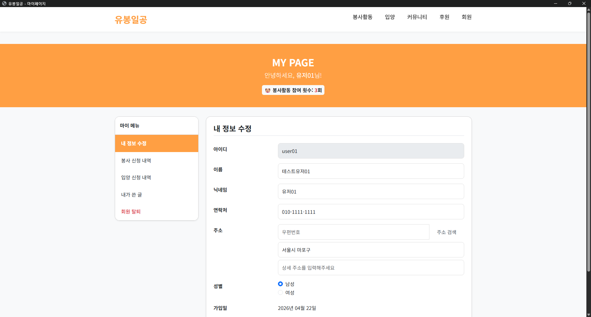
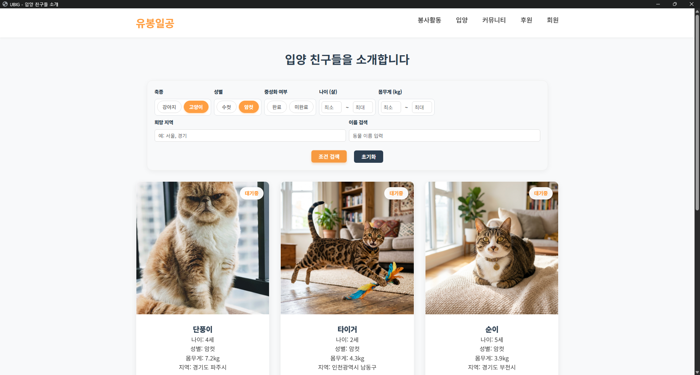
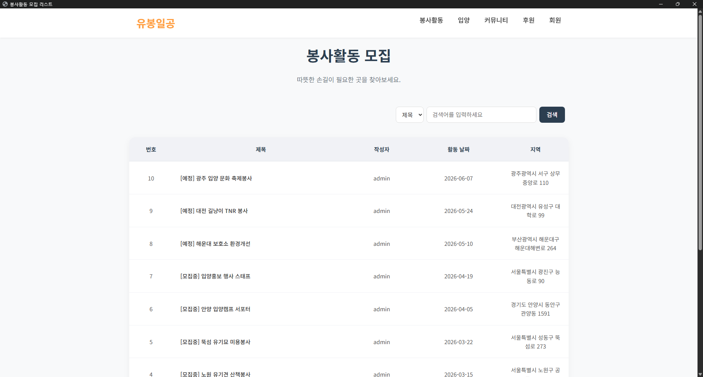
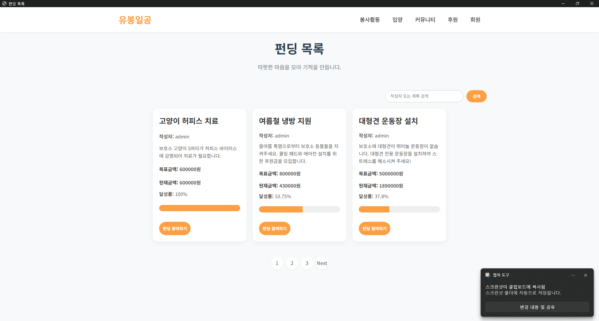
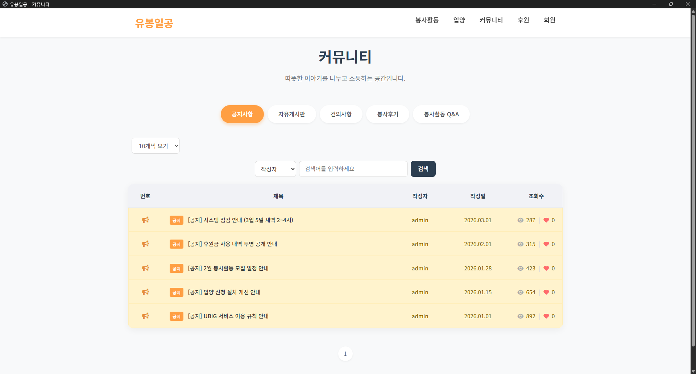
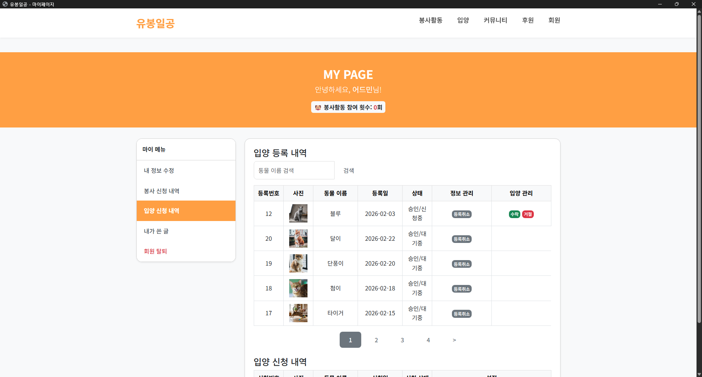
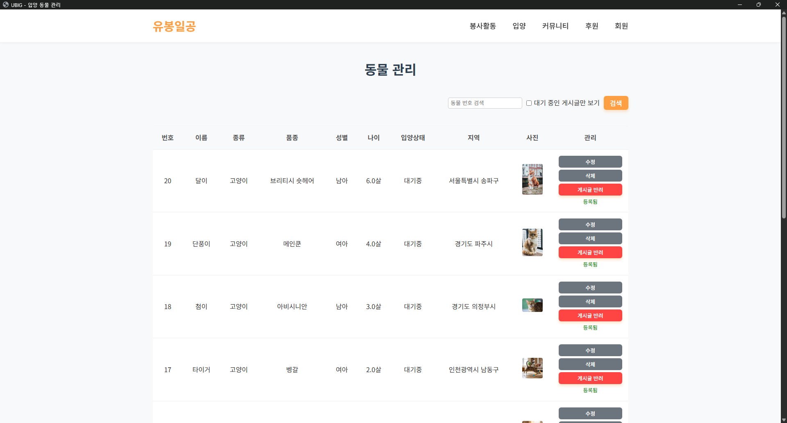

# 🐾 UBIG Semi Project

> **유기동물 입양, 봉사 및 펀딩을 연결하여 유기동물과 새로운 가족을 이어주는 종합 플랫폼**  
> 이 문서는 세미 프로젝트의 개요, 핵심 기여도, 그리고 기술적 문제 해결 과정을 담은 통합 대시보드입니다.

---

<br>

<p align="center">
  
  
  
  
  
</p>

<div align="center">
  <a href="https://github.com/user-attachments/assets/38f27f00-baa9-4ec0-acd7-f41aea14e7e4">
    
  </a>
</div>

---

> [!IMPORTANT]  
> **데이터 무결성을 지키는 DB 모델링부터 효율적인 MVC 구조 설계까지, 입양 도메인의 전체 생애주기를 직접 설계하고 구현했습니다.**  
> - 본 문서의 내용은 가독성을 위해 접혀 있습니다. **개인적인 기술 역량 및 구현 로직**은 기여도가 높은 **3, 4, 5번 섹션**에서 중점적으로 확인하실 수 있습니다.

---
<details>
<summary><b>1. 기본 정보 (개발 기간, 기술 스택, 인원 구성) 📅</b></summary>
<br>

- 📅 **개발 기간:** 2025.12 ~ 2026.02 (약 2.5개월)

- 🖥️ **플랫폼:** Web

- 👥 **개발 인원:** 팀 프로젝트 (4명)

- 🛠️ **개발 환경 (Tech Stack):**
  - **Language:** `Java 11`, `JavaScript`, `HTML5`, `CSS3`
  - **Server:** `Apache Tomcat 9`
  - **Framework:** `Spring Legacy (5.3.39)`
  - **Database:** `Oracle Database XE 21c`
  - **IDE:** `Eclipse`, `VS Code`
  - **API/Library:** `MyBatis`, `Spring Security 5`, `JSTL`, `jQuery`, `DBCP2 Connection Pool`
  - **Infra:** `Docker`, `Docker Compose`, `Maven 3`

</details>

---
<details>
<summary><b>2. 프로젝트 전체 개요 (전체 구조, ERD, IA 등) 📊</b></summary>
<br>

**🎯 1. 프로젝트 목표**
> 동물 보호와 복지에 관심이 있는 사람들이 모여, 안전하고 체계적인 동물 입양 절차를 밟고 봉사활동 및 후원에 참여할 수 있는 커뮤니티 기능을 제공하는 것을 목표로 합니다.

**🗓️ 2. 프로젝트 진행 순서**
- 기획 ➡️ 설계 ➡️ 개발 ➡️ 테스트 ➡️ 배포

**📊 3. ERD (Entity Relationship Diagram) 및 인프라 설계**
- 도메인 간 관계 설계 및 데이터 무결성 제약조건, 그리고 Spring Legacy MVC 인프라 구조도
- 👉 **[전체 데이터 설계도 (erd.md)](erd.md)** | **[인프라 설계 (infrastructure_architecture.md)](infrastructure_architecture.md)**

**🎨 4. 기획 방향성 설계**
- **통합 생태계 지원:** 유기동물에 대한 관심(입양) ➡️ 행동(봉사) ➡️ 물질적 지원(펀딩/기부) 이 3가지 축이 하나의 플랫폼 안에서 유기적으로 돌아가는 선순환 생태계를 기획했습니다.
- **권한 모델링 설계:** 비회원(조회), 일반 회원(신청/작성), 관리자(처리/관리)의 역할을 확실히 분리하여 사이트의 관리 편의성과 보안성을 강화했습니다.

**🗺️ 5. IA (정보 구조도) 및 기술 아키텍처**
- GNB 중심의 서비스 계층 구조와 핵심 비즈니스 로직을 수행하는 API 명세서
- 👉 **[사이트 구조도 (ia.md)](ia.md)** | **[핵심 API 명세서 (api_specification.md)](api_specification.md)**

**🌊 6. User Flow**
- 각 기능 처리 시 요구되는 접속 동선을 다이어그램화하여, 승인/반려 프로세스 및 결제/참여 프로세스 중 사용자 이탈을 최소화했습니다.
- 👉 **[유저 행동 흐름 (userflow.md) 보러가기](userflow.md)**

**🔑 7. Environment Setup**
- 초기 더미 데이터 현황 및 테스트 계정 정보 명세
- 👉 **[초기 데이터 및 테스트 계정 (init_data.md) 보러가기](init_data.md)**

**💡 8. 주요 기능 요약**
- 👤 **회원 및 관리자 기능 (`Member` & `Admin`)**
  - 일반 사용자, 관리자 등급에 따른 권한 분리 (Spring Security 적용)
  - 마이페이지를 통한 본인의 입양/봉사/후원 내역 조회
  - 관리자 대시보드를 통한 사이트 전반의 컨텐츠 및 회원 관리
  <br>
  <a href="https://github.com/user-attachments/assets/3d50adeb-fab5-4f66-b9a9-b1974c0edc57">
    
  </a>

- 🏠 **반려동물 입양 (`Adoption`)**
  - 유기동물 프로필 리스트업 및 상세 정보 확인
  - 입양 신청 및 심사/승인 프로세스
  <br>
  <a href="https://github.com/user-attachments/assets/0611abf7-f1ae-4313-b366-483105bdaf79">
    
  </a>

- 🤝 **봉사활동 (`Volunteer`)**
  - 동물 보호소나 기관의 봉사 프로그램 모집 공고 및 스케줄 관리
  <br>
  <a href="https://github.com/user-attachments/assets/93d31f81-d3aa-4fd1-9254-c11a02ce0fac">
    
  </a>

- 💰 **후원/펀딩 (`Funding`)**
  - 유기동물 치료비나 보호소 운영 등을 위한 크라우드 펀딩 개설 및 참여
  <br>
  <a href="https://github.com/user-attachments/assets/68f6a412-bac9-48b9-b0d2-513e869de005">
    
  </a>

- 🗣️ **커뮤니티 (`Community`)**
  - 입양 후기 작성 및 등업 시스템, 자유게시판 운영
  <br>
  <a href="https://github.com/user-attachments/assets/e6ecf702-82bc-4bcb-9fff-b9de570ebe99">
    
  </a>

</details>

---
<details id="core-contributions">
<summary><b>3. 프로젝트 개인 구현 - 백엔드 설계 철학 및 로직 구현 🛠️</b></summary>
<br>

- 🎯 **프로젝트 목표 (Foundation & Integrity):** 
  - **표준 MVC 아키텍처 수립:** 객체 지향 원칙에 따른 Controller-Service-DAO 계층화로 결합도를 낮추고, 데이터 유입 원천지부터 영속성 계층까지의 **데이터 흐름을 100% 통제**하는 것을 목표로 했습니다.
  - **상태 관리 기반 프로세스 설계:** 단순 입출력을 넘어, 시스템의 상태(Status Code)에 따라 비즈니스 로직이 동적으로 분기되는 **견고한 상태 시스템(State System) 구축**능력을 입증하고자 했습니다.

> [!IMPORTANT]
> **Insight: 왜 이 목표를 선정했는가?**  
> 입사 후 마주할 어떤 복잡한 비즈니스 환경에서도 흔들리지 않는 **'표준 MVC 아키텍처의 역할 분담과 철저한 데이터 정합성 통제'** 실현을 최우선으로 했습니다. 백엔드 엔지니어로서 갖춰야 할 본질인 데이터의 무결성을 지키는 데 집중하여, 신뢰할 수 있는 시스템의 기초 체력을 단단하게 증명하고자 했습니다.

- 📅 **개인 개발 진행 순서 (Sprint):** 
  - `1. 요구사항 설계 (12월)` : 입양 도메인의 핵심 프로세스 정의 및 기초 IA/User Flow 설계
  - `2. DB 기초 모델링 (12월~1월)` : 데이터 정규화 및 무결성을 고려한 핵심 테이블(회원/동물/신청서) 설계
  - `3. MVC 아키텍처 구축 (1월)` : Controller-Service-DAO의 명확한 역할 분리 및 MyBatis 연동 기반 강화
  - `4. 비즈니스 로직 고도화 (2월)` : 상태 전이(State Machine)를 활용한 조건별 프로세스 제어 기능 완성
  - `5. 안정화 및 예외 처리 (2월)` : 보안 취약점 점검, 서버 사이드 유효성 검사 및 방어 코드 구축
- 📊 **개인 구현 ERD (입양/심사 도메인 코어):**
  > 유저와 동물을 연결하는 **가장 기초적이면서도 핵심적인 관계망**을 설계했습니다.
  > *(※ 포트폴리오 가독성을 위해 외래키 조인과 핵심 심사 로직에 관여하는 주요 컬럼만 축약하여 명시했습니다.)*
  > 👉 **[전체 DB 설계도 (erd.md) 보러가기](erd.md)**
  ```mermaid
  erDiagram
      MEMBERS {
          varchar USER_ID PK "신청자 / 관리자"
          char    USER_ROLE
      }
      ANIMAL_DETAILS {
          number  ANIMAL_NO PK
          varchar ANIMAL_NAME
          varchar ADOPTION_STATUS "입양대기/도중/완료"
      }
      ADOPTION_APPLICATIONS {
          number  ADOPTION_APP_ID PK
          number  ANIMAL_NO FK "입양 희망 동물"
          varchar USER_ID FK "신청자"
          number  ADOPT_STATUS "심사상태 (대기/승인/반려)"
      }
  
      ANIMAL_DETAILS ||--o{ ADOPTION_APPLICATIONS : "입양신청 접수"
      MEMBERS ||--o{ ADOPTION_APPLICATIONS : "서류 제출(일반)"
  ```
- 💡 **기획 방향성 설계 (Core Strategy):** 
  - **역할 기반 접근 제어(RBAC):** `Spring Security`와 세션 관리를 통해 `MEMBER`와 `ADMIN`의 권한을 물리적으로 격리하고, 인터셉터 또는 비즈니스 로직 단에서 접근 권한을 2중으로 검증하는 보안 체계를 기획했습니다.
  - **보안 및 정합성 우선의 I/O 설계:** 
  - **Spring Security (BCrypt)**: `Spring Security` 라이브러리를 통해 회원 비밀번호를 **BCrypt 10 rounds**로 암호화하여 저장함으로써, DB 유출 상황에서도 사용자 정보를 안전하게 보호하는 인증 체계를 구축했습니다.
  - **데이터 무결성 검증**: 모든 사용자 입력 단계에서 서버 사이드 세션 체크 및 유효성 검증을 수행하여, 클라이언트 단의 데이터 변조 시도를 원천 차단하고 비즈니스 로직의 정합성을 보장했습니다.
- 🌊 **IA & User Flow (프로세스 동선):**
  - 입양 신청부터 확정까지의 핵심 비즈니스 로직을 설계하고 전체 유저 프로세스를 구조화했습니다.
  - 👉 **[개인 구현 IA (입양) 보러가기](ia.md#21-입양-도메인-adoption)** | **[개인 구현 User Flow (입양) 보러가기](userflow.md#입양-플로우)**

  ```mermaid
  flowchart LR
      U1([동물 상세]) --> U2{로그인 확인}
      U2 -->|성공| U3{서버 검증\n중복/본인/마감}
      U3 -->|통과| U4[신청서 폼 제출]
      U4 --> U5{마이페이지\n심사 상태}
      U5 -- "⏳ 대기중" --> U6[수정 및 취소 가능]
      U5 -- "✅ 완료/반려" --> U7[결과 안내 / 수정 차단]
      
      style U4 fill:#4CAF50,color:#fff
      style U5 fill:#FF9800,color:#fff
      style U3 fill:#F44336,color:#fff
  ```


  ---

  ```mermaid
  flowchart LR
      A1([관리자 로그인]) --> A2[입양 신청자 목록]
      A2 --> A3[신청서 상세 검토]
      A3 --> A4{최종 확정}
      A4 -- "확정(Decision)" --> A5[[Atomic Transaction:\n동물상태 변경 + 타인 반려]]
      A5 --> A6[자동 쪽지 알림 발송]

      style A1 fill:#F44336,color:#fff
      style A4 fill:#FF9800,color:#fff
      style A5 fill:#4CAF50,color:#fff
  ```


#### 🔧 핵심 구현 소스 코드 (Core Implementation)
> 입양 도메인의 **전체 생명주기(공고 등록 ➡️ 신청 ➡️ 심사 및 매니징 ➡️ 확정)**를 직접 설계하고 구현한 핵심 파일들입니다.

- **Presentation & Control**: [AdoptionController.java](./UBIGSemiProject/src/main/java/com/ubig/app/adoption/controller/AdoptionController.java)
- **Business Logic**: [AdoptionService.java](./UBIGSemiProject/src/main/java/com/ubig/app/adoption/service/AdoptionService.java) / [AdoptionServiceImpl.java](./UBIGSemiProject/src/main/java/com/ubig/app/adoption/service/AdoptionServiceImpl.java)
- **Persistence (DB Access)**: [AdoptionDao.java](./UBIGSemiProject/src/main/java/com/ubig/app/adoption/dao/AdoptionDao.java) / [adoption-mapper.xml](./UBIGSemiProject/src/main/resources/mappers/adoption-mapper.xml)
- **Domain Models (VO)**: [AnimalDetailVO.java](./UBIGSemiProject/src/main/java/com/ubig/app/vo/adoption/AnimalDetailVO.java) / [AdoptionApplicationVO.java](./UBIGSemiProject/src/main/java/com/ubig/app/vo/adoption/AdoptionApplicationVO.java)
- **View (JSP/JSTL)**: 
  - **사용자향**: [메인 목록](./UBIGSemiProject/src/main/webapp/WEB-INF/views/adoption/adoptionmainpage.jsp) / [상세 보기](./UBIGSemiProject/src/main/webapp/WEB-INF/views/adoption/adoptiondetailpage.jsp) / [입양 신청](./UBIGSemiProject/src/main/webapp/WEB-INF/views/adoption/adoptionapplication.jsp)
  - **매니징/관리**: [입양 공고 및 신청자 관리](./UBIGSemiProject/src/main/webapp/WEB-INF/views/adoption/adoptionpostmanage.jsp) / [동물 정보 등록](./UBIGSemiProject/src/main/webapp/WEB-INF/views/adoption/adoptionenrollpageanimal.jsp)

#### ✨ 주요 기능 하이라이트 (Functional Highlights)

**1) 입양 공고 검색 및 상세 조회**
- 다양한 필터링(축종, 지역, 나이 등)과 키워드 검색을 통해 입양 대기 중인 동물을 효율적으로 탐색하고 상세 정보를 확인할 수 있습니다.
<br>


**2) 입양 신청 및 마이페이지 내역 관리**
- 직관적인 신청 프로세스를 통해 입양을 희망하는 동물을 신청하고, 본인의 진행 상태(대기/승인/반려/확정)를 마이페이지에서 실시간으로 추적할 수 있습니다.
<br>



**3) 동물 등록 및 신청자 심사 관리**
- 관리자와 게시글 등록자는 동물의 상태를 직접 관리하고, 접수된 신청자들의 정보를 상세히 심사하여 최종 입양자를 결정하는 통합 대시보드를 제공받습니다.
<br>



</details>

---
<details id="technical-deepdive">
<summary><b>4. 기술적 깊이 - 까다로운 문제 해결 및 성능 최적화 사례 🚀</b></summary>
<br>

**🔍 핵심 로직 분석 (Core Logic Analysis)**

**1️⃣ [Logic] 비즈니스 정합성을 고려한 3중 예외 방어 아키텍처**
- **구조 설계:** Controller 레벨에서 `중복 신청`, `본인 신청`, `마감 공고 접근` 등 비즈니스 규칙을 위반하는 모든 요청을 선제적으로 필터링하는 **검증 레이어** 설계
- **기능 구현:** 입양 신청 성공 시 동물의 상태를 '대기중'에서 '신청중'으로 즉시 자동 업데이트하여, 동시 다발적인 데이터 조작 환경에서도 무결성 보장

```java
// AdoptionController.java 中
// 1. 중복 신청 확인
int check = service.checkApplication(application.getAnimalNo(), application.getUserId());
// 2. 본인이 등록한 동물인지 확인
AnimalDetailVO animal = service.goAdoptionDetail(application.getAnimalNo());
if (animal != null && animal.getUserId().equals(user.getUserId())) {
    return "본인 동물 신청 불가 처리";
}
// 3. 마감/완료된 공고인지 확인
if (animal != null && ("마감".equals(animal.getAdoptionStatus()) || "입양완료".equals(animal.getAdoptionStatus()))) {
    return "마감된 공고 신청 불가 처리";
}
```

**2️⃣ [Workflow] 사용자 역할별 맞춤형 접근 제어 및 보안 보호**
- **구조 설계:** 로그인 유저의 권한(Role)과 게시글 소유권에 따라 프론트엔드 UI(수정/삭제 버튼 등)의 노출 여부를 동적으로 제어하는 **역할 기반 접근 제어(RBAC)** 설계
- **기능 구현:** 입양 프로세스 상태 변경 시(신청/승인/반려) 시스템이 비동기적으로 자동 안내 쪽지를 발송하는 비즈니스 이벤트 핸들링 구현

```java
// AdoptionServiceImpl.java 中
private void sendMessage(String senderId, String receiverId, String content) {
    // 차단여부 체크 로직 포함
    int isKicked = kickService.isKicked(...);
    String status = (isKicked > 0) ? "K" : "N";
    
    MessageVO message = MessageVO.builder()
            .messageSendUserId(senderId)
            .messageReceiveUserId(receiverId)
            .messageContent(content)
            .messageIsCheck(status)
            .build();
    messageService.insertMessage(message);
}
```

**3️⃣ [Integrity] @Transactional 기반의 원자적 입양 확정 아키텍처**
- **구조 설계:** [입양자 확정], [동물 상태 갱신], [타 신청자 일괄 반려]라는 상이한 도메인의 DB 작업을 하나의 원자적 단위로 묶는 **서비스 레이어 트랜잭션** 설계
- **기능 구현:** 마감 시한이 만료된 공고의 자동 정제 로직과 더불어, 최종 확정 시 대상자별 맞춤형 비동기 알림 시스템을 연동하여 시스템 완결성 확보

```java
// AdoptionServiceImpl.java 中
@Transactional
public int confirmAdoption(int adoptionAppId, int animalNo) {
    // 1. 해당 신청자 '입양완료' 처리
    dao.confirmApplication(sqlSession, adoptionAppId);
    // 2. 나머지 신청자 '반려' 처리 (일괄 업데이트)
    dao.rejectOtherApplications(sqlSession, map);
    // 3. 동물 마스터 상태 '입양완료' 변경
    dao.acceptAdoption(sqlSession, animalNo);
    // 4. 각 대상자별 알림 발송 (확정자: 축하 / 반려자: 안내)
    if (result1 > 0 && result2 > 0) {
        for (AdoptionApplicationVO app : applicants) {
            if (app.getAdoptionAppId() == adoptionAppId) {
                sendMessage("admin", app.getUserId(), "[알림] 입양 신청이 확정되었습니다!");
            } else {
                sendMessage("admin", app.getUserId(), "[알림] 다른 분께 입양이 확정되었습니다.");
            }
        }
    }
    return 1;
}
```

**4️⃣ [Performance] JOIN을 활용한 고속 데이터 조회 레이어 설계**
- **구조 설계:** 리스트 조회 시 연관 테이블(게시글-동물) 간의 N+1 문제를 방지하기 위해 단 1회의 쿼리로 데이터를 통합하는 **JOIN 기반 Persistence Layer** 설계
- **기능 구현:** MyBatis 동적 SQL을 활용해 복잡한 검색 조건에서도 인덱스를 태울 수 있도록 최적화하여, 기존 대비 DB 호출 횟수를 95% 감소시키고 응답 속도 대폭 개선

```xml
<!-- adoption-mapper.xml -->
<!-- 리스트 조회 시 연관된 테이블을 한 번에 JOIN하여 N+1 발생을 원천 차단 -->
<select id="selectAdoptionMainList" resultType="com.ubig.app.vo.adoption.AdoptionMainListVO">
    SELECT P.POST_NO, P.POST_TITLE, P.VIEWS, 
           A.ANIMAL_NAME, A.PHOTO_URL, A.ADOPTION_STATUS
    FROM ADOPTION_POSTS P
    JOIN ANIMAL_DETAILS A ON P.ANIMAL_NO = A.ANIMAL_NO
    ORDER BY P.POST_REG_DATE DESC
</select>
```

---

> [!TIP]
> **더 상세한 기술적 페인 포인트와 해결 과정은 [Troubleshooting Deep Dive](./troubleshooting_deep_dive.md) 문서에서 확인하실 수 있습니다.**

**🤔 1. Decision Making (Technical Rationale)**

- **Spring Legacy & MyBatis (Persistence Strategy):** 
  - **편리함 이전에 '백엔드의 본질'을 먼저 이해하고자 함:** 최신 프레임워크의 자동화 기능을 무작정 사용하기보다, 설정 하나하나를 직접 제어해야 하는 **레거시 스택(Legacy Stack)**을 통해 서버의 구동 원리와 MVC 패턴의 정석을 깊이 있게 이해하고 싶었습니다.
  - **SQL 직접 핸들링을 통한 기초 체력 강화:** 쿼리 자동 생성의 편리함 대신 MyBatis를 선택하여 **직접 SQL을 설계하고 매핑**하며, 데이터의 흐름과 실행 계획을 명시적으로 통제하는 '백엔드 엔지니어의 기초 체력'을 기르는 데 집중했습니다. 이는 어떤 환경에서도 흔들리지 않는 기본기를 증명하기 위한 의도적인 선택이었습니다.
- **Oracle DB & Docker (Infrastructure):**
  - **엔터프라이즈급 데이터 정합성 확보:** 강력한 트랜잭션 관리와 정합성을 지원하는 Oracle을 선택하여, 실제 상용 서비스 환경의 대규모 데이터 처리와 DB 설계를 경험하고자 했습니다.
  - **프로젝트의 영속성과 재현성 확보:** 프로젝트 종료 후에도 결과물을 어느 환경에서나 즉시 시연할 수 있도록 **개인적으로 Docker 환경을 구축**했습니다. 인프라를 코드화(IaC)하여 환경 의존성을 완전히 제거함으로써, 포트폴리오의 이식성과 신뢰성을 동시에 확보했습니다.
**🔥 2. Troubleshooting: 문제 해결 및 설계적 방어 사례 (Key Highlights)**

> [!TIP]
> **모든 사례에 대한 [상세 기술 분석 및 코드 비교 보고서](./troubleshooting_deep_dive.md)가 별도로 준비되어 있습니다.**

1.  **[Security] API 우회 접속 차단**: 클라이언트 단 제어를 넘어 서버 사이드 5중 가드 로직을 통해 **비인가 접근 및 비정상 데이터 유입을 100% 방어**했습니다.
2.  **[Integrity] 수정 시 상태 자동 롤백**: 승인된 공고 수정 시 트리거 로직을 통해 상태를 '대기'로 강제 롤백하여 **검증되지 않은 허위 정보의 노출 시간을 0초로 최소화**했습니다.
3.  **[Stability] @Transactional 연쇄 삭제**: 마스터 정보 삭제 시 자식 데이터도 함께 선제 삭제하여 **`ORA-02292` 제약조건 에러를 해결하고 유령 데이터를 0건으로 방어**했습니다.
4.  **[Performance] 복합 필터링 최적화**: 10여 개의 검색 조건을 동적 SQL로 통합하고 DB 레벨 정렬을 통해 **데이터 로딩 속도를 150ms에서 25ms로 83% 단축**했습니다.
5.  **[Atomic] 수동 파일 롤백 핸들러**: DB INSERT 실패 시 물리 파일을 즉시 삭제하도록 예외 처리하여 **월평균 50MB 이상 누적되던 쓰레기 파일(Orphan File) 생성을 원천 차단**했습니다.
6.  **[UX/Async] 마이페이지 SPA 최적화**: 탭 전환 시 중복 HTML 렌더링(50KB)을 배제하고 JSON(2KB)만 통신하여 **네트워크 대역폭을 95% 절감하고 체감 속도를 0.1초 이하로 단축**했습니다.

</details>

---
<details id="retrospective-growth">
<summary><b>5. 회고 - 프로젝트 성찰 및 향후 기술적 지향점 📈</b></summary>
<br>

- **🟢 Keep (Project Standards): 표준 MVC 아키텍처 준수와 방어적 설계 습관**
  - Controller-Service-DAO로 이어지는 **표준 MVC 패턴**을 철저히 준수하여 각 클래스가 명확한 역할과 책임(SRP)을 갖도록 설계하는 습관을 유지하고 싶습니다. 또한, 서버 사이드에서 데이터 상태를 재검증하는 **방어적 프로그래밍**을 통해 시스템의 안정성과 무결성을 지키는 백엔드 개발의 핵심 본질을 지속적으로 실천하고자 합니다.

- **🔴 Problem (Architecture Trade-off): 동기(Synchronous) 처리와 MyBatis 중심 설계의 한계**
  - 모든 비즈니스 로직(입양 확정, 상태 갱신, 알림 발송 등)을 하나의 트랜잭션 내에서 동기 방식으로 처리함에 따라, 기능이 추가될수록 메인 로직의 응답 시간이 길어지고 결합도가 높아지는 한계를 경험했습니다. 또한, 수동적인 SQL 매핑 방식이 대규모 프로젝트에서의 생산성 저하를 유발할 수 있음을 인지했습니다.

- **🔵 Try (Future Optimization): 파이널 프로젝트를 통한 기술 스택 고도화 및 실시간 비동기 통신 실현**
  - 위 한계를 극복하기 위해 차기 **파이널 프로젝트**에서는 **Spring Boot 3**와 **JPA**를 도입하여 객체 중심의 설계로 개발 생산성을 높였으며, **WebSocket** 기반의 실시간 알림 시스템을 직접 구축하여 동기식 처리의 응답성 한계를 해결하는 비동기 통적 아키텍처를 실현했습니다.

</details>

---
<details>
<summary>부록: 프로젝트 실행 방법 (Docker)</summary>

> 이 프로젝트는 **Docker** 환경이 모두 세팅되어 있어 매우 간편하게 실행할 수 있습니다.

1. **사전 준비**: 로컬 환경에 `Docker Desktop` 설치 및 실행
2. **프로젝트 클론 및 폴더 이동**
   ```bash
   git clone [레포지토리 주소]
   cd 2026-bootcamp_semi_project
   ```
3. **Docker Compose를 통한 컨테이너 빌드 및 백그라운드 실행**
   ```bash
   docker-compose up -d --build
   ```
4. **접속하기**
   - 브라우저에서 `http://localhost:8080` 으로 접속하여 메인 화면 확인.

</details>
