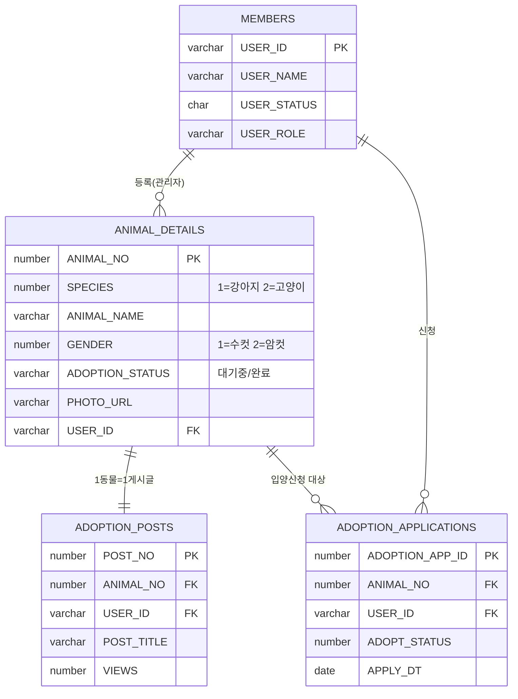
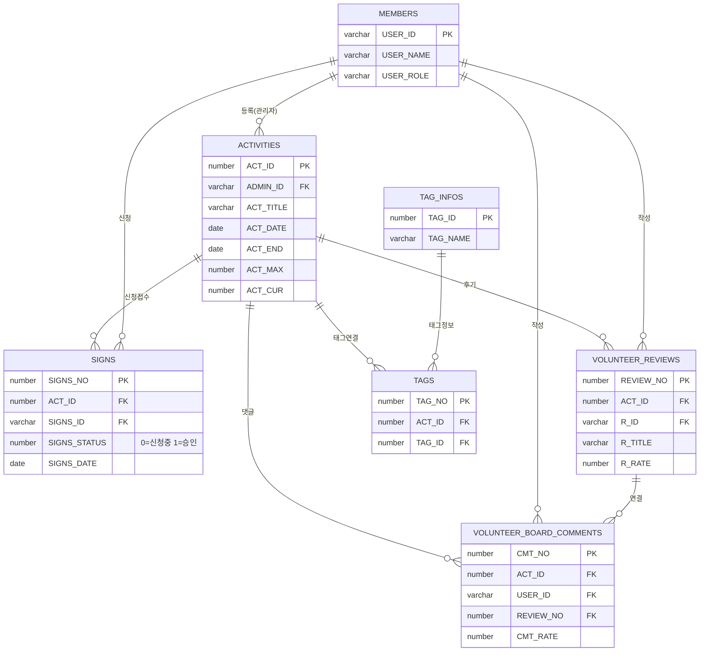
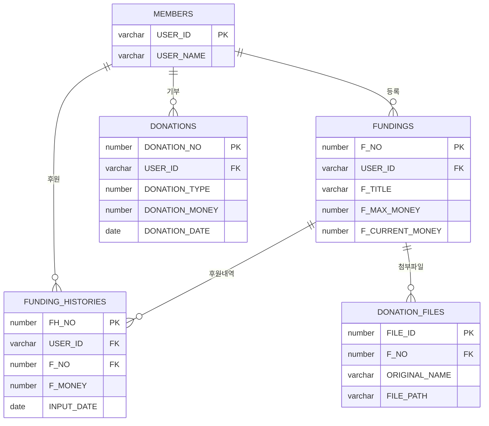
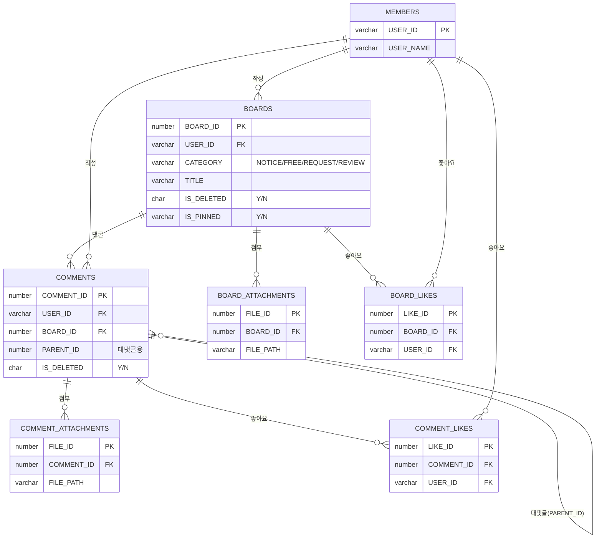
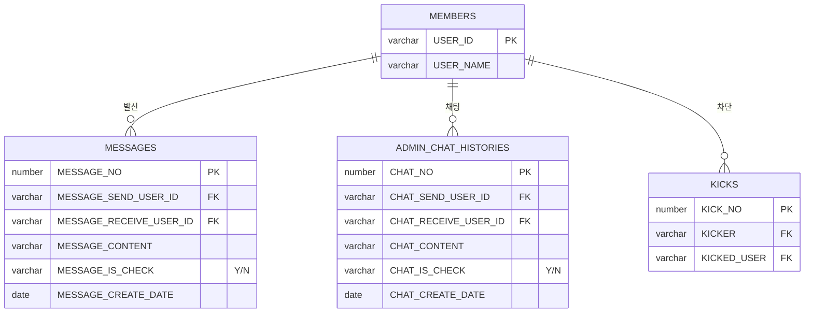

```mermaid
erDiagram

    %% ──────────────────────────
    %%  회원
    %% ──────────────────────────
    MEMBERS {
        varchar USER_ID PK
        varchar USER_PWD
        varchar USER_NAME
        varchar USER_NICKNAME
        varchar USER_ADDRESS
        varchar USER_CONTACT
        char    USER_GENDER
        number  USER_AGE
        number  USER_ATTENDED_COUNT
        date    USER_RESTRICT_END_DATE
        char    USER_STATUS
        varchar USER_ROLE
        date    USER_ENROLL_DATE
        date    USER_MODIFY_DATE
    }

    %% ──────────────────────────
    %%  입양
    %% ──────────────────────────
    ANIMAL_DETAILS {
        number  ANIMAL_NO PK
        number  SPECIES
        varchar ANIMAL_NAME
        varchar BREED
        number  GENDER
        number  AGE
        number  WEIGHT
        number  PET_SIZE
        number  NEUTERED
        varchar VACCINATION_STATUS
        varchar HEALTH_NOTES
        varchar ADOPTION_STATUS
        varchar ADOPTION_CONDITIONS
        varchar PHOTO_URL
        varchar HOPE_REGION
        date    DEADLINE_DATE
        varchar USER_ID FK
    }

    ADOPTION_POSTS {
        number  POST_NO PK
        number  ANIMAL_NO FK
        varchar USER_ID FK
        varchar POST_TITLE
        date    POST_REG_DATE
        date    POST_UPDATE_DATE
        number  VIEWS
    }

    ADOPTION_APPLICATIONS {
        number  ADOPTION_APP_ID PK
        number  ANIMAL_NO FK
        varchar USER_ID FK
        number  ADOPT_STATUS
        date    APPLY_DT
    }

    %% ──────────────────────────
    %%  봉사활동
    %% ──────────────────────────
    ACTIVITIES {
        number  ACT_ID PK
        varchar ADMIN_ID FK
        date    ACT_DATE
        date    ACT_END
        varchar ACT_ADDRESS
        number  ACT_LAT
        number  ACT_LON
        date    ACT_LOAD
        varchar ACT_TITLE
        number  ACT_MAX
        number  ACT_CUR
        number  ACT_MONEY
        number  ACT_RATE
    }

    SIGNS {
        number  SIGNS_NO PK
        number  ACT_ID FK
        varchar SIGNS_ID FK
        number  SIGNS_WAIT
        number  SIGNS_STATUS
        date    SIGNS_DATE
    }

    VOLUNTEER_REVIEWS {
        number  REVIEW_NO PK
        number  ACT_ID FK
        varchar R_ID FK
        varchar R_TITLE
        varchar R_REVIEW
        number  R_RATE
        date    R_CREATE
        date    R_UPDATE
        number  R_REMOVE
    }

    VOLUNTEER_BOARD_COMMENTS {
        number  CMT_NO PK
        number  ACT_ID FK
        varchar USER_ID FK
        varchar CMT_ANSWER
        date    CMT_DATE
        date    CMT_UPDATE
        number  CMT_REMOVE
        number  CMT_RATE
        number  REVIEW_NO FK
    }

    TAG_INFOS {
        number  TAG_ID PK
        varchar TAG_NAME
    }

    TAGS {
        number TAG_NO PK
        number ACT_ID FK
        number TAG_ID FK
    }

    %% ──────────────────────────
    %%  펀딩
    %% ──────────────────────────
    FUNDINGS {
        number  F_NO PK
        varchar USER_ID FK
        varchar F_TITLE
        varchar F_CONTENT
        number  F_MAX_MONEY
        number  F_CURRENT_MONEY
    }

    FUNDING_HISTORIES {
        number  FH_NO PK
        varchar USER_ID FK
        number  F_NO FK
        number  F_MONEY
        date    INPUT_DATE
    }

    DONATION_FILES {
        number  FILE_ID PK
        number  F_NO FK
        varchar ORIGINAL_NAME
        varchar SAVED_NAME
        varchar FILE_PATH
        number  FILE_SIZE
        date    CREATE_DATE
    }

    DONATIONS {
        number  DONATION_NO PK
        varchar USER_ID FK
        number  DONATION_TYPE
        number  DONATION_MONEY
        number  DONATION_YN
        date    DONATION_DATE
    }

    %% ──────────────────────────
    %%  커뮤니티 게시판
    %% ──────────────────────────
    BOARDS {
        number  BOARD_ID PK
        varchar USER_ID FK
        varchar CATEGORY
        varchar TITLE
        varchar CONTENT
        date    CREATE_DATE
        date    UPDATE_DATE
        number  VIEW_COUNT
        char    IS_DELETED
        varchar IS_PINNED
        varchar HASHTAGS
    }

    COMMENTS {
        number  COMMENT_ID PK
        varchar USER_ID FK
        number  BOARD_ID FK
        varchar CONTENT
        date    CREATE_DATE
        date    UPDATE_DATE
        char    IS_DELETED
        number  PARENT_ID
    }

    BOARD_ATTACHMENTS {
        number  FILE_ID PK
        number  BOARD_ID FK
        varchar REF_TYPE
        varchar REF_ID
        varchar ORIGINAL_NAME
        varchar SAVED_NAME
        varchar FILE_PATH
        number  FILE_SIZE
        date    CREATE_DATE
    }

    BOARD_LIKES {
        number  LIKE_ID PK
        number  BOARD_ID FK
        varchar USER_ID FK
        varchar TARGET_TYPE
        date    CREATE_DATE
    }

    COMMENT_ATTACHMENTS {
        number  FILE_ID PK
        number  COMMENT_ID FK
        varchar REF_TYPE
        varchar REF_ID
        varchar ORIGINAL_NAME
        varchar SAVED_NAME
        varchar FILE_PATH
        number  FILE_SIZE
        date    CREATE_DATE
    }

    COMMENT_LIKES {
        number  LIKE_ID PK
        number  COMMENT_ID FK
        varchar USER_ID FK
        varchar TARGET_TYPE
        date    CREATE_DATE
    }

    %% ──────────────────────────
    %%  메시지 / 채팅 / 차단
    %% ──────────────────────────
    MESSAGES {
        number  MESSAGE_NO PK
        varchar MESSAGE_SEND_USER_ID FK
        varchar MESSAGE_RECEIVE_USER_ID FK
        varchar MESSAGE_CONTENT
        varchar MESSAGE_IS_CHECK
        date    MESSAGE_CREATE_DATE
    }

    ADMIN_CHAT_HISTORIES {
        number  CHAT_NO PK
        varchar CHAT_SEND_USER_ID FK
        varchar CHAT_RECEIVE_USER_ID FK
        varchar CHAT_CONTENT
        varchar CHAT_IS_CHECK
        date    CHAT_CREATE_DATE
    }

    KICKS {
        number  KICK_NO PK
        varchar KICKER FK
        varchar KICKED_USER FK
    }

    %% ══════════════════════════
    %%  관계 정의
    %% ══════════════════════════

    %% 회원 ↔ 동물/입양
    MEMBERS ||--o{ ANIMAL_DETAILS : "등록(관리자)"
    ANIMAL_DETAILS ||--|| ADOPTION_POSTS : "1동물=1게시글"
    ANIMAL_DETAILS ||--o{ ADOPTION_APPLICATIONS : "입양신청"
    MEMBERS ||--o{ ADOPTION_APPLICATIONS : "신청"

    %% 회원 ↔ 봉사활동
    MEMBERS ||--o{ ACTIVITIES : "등록(관리자)"
    ACTIVITIES ||--o{ SIGNS : "신청"
    MEMBERS ||--o{ SIGNS : "신청"
    ACTIVITIES ||--o{ VOLUNTEER_REVIEWS : "후기"
    MEMBERS ||--o{ VOLUNTEER_REVIEWS : "작성"
    ACTIVITIES ||--o{ VOLUNTEER_BOARD_COMMENTS : "댓글"
    MEMBERS ||--o{ VOLUNTEER_BOARD_COMMENTS : "작성"
    VOLUNTEER_REVIEWS ||--o{ VOLUNTEER_BOARD_COMMENTS : "연결"
    ACTIVITIES ||--o{ TAGS : "태그"
    TAG_INFOS ||--o{ TAGS : "태그정보"

    %% 회원 ↔ 펀딩
    MEMBERS ||--o{ FUNDINGS : "등록"
    FUNDINGS ||--o{ FUNDING_HISTORIES : "후원내역"
    MEMBERS ||--o{ FUNDING_HISTORIES : "후원"
    FUNDINGS ||--o{ DONATION_FILES : "첨부파일"
    MEMBERS ||--o{ DONATIONS : "기부"

    %% 회원 ↔ 커뮤니티
    MEMBERS ||--o{ BOARDS : "작성"
    BOARDS ||--o{ COMMENTS : "댓글"
    MEMBERS ||--o{ COMMENTS : "작성"
    COMMENTS ||--o{ COMMENTS : "대댓글(PARENT_ID)"
    BOARDS ||--o{ BOARD_ATTACHMENTS : "첨부"
    BOARDS ||--o{ BOARD_LIKES : "좋아요"
    MEMBERS ||--o{ BOARD_LIKES : "좋아요"
    COMMENTS ||--o{ COMMENT_ATTACHMENTS : "첨부"
    COMMENTS ||--o{ COMMENT_LIKES : "좋아요"
    MEMBERS ||--o{ COMMENT_LIKES : "좋아요"

    %% 회원 ↔ 메시지/채팅/차단
    MEMBERS ||--o{ MESSAGES : "발신"
    MEMBERS ||--o{ ADMIN_CHAT_HISTORIES : "채팅"
    MEMBERS ||--o{ KICKS : "차단"
```

# UBIG 세미 프로젝트 ERD

> Mermaid 문법으로 작성  
> 보는 방법: VS Code(Mermaid 확장) / GitHub / Obsidian / [mermaid.live](https://mermaid.live) 에 붙여넣기

---



---

## 📋 테이블 그룹 요약

| 그룹 | 테이블 |
|---|---|
| 👤 회원 | `MEMBERS` |
| 🐾 입양 | `ANIMAL_DETAILS`, `ADOPTION_POSTS`, `ADOPTION_APPLICATIONS` |
| 🌱 봉사활동 | `ACTIVITIES`, `SIGNS`, `VOLUNTEER_REVIEWS`, `VOLUNTEER_BOARD_COMMENTS`, `TAGS`, `TAG_INFOS` |
| 💰 펀딩/기부 | `FUNDINGS`, `FUNDING_HISTORIES`, `DONATION_FILES`, `DONATIONS` |
| 📝 커뮤니티 | `BOARDS`, `COMMENTS`, `BOARD_ATTACHMENTS`, `BOARD_LIKES`, `COMMENT_ATTACHMENTS`, `COMMENT_LIKES` |
| 💬 메시지/채팅/차단 | `MESSAGES`, `ADMIN_CHAT_HISTORIES`, `KICKS` |

---

## 🗂️ 도메인별 분리 ERD (간소화 — PK/FK 중심)

> 가독성을 위해 핵심 컬럼(PK, FK)만 표시한 도메인별 다이어그램입니다.

### 🐾 1. 입양 도메인



---

### 🌱 2. 봉사활동 도메인



---

### 💰 3. 펀딩/기부 도메인



---

### 📝 4. 커뮤니티 도메인



---

### 💬 5. 메시지/채팅/차단 도메인



---

## 🎨 DBML 코드 (dbdiagram.io 용)

> [dbdiagram.io](https://dbdiagram.io) 에 아래 코드를 붙여넣으면 시각적으로 예쁜 ERD 자동 생성됩니다.  
> Export → PNG 저장 후 GitHub README에 이미지로 삽입 가능.

```dbml
// UBIG 세미 프로젝트 ERD
// dbdiagram.io 에 붙여넣기

Table MEMBERS {
  USER_ID       varchar(30)  [pk, note: '회원 아이디']
  USER_PWD      varchar(100) [note: 'BCrypt 암호화']
  USER_NAME     varchar(50)
  USER_NICKNAME varchar(30)
  USER_ADDRESS  varchar(200)
  USER_CONTACT  varchar(20)
  USER_GENDER   varchar(1)   [note: 'M/F']
  USER_AGE      int
  USER_ATTENDED_COUNT    int
  USER_RESTRICT_END_DATE date
  USER_STATUS   varchar(1)   [note: 'Y=정상 N=탈퇴']
  USER_ROLE     varchar(10)  [note: 'ADMIN/USER']
  USER_ENROLL_DATE  date
  USER_MODIFY_DATE  date
}

Table ANIMAL_DETAILS {
  ANIMAL_NO          int          [pk, increment]
  SPECIES            int          [note: '1=강아지 2=고양이']
  ANIMAL_NAME        varchar(100)
  BREED              varchar(100)
  GENDER             int          [note: '1=수컷 2=암컷']
  AGE                int
  WEIGHT             int
  PET_SIZE           int          [note: '1=소 2=중 3=대']
  NEUTERED           int          [note: '0=미완료 1=완료']
  VACCINATION_STATUS varchar(1000)
  HEALTH_NOTES       varchar(1000)
  ADOPTION_STATUS    varchar(10)  [note: '대기중/완료']
  ADOPTION_CONDITIONS varchar(1000)
  PHOTO_URL          varchar(1000)
  HOPE_REGION        varchar(100)
  DEADLINE_DATE      date
  USER_ID            varchar(30)  [ref: > MEMBERS.USER_ID]
}

Table ADOPTION_POSTS {
  POST_NO         int         [pk, increment]
  ANIMAL_NO       int         [ref: > ANIMAL_DETAILS.ANIMAL_NO]
  USER_ID         varchar(30) [ref: > MEMBERS.USER_ID]
  POST_TITLE      varchar(100)
  POST_REG_DATE   date
  POST_UPDATE_DATE date
  VIEWS           int
}

Table ADOPTION_APPLICATIONS {
  ADOPTION_APP_ID int         [pk, increment]
  ANIMAL_NO       int         [ref: > ANIMAL_DETAILS.ANIMAL_NO]
  USER_ID         varchar(30) [ref: > MEMBERS.USER_ID]
  ADOPT_STATUS    int
  APPLY_DT        date
}

Table ACTIVITIES {
  ACT_ID      int         [pk, increment]
  ADMIN_ID    varchar(30) [ref: > MEMBERS.USER_ID]
  ACT_DATE    date
  ACT_END     date
  ACT_ADDRESS varchar(255)
  ACT_LAT     decimal
  ACT_LON     decimal
  ACT_LOAD    date
  ACT_TITLE   varchar(50)  [note: '한글 최대 16자']
  ACT_MAX     int
  ACT_CUR     int
  ACT_MONEY   int
  ACT_RATE    decimal
}

Table SIGNS {
  SIGNS_NO     int         [pk, increment]
  ACT_ID       int         [ref: > ACTIVITIES.ACT_ID]
  SIGNS_ID     varchar(30) [ref: > MEMBERS.USER_ID]
  SIGNS_WAIT   int
  SIGNS_STATUS int         [note: '0=신청중 1=승인']
  SIGNS_DATE   date
}

Table VOLUNTEER_REVIEWS {
  REVIEW_NO int         [pk, increment]
  ACT_ID    int         [ref: > ACTIVITIES.ACT_ID]
  R_ID      varchar(30) [ref: > MEMBERS.USER_ID]
  R_TITLE   varchar(200)
  R_REVIEW  varchar(4000)
  R_RATE    decimal
  R_CREATE  date
  R_UPDATE  date
  R_REMOVE  int         [note: '0=정상 1=삭제']
}

Table VOLUNTEER_BOARD_COMMENTS {
  CMT_NO     int         [pk, increment]
  ACT_ID     int         [ref: > ACTIVITIES.ACT_ID]
  USER_ID    varchar(30) [ref: > MEMBERS.USER_ID]
  REVIEW_NO  int         [ref: > VOLUNTEER_REVIEWS.REVIEW_NO]
  CMT_ANSWER varchar(2000)
  CMT_DATE   date
  CMT_UPDATE date
  CMT_REMOVE int
  CMT_RATE   decimal
}

Table TAG_INFOS {
  TAG_ID   int         [pk, increment]
  TAG_NAME varchar(60)
}

Table TAGS {
  TAG_NO int [pk, increment]
  ACT_ID int [ref: > ACTIVITIES.ACT_ID]
  TAG_ID int [ref: > TAG_INFOS.TAG_ID]
}

Table FUNDINGS {
  F_NO            int         [pk, increment]
  USER_ID         varchar(30) [ref: > MEMBERS.USER_ID]
  F_TITLE         varchar(30) [note: '한글 최대 10자']
  F_CONTENT       varchar(1000)
  F_MAX_MONEY     int
  F_CURRENT_MONEY int
}

Table FUNDING_HISTORIES {
  FH_NO      int         [pk, increment]
  USER_ID    varchar(30) [ref: > MEMBERS.USER_ID]
  F_NO       int         [ref: > FUNDINGS.F_NO]
  F_MONEY    int
  INPUT_DATE date
}

Table DONATION_FILES {
  FILE_ID       int         [pk, increment]
  F_NO          int         [ref: > FUNDINGS.F_NO]
  ORIGINAL_NAME varchar(255)
  SAVED_NAME    varchar(255)
  FILE_PATH     varchar(255)
  FILE_SIZE     int
  CREATE_DATE   date
}

Table DONATIONS {
  DONATION_NO    int         [pk, increment]
  USER_ID        varchar(30) [ref: > MEMBERS.USER_ID]
  DONATION_TYPE  int
  DONATION_MONEY int
  DONATION_YN    int
  DONATION_DATE  date
}

Table BOARDS {
  BOARD_ID    int         [pk, increment]
  USER_ID     varchar(30) [ref: > MEMBERS.USER_ID]
  CATEGORY    varchar(50) [note: 'NOTICE/FREE/REQUEST/REVIEW']
  TITLE       varchar(100)
  CONTENT     varchar(4000)
  CREATE_DATE date
  UPDATE_DATE date
  VIEW_COUNT  int
  IS_DELETED  char(1)     [note: 'Y/N']
  IS_PINNED   varchar(1)  [note: 'Y/N']
  HASHTAGS    varchar(1000)
}

Table COMMENTS {
  COMMENT_ID  int         [pk, increment]
  USER_ID     varchar(30) [ref: > MEMBERS.USER_ID]
  BOARD_ID    int         [ref: > BOARDS.BOARD_ID]
  CONTENT     varchar(1000)
  CREATE_DATE date
  UPDATE_DATE date
  IS_DELETED  char(1)
  PARENT_ID   int         [note: '대댓글용']
}

Table BOARD_ATTACHMENTS {
  FILE_ID       int         [pk, increment]
  BOARD_ID      int         [ref: > BOARDS.BOARD_ID]
  REF_TYPE      varchar(20)
  REF_ID        varchar(20)
  ORIGINAL_NAME varchar(255)
  SAVED_NAME    varchar(255)
  FILE_PATH     varchar(255)
  FILE_SIZE     int
  CREATE_DATE   date
}

Table BOARD_LIKES {
  LIKE_ID     int         [pk, increment]
  BOARD_ID    int         [ref: > BOARDS.BOARD_ID]
  USER_ID     varchar(30) [ref: > MEMBERS.USER_ID]
  TARGET_TYPE varchar(50)
  CREATE_DATE date
}

Table COMMENT_ATTACHMENTS {
  FILE_ID       int         [pk, increment]
  COMMENT_ID    int         [ref: > COMMENTS.COMMENT_ID]
  REF_TYPE      varchar(20)
  REF_ID        varchar(20)
  ORIGINAL_NAME varchar(255)
  SAVED_NAME    varchar(255)
  FILE_PATH     varchar(255)
  FILE_SIZE     int
  CREATE_DATE   date
}

Table COMMENT_LIKES {
  LIKE_ID     int         [pk, increment]
  COMMENT_ID  int         [ref: > COMMENTS.COMMENT_ID]
  USER_ID     varchar(30) [ref: > MEMBERS.USER_ID]
  TARGET_TYPE varchar(50)
  CREATE_DATE date
}

Table MESSAGES {
  MESSAGE_NO               int         [pk, increment]
  MESSAGE_SEND_USER_ID     varchar(30) [ref: > MEMBERS.USER_ID]
  MESSAGE_RECEIVE_USER_ID  varchar(30) [ref: > MEMBERS.USER_ID]
  MESSAGE_CONTENT          varchar(200)
  MESSAGE_IS_CHECK         varchar(1)  [note: 'Y/N']
  MESSAGE_CREATE_DATE      date
}

Table ADMIN_CHAT_HISTORIES {
  CHAT_NO               int         [pk, increment]
  CHAT_SEND_USER_ID     varchar(30) [ref: > MEMBERS.USER_ID]
  CHAT_RECEIVE_USER_ID  varchar(30) [ref: > MEMBERS.USER_ID]
  CHAT_CONTENT          varchar(200)
  CHAT_IS_CHECK         varchar(1)
  CHAT_CREATE_DATE      date
}

Table KICKS {
  KICK_NO    int         [pk, increment]
  KICKER     varchar(30) [ref: > MEMBERS.USER_ID]
  KICKED_USER varchar(30) [ref: > MEMBERS.USER_ID]
}
```

---

## 🛠️ 온라인 시각화 방법

| 방법 | 주소 | 특징 |
|---|---|---|
| **전체 ERD (Mermaid)** | [mermaid.live](https://mermaid.live) | 맨 위 코드블록 붙여넣기 |
| **도메인별 ERD (Mermaid)** | [mermaid.live](https://mermaid.live) | 각 도메인 코드블록 붙여넣기 |
| **예쁜 ERD 이미지 (DBML)** | [dbdiagram.io](https://dbdiagram.io) | DBML 코드 붙여넣기 → PNG 내보내기 |

> **GitHub README에 이미지 삽입**: ``
