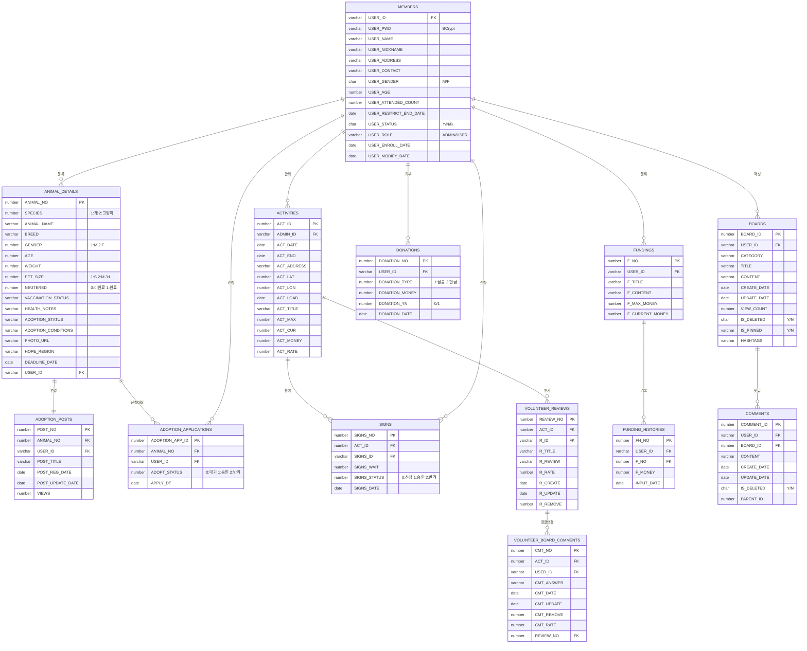
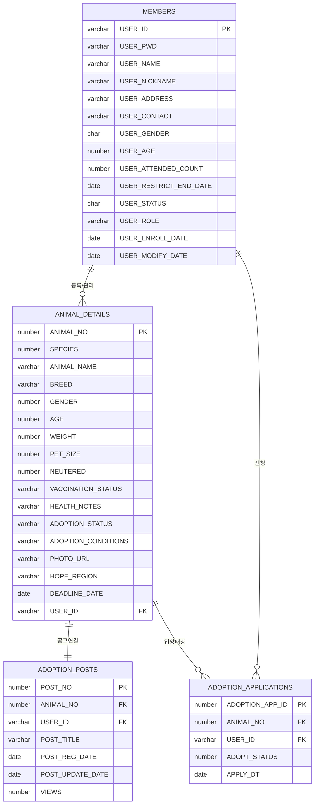
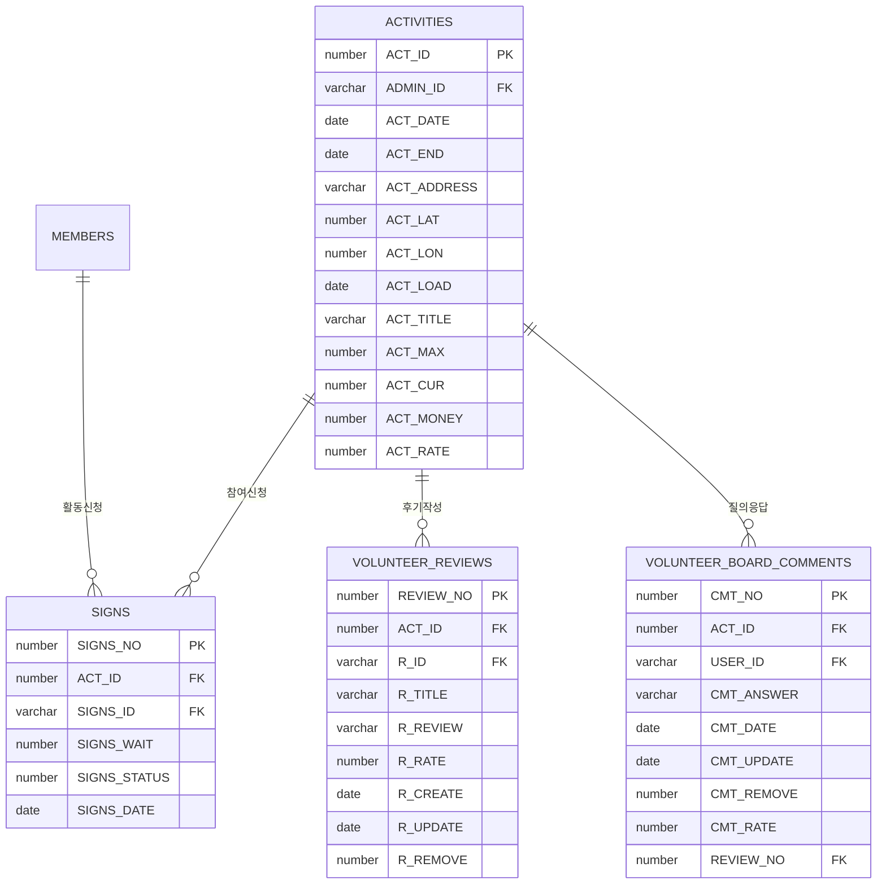
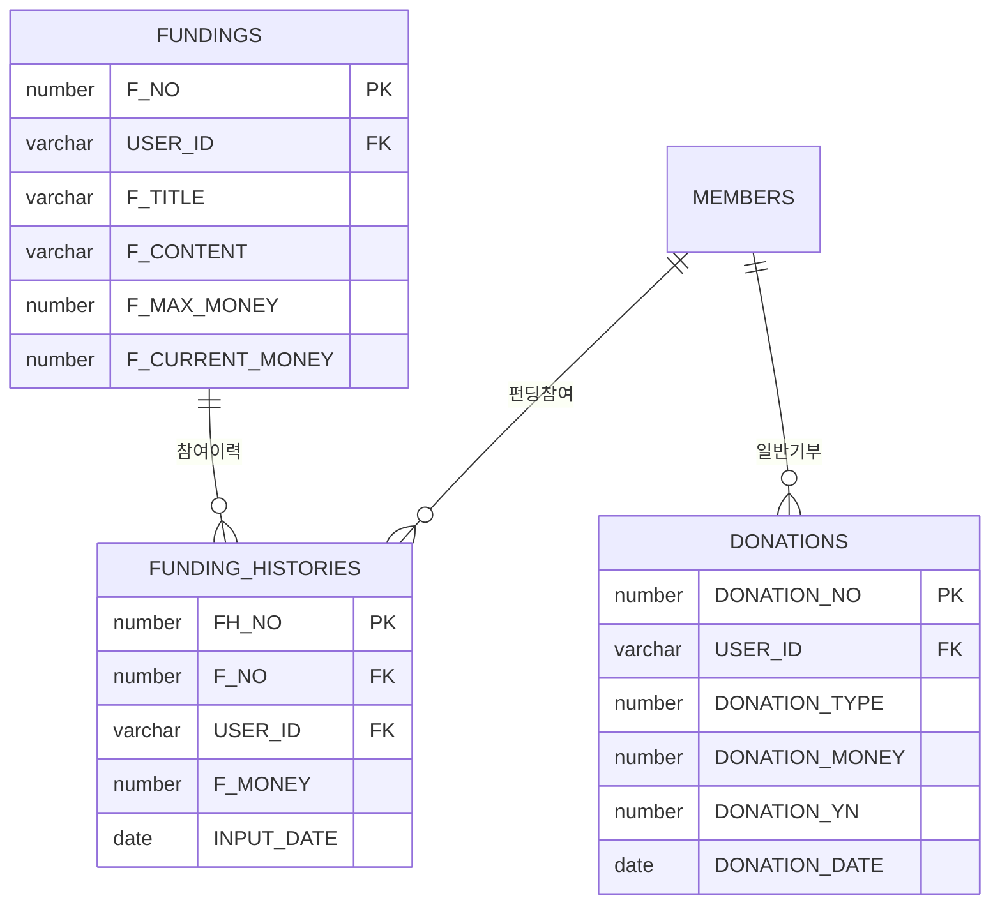
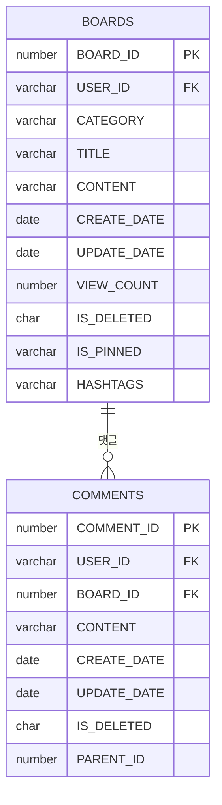
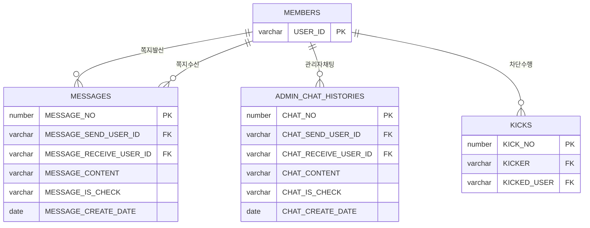

# 🗄️ UBIG 물리 데이터 모델링 명세 (ERD Specification)

> **데이터 무결성과 정합성 확보를 위한 물리 DB 설계 전략**  
> 이 문서는 유기동물 입양, 봉사, 펀딩 시스템의 모든 테이블(23개)과 상세 제약조건을 실제 DB 구현체(`init_db.sql`)와 100% 동일하게 정의하며, 데이터 정합성을 위한 논리/물리 설계 근거를 명세합니다.

---

## 📑 목차
1. [데이터 설계 및 정합성 유지 원칙](#-데이터-설계-및-정합성-유지-원칙-technical-note)
2. [전체 도메인 관계도 (Overview)](#1-전체-도메인-관계도-overview)
3. [도메인 계층 구조 (Hierarchy View)](#2-도메인-계층-구조-hierarchy-view)
4. [테이블 상세 명세 (Data Dictionary)](#3-테이블-상세-명세-data-dictionary)
5. [도메인별 분리 ERD (Domain Specific)](#4-도메인별-분리-erd-domain-specific)
6. [DB 성능 최적화 전략 (Performance Optimization)](#5-db-성능-최적화-전략-performance-optimization)

---

## 💡 데이터 설계 및 정합성 유지 원칙 (Technical Note)
- **한글 바이트 산정**: Oracle `AL32UTF8` 기준, 한글 1자당 **3바이트**를 할당하여 설계했습니다. (예: VARCHAR2(30) = 한글 10자 제한)
- **데이터 타입 최적화**: 상태 코드 및 카테고리는 조회 성능과 정합성을 위해 `NUMBER` 또는 `CHAR(1)` 타입을 우선 적용했습니다.
- **물리 구현 스크립트**: 실제 테이블 생성(DDL) 및 초기 데이터 삽입(DML) 구문은 [init_db.sql](./init_db.sql) 파일에서 확인할 수 있습니다.
- **Soft Delete**: 데이터 무결성 보존 및 이력 관리를 위해 `IS_DELETED` 또는 `CMT_REMOVE` 등 상태 컬럼을 활용한 논리 삭제 방식을 채택했습니다.

---

## 📊 1. 전체 도메인 관계도 (Overview)



---

## 🔄 2. 도메인 계층 구조 (Hierarchy View)

```text
MEMBERS (USER_ID)
  ├── ANIMAL_DETAILS (USER_ID)
  │     └── ADOPTION_POSTS (ANIMAL_NO)
  │           └── ADOPTION_APPLICATIONS (ANIMAL_NO)
  ├── ACTIVITIES (ADMIN_ID)
  │     ├── SIGNS (ACT_ID)
  │     ├── TAGS (ACT_ID) → TAG_INFOS
  │     ├── VOLUNTEER_REVIEWS (ACT_ID)
  │     └── VOLUNTEER_BOARD_COMMENTS (REVIEW_NO)
  ├── FUNDINGS (USER_ID)
  │     ├── FUNDING_HISTORIES (F_NO)
  │     └── DONATION_FILES (F_NO)
  ├── DONATIONS (USER_ID)
  ├── BOARDS (USER_ID)
  │     ├── COMMENTS (BOARD_ID)
  │     │     ├── COMMENT_ATTACHMENTS (COMMENT_ID)
  │     │     └── COMMENT_LIKES (COMMENT_ID)
  │     ├── BOARD_ATTACHMENTS (BOARD_ID)
  │     └── BOARD_LIKES (BOARD_ID)
  ├── MESSAGES (발신/수신)
  ├── ADMIN_CHAT_HISTORIES (발신/수신)
  └── KICKS (차단자/피차단자)
```

---

## 📋 3. 테이블 상세 명세 (Data Dictionary)

본 섹션은 `UBIG` 시스템의 데이터 무결성과 비즈니스 로직 최적화를 위해 설계된 **23개 전체 테이블**의 실제 `init_db.sql` 물리 명세와 100% 동기화된 정보입니다.

### 🔑 3.1 회원 및 보안 (Identity & Security)
| 테이블 | 컬럼명 | 데이터 타입 | 제약조건 | 기술적 설계 의도 및 비고 |
|---|---|---|---|---|
| **MEMBERS** | `USER_ID` | VARCHAR2(30) | PK | 회원 고유 아이디 |
| | `USER_PWD` | VARCHAR2(100) | NN | **BCrypt** 해시 암호화 비밀번호 |
| | `USER_NAME` | VARCHAR2(50) | NN | 회원의 실명 |
| | `USER_NICKNAME` | VARCHAR2(30) | NN | 커뮤니티 활동용 닉네임 |
| | `USER_ADDRESS` | VARCHAR2(200) | - | 회원 주소 정보 |
| | `USER_CONTACT` | VARCHAR2(20) | NN | 연락처 (010-XXXX-XXXX) |
| | `USER_GENDER` | VARCHAR2(1) | CHECK | `M`(남성), `F`(여성) |
| | `USER_AGE` | NUMBER | - | 회원 연령 |
| | `USER_ATTENDED_COUNT`| NUMBER | DEF 0 | 봉사활동 누적 참가 횟수 |
| | `USER_RESTRICT_END_DATE`| DATE | - | 정지 해제 일자 |
| | `USER_STATUS` | VARCHAR2(1) | DEF 'Y' | `Y`(활성), `N`(탈퇴), `B`(정지) |
| | `USER_ROLE` | VARCHAR2(10) | DEF 'USER'| `USER`, `ADMIN` 권한 체계 |
| | `USER_ENROLL_DATE` | DATE | DEF SYS | 가입 일자 |
| | `USER_MODIFY_DATE` | DATE | DEF SYS | 정보 수정 일자 |
| **KICKS** | `KICK_NO` | NUMBER | PK | 차단 이력 번호 |
| | `KICKER` | VARCHAR2(30) | FK | 차단 집행자 (MEMBERS.USER_ID) |
| | `KICKED_USER` | VARCHAR2(30) | FK | 차단 대상자 (MEMBERS.USER_ID) |

### 🐕 3.2 입양 및 동물 관리 (Adoption Domain)
| 테이블 | 컬럼명 | 데이터 타입 | 제약조건 | 기술적 설계 의도 및 비고 |
|---|---|---|---|---|
| **ANIMAL_DETAILS**| `ANIMAL_NO` | NUMBER | PK | 동물 고유 관리 번호 |
| | **`SPECIES`** | **NUMBER** | NN | 동물 종 (1:강아지, 2:고양이) |
| | `ANIMAL_NAME` | VARCHAR2(100) | NN | 동물의 이름 |
| | `BREED` | VARCHAR2(100) | NN | 품종 정보 |
| | **`GENDER`** | **NUMBER** | NN | 성별 (1:수컷, 2:암컷) |
| | `AGE` / `WEIGHT` | NUMBER | NN | 나이 및 체중 |
| | **`PET_SIZE`** | **NUMBER** | NN | 크기 (1:소형, 2:중형, 3:대형) |
| | **`NEUTERED`** | **NUMBER** | NN | 중성화 (0:미완료, 1:완료) |
| | `VACCINATION_STATUS`| VARCHAR2(1000)| - | 예방 접종 상태 상세 |
| | `HEALTH_NOTES` | VARCHAR2(1000)| - | 특이사항 및 건강 메모 |
| | `ADOPTION_STATUS`| VARCHAR2(10) | DEF '대기중'| 현재 입양 진행 상태 |
| | `ADOPTION_CONDITIONS`| VARCHAR2(1000)| - | 입양 조건 상세 |
| | `PHOTO_URL` | VARCHAR2(1000)| - | 동물 사진 파일 경로 |
| | `HOPE_REGION` | VARCHAR2(100) | - | 입양 희망 지역 |
| | `DEADLINE_DATE` | DATE | - | 입양 공고 마감 기한 |
| | `USER_ID` | VARCHAR2(30) | FK | 담당 관리자 ID |
| **ADOPTION_POSTS**| `POST_NO` | NUMBER | PK | 입양 공고 게시글 번호 |
| | `ANIMAL_NO` | NUMBER | FK | 동물 상세 참조 |
| | `USER_ID` | VARCHAR2(30) | FK | 작성 관리자 ID |
| | `POST_TITLE` | VARCHAR2(100) | NN | 공고 제목 |
| | `POST_REG_DATE` | DATE | NN | 등록일 |
| | `POST_UPDATE_DATE`| DATE | NN | 수정일 |
| | `VIEWS` | NUMBER | NN | 조회수 |
| **ADOPTION_APPLICATIONS**| `ADOPTION_APP_ID`| NUMBER | PK | 입양 신청 식별 번호 |
| | `ANIMAL_NO` | NUMBER | FK | 대상 동물 |
| | `USER_ID` | VARCHAR2(30) | FK | 신청 회원 |
| | **`ADOPT_STATUS`** | **NUMBER** | NN | 신청 상태 (0:대기, 1:승인, 2:반려) |
| | `APPLY_DT` | DATE | NN | 신청 날짜 |

### 🤝 3.3 봉사 및 활동 (Volunteer Domain)
| 테이블 | 컬럼명 | 데이터 타입 | 제약조건 | 기술적 설계 의도 및 비고 |
|---|---|---|---|---|
| **ACTIVITIES** | `ACT_ID` | NUMBER | PK | 봉사 프로그램 고유 번호 |
| | `ADMIN_ID` | VARCHAR2(30) | FK | 담당 관리자 |
| | `ACT_DATE` / `ACT_END`| DATE | NN | 활동 시작 및 종료 일시 |
| | `ACT_ADDRESS` | VARCHAR2(255) | NN | 활동 장소 주소 |
| | `ACT_LAT` / `ACT_LON`| NUMBER(10,7) | NN | 정밀 위도/경도 좌표 |
| | `ACT_LOAD` | DATE | NN | 게시 일자 |
| | `ACT_TITLE` | VARCHAR2(50) | NN | 프로그램 제목 |
| | `ACT_MAX` / `ACT_CUR`| NUMBER | NN | 모집 정원 및 현재 신청 인원 |
| | `ACT_MONEY` | NUMBER | NN | 활동 필요 후원금액 |
| | `ACT_RATE` | NUMBER | - | 활동 종료 후 평균 평점 |
| **SIGNS** | `SIGNS_NO` | NUMBER | PK | 봉사 신청 이력 번호 |
| | `ACT_ID` | NUMBER | FK | 프로그램 참조 |
| | `SIGNS_ID` | VARCHAR2(30) | FK | 신청 회원 ID |
| | `SIGNS_WAIT` | NUMBER | NN | 대기 순번 |
| | **`SIGNS_STATUS`** | **NUMBER** | NN | 신청 상태 (0:대기, 1:확정, 2:취소) |
| | `SIGNS_DATE` | DATE | NN | 신청 일자 |
| **VOLUNTEER_REVIEWS**| `REVIEW_NO` | NUMBER | PK | 활동 후기 번호 |
| | `ACT_ID` | NUMBER | FK | 대상 프로그램 |
| | `R_ID` | VARCHAR2(30) | FK | 작성 회원 |
| | `R_TITLE` | VARCHAR2(200) | - | 후기 제목 |
| | `R_REVIEW` | VARCHAR2(4000)| NN | 봉사활동 후기 본문 |
| | `R_RATE` | NUMBER | NN | 봉사 평점 (1~5점) |
| | `R_CREATE` / `R_UPDATE`| DATE | NN | 작성 및 수정 일자 |
| | `R_REMOVE` | NUMBER | NN | 삭제 여부 (0:정상, 1:삭제) |
| **VOLUNTEER_BOARD_COMMENTS**| `CMT_NO` | NUMBER | PK | 봉사 관련 질의/댓글 |
| | `ACT_ID` | NUMBER | FK | 프로그램 참조 |
| | `USER_ID` | VARCHAR2(30) | FK | 작성 회원 |
| | `CMT_ANSWER` | VARCHAR2(2000)| NN | 댓글 내용 |
| | `CMT_DATE` / `CMT_UPDATE`| DATE | NN | 작성 및 수정 일자 |
| | `CMT_REMOVE` | NUMBER | NN | 삭제 여부 (0:정상, 1:삭제) |
| | `CMT_RATE` | NUMBER | - | 댓글 추천/평점 |
| | `REVIEW_NO` | NUMBER | - | 연관 후기 번호 (연결용) |
| **TAGS** / **TAG_INFOS**| `TAG_ID` | NUMBER | PK | 활동 검색용 태그 정보 |

### 💰 3.4 후원 및 펀딩 (Funding Domain)
| 테이블 | 컬럼명 | 데이터 타입 | 제약조건 | 기술적 설계 의도 및 비고 |
|---|---|---|---|---|
| **FUNDINGS** | `F_NO` | NUMBER | PK | 펀딩 프로젝트 번호 |
| | `USER_ID` | VARCHAR2(30) | FK | 등록 회원 |
| | `F_TITLE` | VARCHAR2(30) | NN | 펀딩 제목 |
| | `F_CONTENT` | VARCHAR2(1000)| NN | 펀딩 상세 내용 |
| | `F_MAX_MONEY` | NUMBER | NN | 목표 금액 |
| | `F_CURRENT_MONEY`| NUMBER | NN | 현재 모금액 |
| **FUNDING_HISTORIES**| `FH_NO` | NUMBER | PK | 펀딩 참여 이력 번호 |
| | `USER_ID` | VARCHAR2(30) | FK | 참여 회원 |
| | `F_NO` | NUMBER | FK | 대상 펀딩 |
| | `F_MONEY` | NUMBER | NN | 참여 금액 |
| | `INPUT_DATE` | DATE | NN | 참여 일자 |
| **DONATIONS** | `DONATION_NO` | NUMBER | PK | 일반 기부 입금 번호 |
| | `USER_ID` | VARCHAR2(30) | FK | 기부 회원 |
| | **`DONATION_TYPE`** | **NUMBER** | NN | 기부 종류 (1:물품, 2:현금) |
| | `DONATION_MONEY`| NUMBER | NN | 기부 액수 |
| | **`DONATION_YN`** | **NUMBER** | NN | 신청 여부 (0/1) |
| | `DONATION_DATE` | DATE | NN | 입금 날짜 |
| **DONATION_FILES**| `FILE_ID` | NUMBER | PK | 증빙 파일 식별 번호 |
| | `F_NO` | NUMBER | FK | 연관 펀딩 번호 |

### 📝 3.5 커뮤니티 및 소통 (Community Domain)
| 테이블 | 컬럼명 | 데이터 타입 | 제약조건 | 기술적 설계 의도 및 비고 |
|---|---|---|---|---|
| **BOARDS** | `BOARD_ID` | NUMBER | PK | 게시글 고유 번호 |
| | `USER_ID` | VARCHAR2(30) | FK | 작성자 |
| | `CATEGORY` | VARCHAR2(50) | NN | 게시판 카테고리 |
| | `TITLE` | VARCHAR2(100) | NN | 제목 |
| | `CONTENT` | VARCHAR2(4000)| NN | 본문 |
| | `CREATE_DATE` / `UPDATE_DATE`| DATE | NN | 작성 및 수정일 |
| | `VIEW_COUNT` | NUMBER | NN | 조회수 |
| | `IS_DELETED` | CHAR(1) | NN | 삭제 여부 (Y/N) |
| | `IS_PINNED` | VARCHAR2(1) | DEF 'N' | 공지 고정 여부 (Y/N) |
| | `HASHTAGS` | VARCHAR2(1000)| - | 해시태그 합산 정보 |
| **COMMENTS** | `COMMENT_ID` | NUMBER | PK | 댓글 식별 번호 |
| | `USER_ID` | VARCHAR2(30) | FK | 작성자 |
| | `BOARD_ID` | NUMBER | FK | 대상 게시글 |
| | `CONTENT` | VARCHAR2(1000)| NN | 댓글 내용 |
| | `CREATE_DATE` / `UPDATE_DATE`| DATE | NN | 작성 및 수정일 |
| | `IS_DELETED` | CHAR(1) | NN | 삭제 여부 (Y/N) |
| | `PARENT_ID` | NUMBER | - | **Self-Join** 부모 댓글 ID |
| **BOARD_ATTACHMENTS**| `FILE_ID` | NUMBER | PK | 게시글 첨부 파일 |
| **BOARD_LIKES** | `LIKE_ID` | NUMBER | PK | 게시글 좋아요 이력 |
| **COMMENT_ATTACHMENTS**| `FILE_ID` | NUMBER | PK | 댓글 첨부 파일 |
| **COMMENT_LIKES**| `LIKE_ID` | NUMBER | PK | 댓글 좋아요 이력 |

### ✉️ 3.6 메시징 및 시스템 (Messaging & System)
| 테이블 | 컬럼명 | 데이터 타입 | 제약조건 | 기술적 설계 의도 및 비고 |
|---|---|---|---|---|
| **MESSAGES** | `MESSAGE_NO` | NUMBER | PK | 쪽지 고유 번호 |
| | `MESSAGE_SEND_USER_ID`| VARCHAR2(30) | NN | 쪽지 발신인 |
| | `MESSAGE_RECEIVE_USER_ID`| VARCHAR2(30) | NN | 쪽지 수신인 |
| | `MESSAGE_CONTENT`| VARCHAR2(200) | NN | 쪽지 본문 내용 |
| | `MESSAGE_IS_CHECK`| VARCHAR2(1) | NN | 확인 상태 (Y/N) |
| | `MESSAGE_CREATE_DATE`| DATE | NN | 발신 일자 |
| **ADMIN_CHAT_HISTORIES**| `CHAT_NO` | NUMBER | PK | 상담 채팅 내역 번호 |
| | `CHAT_SEND_USER_ID`| VARCHAR2(30) | NN | 채팅 발신인 |
| | `CHAT_RECEIVE_USER_ID`| VARCHAR2(30) | NN | 채팅 수신인 |
| | `CHAT_CONTENT` | VARCHAR2(200) | NN | 채팅 본문 내용 |
| | `CHAT_IS_CHECK` | VARCHAR2(1) | NN | 확인 상태 (Y/N) |
| | `CHAT_CREATE_DATE`| DATE | NN | 발신 일자 |

### 🏷️ 3.7 주요 시퀀스 정보 (Database Sequences)
- `SEQ_ACTIVITIES`: 봉사 프로그램 일련번호
- `SEQ_ADOPTION_APPS`: 입양 신청 관리 번호
- `SEQ_ANIMAL_DETAILS`: 동물 정보 고유 번호
- `SEQ_BOARDS` / `SEQ_COMMENTS`: 커뮤니티 식별 번호
- `SEQ_FUNDINGS` / `SEQ_FUNDING_HIS`: 펀딩 관리 번호
- `SEQ_SIGNS`: 봉사 신청 관리 번호
- `SEQ_MESSAGES` / `SEQ_ADMIN_CHAT`: 소통 기록 번호

---

## 🗂️ 4. 도메인별 분리 ERD (Domain Specific)

### 🐾 4.1 입양 도메인 (Adoption Core)


### 🤝 4.2 봉사 활동 도메인 (Volunteer Activity)


### 💰 4.3 후원 및 펀딩 도메인 (Donation & Funding)


### 📝 4.4 커뮤니티 도메인 (Community)


### ✉️ 4.5 메시징 및 시스템 (Messaging & System)


---

## ⚡ 5. DB 성능 최적화 전략 (Performance Optimization)

UBIG 프로젝트는 수천 마리의 유기동물 데이터와 복잡한 필터링 조건을 처리하기 위해 검색 성능과 데이터 무결성을 최우선으로 설계했습니다.

### 5.1 검색 성능 최적화 (Search Indexing)
- **복합 필터 인덱스 (`IDX_ANIMAL_SEARCH`)**: 유기동물 검색에서 가장 빈번하게 조합되는 `(SPECIES, ADOPTION_STATUS, ANIMAL_NO DESC)` 순으로 인덱스를 구성하여 조회 성능을 확보했습니다.
- **페이징 전용 인덱스**: 게시판(`BOARDS`)과 입양 공고(`ADOPTION_POSTS`) 테이블의 PK에 인덱스를 활용하여 최신 데이터 페이징 처리를 최적화했습니다.
- **회원 검색 인덱스**: `MEMBERS.USER_NICKNAME`에 고유 인덱스를 설정하여 회원 검색 및 중복 체크 시의 성능을 확보했습니다.

### 5.2 데이터 정합성 및 무결성 (Data Integrity)
- **비즈니스 상태 제약 조건**: `ADOPT_STATUS`, `USER_STATUS`, `GENDER` 등 도메인 범위를 DB 수준에서 `CHECK` 또는 `NUMBER` 코드화하여 잘못된 데이터 진입을 원천 차단했습니다.
- **참조 무결성 및 연쇄 삭제**: `ON DELETE CASCADE`를 봉사활동 신청(`SIGNS`), 입양 신청(`ADOPTION_APPS`) 등에 적용하여 데이터 정제 시 고아 레코드가 발생하지 않도록 설계했습니다.
- **Not Null 제약**: 서비스 운영에 필수적인 모든 수치 데이터와 날짜 데이터에 대해 엄격한 NOT NULL 조건을 적용하여 데이터 정합성을 확보했습니다.

### 5.3 쿼리 및 통계 최적화 (Query Strategy)
- **계층형 쿼리 최적화**: 댓글(`COMMENTS`) 테이블의 `PARENT_ID` 컬럼을 활용한 `START WITH ... CONNECT BY` 쿼리에 최적화된 인덱스를 구성하여 대규모 댓글도 효율적으로 처리합니다.
- **집계 데이터 처리**: 펀딩(`FUNDINGS`) 프로젝트의 실시간 모금액(`F_CURRENT_MONEY`)은 트랜잭션 단위로 관리하여 동시성 제어와 성능 사이의 균형을 맞췄습니다.

---

## 💡 설계 결정 근거 (Design Rationale)
- **Oracle AL32UTF8 활용**: 글로벌 표준 문자셋을 채택하여 한글 1자당 3바이트를 기준으로 물리 저장 공간을 산정함으로써 데이터 손실 가능성을 해결했습니다.
- **도메인 코드화**: 성별, 종, 크기 등의 정보를 `NUMBER` 타입의 코드로 관리함으로써 저장 공간을 절약하고 인덱스 스캔 효율을 극대화했습니다.
- **저장 효율화**: 상태 코드(`STATUS`)에는 `CHAR(1)` 또는 `NUMBER`를 사용하고 가변 텍스트에는 `VARCHAR2`를 적절히 배치하여 Oracle 블록 저장 효율을 극대화했습니다.
