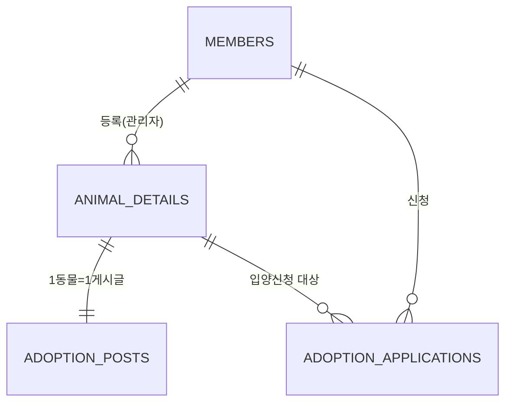
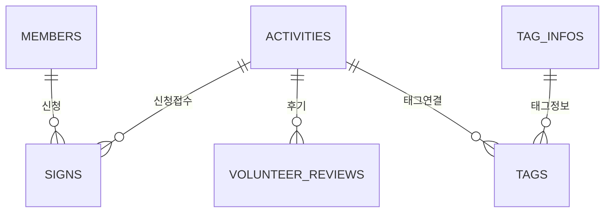
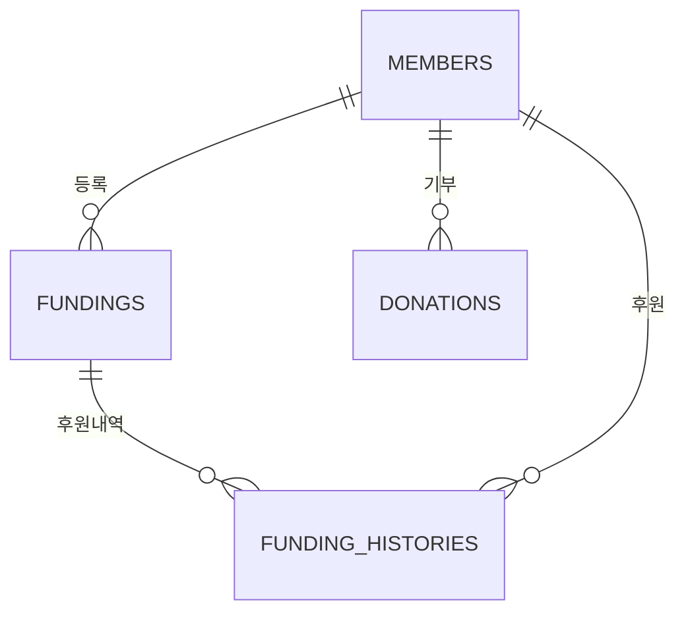
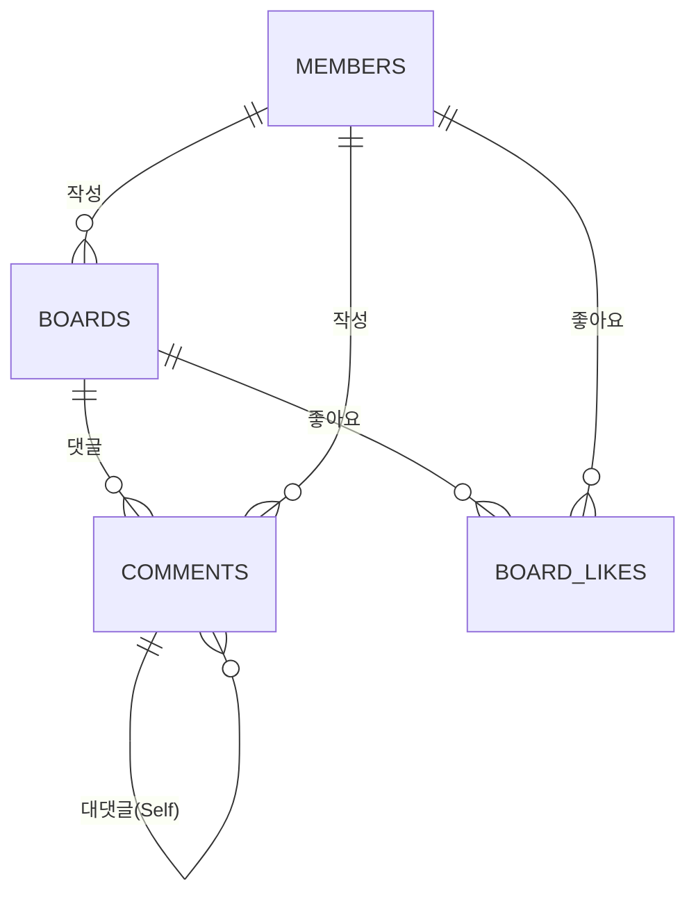

# UBIG 세미 프로젝트 ERD (Entity Relationship Diagram)

> **전체 아키텍처 다이어그램 및 도메인별 상세 설계 명세 통합본**  
> 이 문서는 시스템의 정적 데이터 구조와 각 테이블의 상세 제약조건을 통합하여 정의합니다.

---

## 💡 데이터 설계 및 정합성 유지 원칙 (Technical Note)
- **한글 바이트 산정**: Oracle `AL32UTF8` 기준, 한글 1자당 **3바이트**를 할당하여 설계했습니다. (예: VARCHAR2(30) = 한글 10자 제한)
- **CHAR vs VARCHAR2**: 상태 코드(`Y/N`) 등 길이가 고정된 플래그는 `CHAR(1)`을, 제목이나 내용 등 가변 데이터는 `VARCHAR2`를 사용해 공간 효율성을 높였습니다.
- **Soft Delete**: 데이터 무결성 보존 및 이력 관리를 위해 `IS_DELETED` 컬럼을 활용한 논리 삭제 방식을 채택했습니다.

---

## 📊 1. 전체 도메인 관계도 (Overview)

```mermaid
erDiagram

    %% ──────────────────────────
    %%  1. 회원 (Identity)
    %% ──────────────────────────
    MEMBERS {
        varchar USER_ID PK
        varchar USER_PWD
        varchar USER_NAME
        varchar USER_NICKNAME
        char    USER_GENDER
        number  USER_AGE
        char    USER_STATUS "Y:정상, N:탈퇴"
        varchar USER_ROLE "ADMIN, USER"
        date    USER_ENROLL_DATE
    }

    %% ──────────────────────────
    %%  2. 입양 (Adoption)
    %% ──────────────────────────
    ANIMAL_DETAILS {
        number  ANIMAL_NO PK
        number  SPECIES "1:개, 2:고양이"
        varchar ANIMAL_NAME
        varchar BREED
        number  GENDER
        number  PET_SIZE
        number  NEUTERED
        varchar ADOPTION_STATUS "대기중/완료"
        varchar USER_ID FK "등록자"
    }

    ADOPTION_POSTS {
        number  POST_NO PK
        number  ANIMAL_NO FK
        varchar USER_ID FK
        varchar POST_TITLE
        date    POST_REG_DATE
        number  VIEWS
    }

    ADOPTION_APPLICATIONS {
        number  ADOPTION_APP_ID PK
        number  ANIMAL_NO FK
        varchar USER_ID FK
        number  ADOPT_STATUS "0:대기, 1:승인, 2:반려"
        date    APPLY_DT
    }

    %% ──────────────────────────
    %%  3. 봉사활동 (Volunteer)
    %% ──────────────────────────
    ACTIVITIES {
        number  ACT_ID PK
        varchar ADMIN_ID FK
        varchar ACT_TITLE
        date    ACT_DATE
        number  ACT_MAX
        number  ACT_CUR
    }

    SIGNS {
        number  SIGNS_NO PK
        number  ACT_ID FK
        varchar SIGNS_ID FK
        number  SIGNS_STATUS "0:신청, 1:승인"
    }

    VOLUNTEER_REVIEWS {
        number  REVIEW_NO PK
        number  ACT_ID FK
        varchar R_ID FK
        varchar R_TITLE
        number  R_RATE
    }

    TAGS {
        number TAG_NO PK
        number ACT_ID FK
        number TAG_ID FK
    }

    TAG_INFOS {
        number TAG_ID PK
        varchar TAG_NAME
    }

    %% ──────────────────────────
    %%  4. 펀딩/기부 (Funding)
    %% ──────────────────────────
    FUNDINGS {
        number  F_NO PK
        varchar USER_ID FK
        varchar F_TITLE
        number  F_MAX_MONEY
        number  F_CURRENT_MONEY
    }

    FUNDING_HISTORIES {
        number  FH_NO PK
        varchar USER_ID FK
        number  F_NO FK
        number  F_MONEY
        date    INPUT_DATE
    }

    DONATIONS {
        number  DONATION_NO PK
        varchar USER_ID FK
        number  DONATION_MONEY
        date    DONATION_DATE
    }

    %% ──────────────────────────
    %%  5. 커뮤니티 (Community)
    %% ──────────────────────────
    BOARDS {
        number  BOARD_ID PK
        varchar USER_ID FK
        varchar CATEGORY
        varchar TITLE
        char    IS_DELETED "Y/N"
    }

    COMMENTS {
        number  COMMENT_ID PK
        varchar USER_ID FK
        number  BOARD_ID FK
        number  PARENT_ID "대댓글용"
    }

    BOARD_LIKES {
        number  LIKE_ID PK
        number  BOARD_ID FK
        varchar USER_ID FK
    }

    %% ══════════════════════════
    %%  관계 정의 (Relationships)
    %% ══════════════════════════

    MEMBERS ||--o{ ANIMAL_DETAILS : "등록"
    ANIMAL_DETAILS ||--|| ADOPTION_POSTS : "연결"
    ANIMAL_DETAILS ||--o{ ADOPTION_APPLICATIONS : "신청대상"
    MEMBERS ||--o{ ADOPTION_APPLICATIONS : "신청"
    
    MEMBERS ||--o{ ACTIVITIES : "관리"
    ACTIVITIES ||--o{ SIGNS : "신청"
    MEMBERS ||--o{ SIGNS : "신청"
    ACTIVITIES ||--o{ VOLUNTEER_REVIEWS : "후기"
    ACTIVITIES ||--o{ TAGS : "태그"
    TAG_INFOS ||--o{ TAGS : "정보"

    MEMBERS ||--o{ FUNDINGS : "등록"
    FUNDINGS ||--o{ FUNDING_HISTORIES : "기록"
    MEMBERS ||--o{ DONATIONS : "기부"

    MEMBERS ||--o{ BOARDS : "작성"
    BOARDS ||--o{ COMMENTS : "댓글"
    BOARDS ||--o{ BOARD_LIKES : "좋아요"
```



---

## 🔄 2. 도메인 계층 구조 (Hierarchy View)

```text
MEMBERS (USER_ID)
  ├── ANIMAL_DETAILS (USER_ID)
  │     └── ADOPTION_POSTS (ANIMAL_NO)
  │           └── ADOPTION_APPLICATIONS (ANIMAL_NO)
  ├── ACTIVITIES (ADMIN_ID)
  │     ├── SIGNS (ACT_ID)
  │     ├── TAGS (ACT_ID) → TAG_INFOS
  │     └── VOLUNTEER_REVIEWS (ACT_ID)
  ├── FUNDINGS (USER_ID)
  │     └── FUNDING_HISTORIES (F_NO)
  ├── DONATIONS (USER_ID)
  └── BOARDS (USER_ID)
        ├── COMMENTS (BOARD_ID)
        └── BOARD_LIKES (BOARD_ID)
```

---

## 📋 3. 테이블 상세 명세 (Data Dictionary)

### 🔑 주요 컬럼 제약사항
| 테이블 | 컬럼 | 타입 | 허용값 / 비고 |
|---|---|---|---|
| `MEMBERS` | `USER_STATUS` | VARCHAR2(1) | `'Y'`=정상, `'N'`=탈퇴 |
| `MEMBERS` | `USER_ROLE` | VARCHAR2(10) | `'ADMIN'` / `'USER'` |
| `MEMBERS` | `USER_PWD` | VARCHAR2(100) | BCrypt 암호화 필수 |
| `ANIMAL_DETAILS` | `ADOPTION_STATUS` | VARCHAR2(10) | `대기중`, `신청중`, `완료`, `마감` |
| `BOARDS` | `IS_DELETED` | CHAR(1) | `Y`(삭제됨), `N`(정상) |
| `SIGNS` | `SIGNS_STATUS` | NUMBER | `0`=신청, `1`=승인, `2`=거절 |

### 🏷️ 시퀀스(Sequence) 목록
| 시퀀스명 | 용도 | 시퀀스명 | 용도 |
|---|---|---|---|
| `SEQ_ACTIVITIES` | 활동 ID | `SEQ_ANIMAL_DETAILS` | 동물 ID |
| `SEQ_ADOPTION_APPS` | 입양 신청 ID | `SEQ_BOARDS` | 게시글 ID |
| `SEQ_COMMENTS` | 댓글 ID | `SEQ_FUNDINGS` | 펀딩 ID |
| `SEQ_SIGNS` | 봉사 신청 ID | `SEQ_MESSAGES` | 메시지 ID |

---

## 🗂️ 4. 도메인별 분리 ERD (Domain Specific)

### 🐾 4.1 입양 도메인 (Adoption Core)
> 유저와 동물을 연결하는 핵심 비즈니스 로직이 집중된 도메인입니다.



### 🌱 4.2 봉사활동 도메인 (Volunteer)
> 프로그램 모집부터 참여 신청, 후기 관리 및 태그 시스템을 포함합니다.



### 💰 4.3 펀딩/기부 도메인 (Funding)
> 프로젝트 기반 후원과 일반 기부 내역을 원자적으로 관리합니다.



### 📝 4.4 커뮤니티 도메인 (Community)
> 게시글, 계층형 댓글, 좋아요 기능이 유기적으로 연동됩니다.



---

## ⚡ 5. DB 성능 최적화 전략 (Index Strategy)

| 분류 | 대상 테이블 | 대상 컬럼 | 기대 효과 |
|---|---|---|---|
| **외래키 조인** | `ADOPTION_POSTS` | `ANIMAL_NO` | 게시글-동물 간 조인 성능 향상 |
| **상태 필터링** | `ANIMAL_DETAILS` | `ADOPTION_STATUS` | 목록 필터링 속도 개선 |
| **사용자 기반 조회** | `ADOPTION_APPLICATIONS` | `USER_ID` | 신청 내역 조회 최적화 |
| **정렬/페이징** | `BOARDS` | `CREATE_DATE` | 최신글 조회 성능 향상 |
