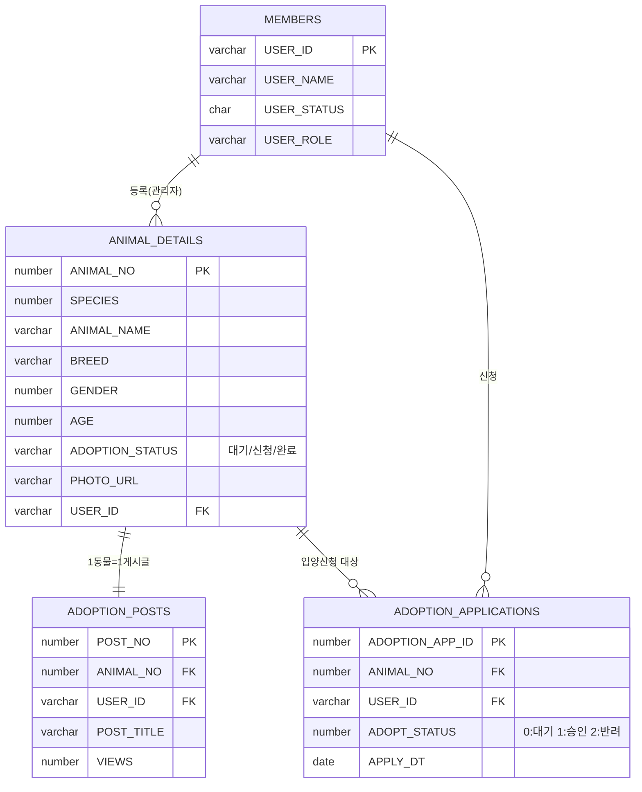
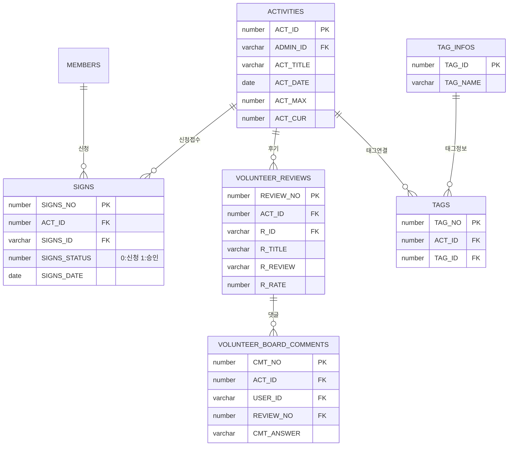
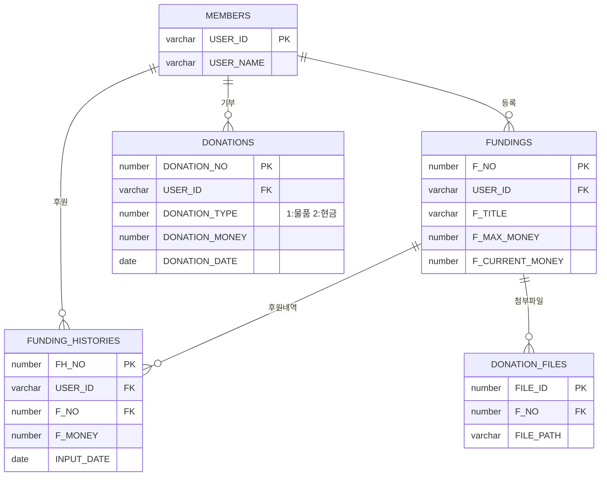
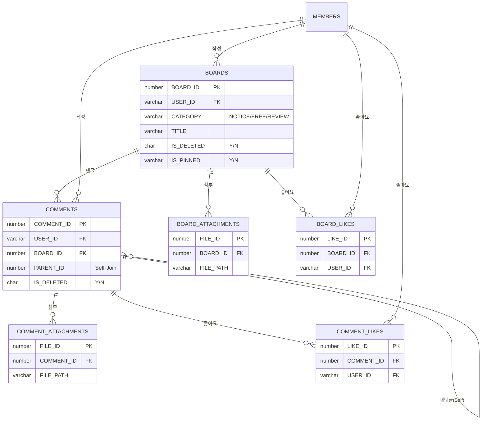

# UBIG 세미 프로젝트 ERD (Entity Relationship Diagram)

> **전체 아키텍처 다이어그램 및 도메인별 상세 설계 명세 통합본**  
> 이 문서는 유기동물 입양, 봉사, 펀딩 시스템의 모든 테이블(23개)과 상세 제약조건을 실제 DB와 100% 동일하게 정의합니다.

---

## 📑 목차
1. [데이터 설계 및 정합성 유지 원칙](#-데이터-설계-및-정합성-유지-원칙-technical-note)
2. [전체 도메인 관계도 (Overview)](#1-전체-도메인-관계도-overview)
3. [도메인 계층 구조 (Hierarchy View)](#2-도메인-계층-구조-hierarchy-view)
4. [테이블 상세 명세 (Data Dictionary)](#3-테이블-상세-명세-data-dictionary)
5. [도메인별 분리 ERD (Domain Specific)](#4-도메인별-분리-erd-domain-specific)
6. [DB 성능 최적화 전략 (Index Strategy)](#5-db-성능-최적화-전략-index-strategy)

---

## 💡 데이터 설계 및 정합성 유지 원칙 (Technical Note)
- **한글 바이트 산정**: Oracle `AL32UTF8` 기준, 한글 1자당 **3바이트**를 할당하여 설계했습니다. (예: VARCHAR2(30) = 한글 10자 제한)
- **CHAR vs VARCHAR2**: 상태 코드(`Y/N`) 등 길이가 고정된 플래그는 `CHAR(1)`을, 제목이나 내용 등 가변 데이터는 `VARCHAR2`를 사용해 공간 효율성을 높였습니다.
- **Soft Delete**: 데이터 무결성 보존 및 이력 관리를 위해 `IS_DELETED` 컬럼을 활용한 논리 삭제 방식을 채택했습니다.

---

## 📊 1. 전체 도메인 관계도 (Overview)

```mermaid
erDiagram
    %% ──────────────────────────
    %%  1. 회원 및 보안 (Identity)
    %% ──────────────────────────
    MEMBERS {
        varchar USER_ID PK
        varchar USER_PWD "BCrypt 암호화"
        varchar USER_NAME
        varchar USER_NICKNAME
        varchar USER_ADDRESS
        varchar USER_CONTACT
        char    USER_GENDER "M/F"
        number  USER_AGE
        number  USER_ATTENDED_COUNT
        date    USER_RESTRICT_END_DATE
        char    USER_STATUS "Y:정상 N:탈퇴 B:차단"
        varchar USER_ROLE "ADMIN/USER"
        date    USER_ENROLL_DATE
    }

    %% ──────────────────────────
    %%  2. 입양 관리 (Adoption)
    %% ──────────────────────────
    ANIMAL_DETAILS {
        number  ANIMAL_NO PK
        number  SPECIES "1:개 2:고양이"
        varchar ANIMAL_NAME
        varchar BREED
        number  GENDER "1:M 2:F"
        number  AGE
        number  WEIGHT
        number  PET_SIZE "1:S 2:M 3:L"
        number  NEUTERED "0:미완료 1:완료"
        varchar ADOPTION_STATUS "대기/신청/완료/마감"
        varchar PHOTO_URL
        varchar USER_ID FK "등록자"
    }

    ADOPTION_POSTS {
        number  POST_NO PK
        number  ANIMAL_NO FK
        varchar USER_ID FK
        varchar POST_TITLE
        date    POST_REG_DATE
        date    POST_UPDATE_DATE
        number  VIEWS
    }

    ADOPTION_APPLICATIONS {
        number  ADOPTION_APP_ID PK
        number  ANIMAL_NO FK
        varchar USER_ID FK
        number  ADOPT_STATUS "0:대기 1:승인 2:반려 3:확정"
        date    APPLY_DT
    }

    %% ──────────────────────────
    %%  3. 봉사활동 (Volunteer)
    %% ──────────────────────────
    ACTIVITIES {
        number  ACT_ID PK
        varchar ADMIN_ID FK
        date    ACT_DATE
        date    ACT_END
        varchar ACT_ADDRESS
        varchar ACT_TITLE
        number  ACT_MAX
        number  ACT_CUR
        number  ACT_RATE
    }

    SIGNS {
        number  SIGNS_NO PK
        number  ACT_ID FK
        varchar SIGNS_ID FK
        number  SIGNS_STATUS "0:신청 1:승인 2:반려"
        date    SIGNS_DATE
    }

    VOLUNTEER_REVIEWS {
        number  REVIEW_NO PK
        number  ACT_ID FK
        varchar R_ID FK
        varchar R_TITLE
        varchar R_REVIEW
        number  R_RATE
        date    R_CREATE
    }

    VOLUNTEER_BOARD_COMMENTS {
        number  CMT_NO PK
        number  ACT_ID FK
        varchar USER_ID FK
        number  REVIEW_NO FK
        varchar CMT_ANSWER
        date    CMT_DATE
    }

    TAGS {
        number TAG_NO PK
        number ACT_ID FK
        number TAG_ID FK
    }

    TAG_INFOS {
        number TAG_ID PK
        varchar TAG_NAME
    }

    %% ──────────────────────────
    %%  4. 펀딩 및 기부 (Funding)
    %% ──────────────────────────
    FUNDINGS {
        number  F_NO PK
        varchar USER_ID FK
        varchar F_TITLE
        varchar F_CONTENT
        number  F_MAX_MONEY
        number  F_CURRENT_MONEY
    }

    FUNDING_HISTORIES {
        number  FH_NO PK
        varchar USER_ID FK
        number  F_NO FK
        number  F_MONEY
        date    INPUT_DATE
    }

    DONATION_FILES {
        number  FILE_ID PK
        number  F_NO FK
        varchar FILE_PATH
    }

    DONATIONS {
        number  DONATION_NO PK
        varchar USER_ID FK
        number  DONATION_TYPE "1:물품 2:현금"
        number  DONATION_MONEY
        date    DONATION_DATE
    }

    %% ──────────────────────────
    %%  5. 커뮤니티 (Community)
    %% ──────────────────────────
    BOARDS {
        number  BOARD_ID PK
        varchar USER_ID FK
        varchar CATEGORY
        varchar TITLE
        varchar CONTENT
        number  VIEW_COUNT
        char    IS_DELETED "Y/N"
        varchar IS_PINNED "Y/N"
        date    CREATE_DATE
    }

    COMMENTS {
        number  COMMENT_ID PK
        varchar USER_ID FK
        number  BOARD_ID FK
        number  PARENT_ID "Self-Join"
        varchar CONTENT
        char    IS_DELETED "Y/N"
        date    CREATE_DATE
    }

    BOARD_ATTACHMENTS {
        number  FILE_ID PK
        number  BOARD_ID FK
        varchar FILE_PATH
    }

    BOARD_LIKES {
        number  LIKE_ID PK
        number  BOARD_ID FK
        varchar USER_ID FK
    }

    COMMENT_ATTACHMENTS {
        number  FILE_ID PK
        number  COMMENT_ID FK
        varchar FILE_PATH
    }

    COMMENT_LIKES {
        number  LIKE_ID PK
        number  COMMENT_ID FK
        varchar USER_ID FK
    }

    %% ──────────────────────────
    %%  6. 메시징 및 시스템 (System)
    %% ──────────────────────────
    MESSAGES {
        number  MESSAGE_NO PK
        varchar MESSAGE_SEND_USER_ID FK
        varchar MESSAGE_RECEIVE_USER_ID FK
        varchar MESSAGE_CONTENT
        varchar MESSAGE_IS_CHECK "Y/N"
        date    MESSAGE_CREATE_DATE
    }

    ADMIN_CHAT_HISTORIES {
        number  CHAT_NO PK
        varchar CHAT_SEND_USER_ID FK
        varchar CHAT_RECEIVE_USER_ID FK
        varchar CHAT_CONTENT
        date    CHAT_CREATE_DATE
    }

    KICKS {
        number  KICK_NO PK
        varchar KICKER FK
        varchar KICKED_USER FK
    }

    %% ══════════════════════════
    %%  관계 정의 (Full Logical)
    %% ══════════════════════════

    MEMBERS ||--o{ ANIMAL_DETAILS : "등록"
    ANIMAL_DETAILS ||--|| ADOPTION_POSTS : "연결"
    ANIMAL_DETAILS ||--o{ ADOPTION_APPLICATIONS : "신청대상"
    MEMBERS ||--o{ ADOPTION_APPLICATIONS : "신청"
    
    MEMBERS ||--o{ ACTIVITIES : "관리"
    ACTIVITIES ||--o{ SIGNS : "신청"
    MEMBERS ||--o{ SIGNS : "신청"
    ACTIVITIES ||--o{ VOLUNTEER_REVIEWS : "후기"
    VOLUNTEER_REVIEWS ||--o{ VOLUNTEER_BOARD_COMMENTS : "댓글연결"
    ACTIVITIES ||--o{ TAGS : "태그"
    TAG_INFOS ||--o{ TAGS : "정보"

    MEMBERS ||--o{ FUNDINGS : "등록"
    FUNDINGS ||--o{ FUNDING_HISTORIES : "기록"
    FUNDINGS ||--o{ DONATION_FILES : "첨부"
    MEMBERS ||--o{ DONATIONS : "기부"

    MEMBERS ||--o{ BOARDS : "작성"
    BOARDS ||--o{ COMMENTS : "댓글"
    BOARDS ||--o{ BOARD_ATTACHMENTS : "파일"
    BOARDS ||--o{ BOARD_LIKES : "좋아요"
    COMMENTS ||--o{ COMMENT_ATTACHMENTS : "파일"
    COMMENTS ||--o{ COMMENT_LIKES : "좋아요"
    COMMENTS ||--o{ COMMENTS : "대댓글(Self)"

    MEMBERS ||--o{ MESSAGES : "쪽지"
    MEMBERS ||--o{ ADMIN_CHAT_HISTORIES : "채팅"
    MEMBERS ||--o{ KICKS : "차단"
```



---

## 🔄 2. 도메인 계층 구조 (Hierarchy View)

```text
MEMBERS (USER_ID)
  ├── ANIMAL_DETAILS (USER_ID)
  │     └── ADOPTION_POSTS (ANIMAL_NO)
  │           └── ADOPTION_APPLICATIONS (ANIMAL_NO)
  ├── ACTIVITIES (ADMIN_ID)
  │     ├── SIGNS (ACT_ID)
  │     ├── TAGS (ACT_ID) → TAG_INFOS
  │     ├── VOLUNTEER_REVIEWS (ACT_ID)
  │     └── VOLUNTEER_BOARD_COMMENTS (REVIEW_NO)
  ├── FUNDINGS (USER_ID)
  │     ├── FUNDING_HISTORIES (F_NO)
  │     └── DONATION_FILES (F_NO)
  ├── DONATIONS (USER_ID)
  ├── BOARDS (USER_ID)
  │     ├── COMMENTS (BOARD_ID)
  │     │     ├── COMMENT_ATTACHMENTS (COMMENT_ID)
  │     │     └── COMMENT_LIKES (COMMENT_ID)
  │     ├── BOARD_ATTACHMENTS (BOARD_ID)
  │     └── BOARD_LIKES (BOARD_ID)
  ├── MESSAGES (발신/수신)
  ├── ADMIN_CHAT_HISTORIES (발신/수신)
  └── KICKS (차단자/피차단자)
```

---

## 📋 3. 테이블 상세 명세 (Data Dictionary)

### 🔑 주요 컬럼 제약사항
| 테이블 | 컬럼 | 타입 | 제약조건 | 설명 / 비고 |
|---|---|---|---|---|
| `MEMBERS` | `USER_PWD` | VARCHAR2(100) | NN | **BCrypt** 10 rounds 암호화 필수 |
| `MEMBERS` | `USER_STATUS` | VARCHAR2(1) | DEFAULT 'Y' | `'Y'`=정상, `'N'`=탈퇴, `'B'`=차단 |
| `MEMBERS` | `USER_ROLE` | VARCHAR2(10) | NN | `'ADMIN'` / `'USER'` 권한 등급 |
| `ANIMAL_DETAILS` | `ADOPTION_STATUS` | VARCHAR2(10) | NN | `대기중`, `신청중`, `완료`, `마감` |
| `BOARDS` | `IS_DELETED` | CHAR(1) | DEFAULT 'N' | `Y`(삭제됨), `N`(정상) Soft Delete |
| `SIGNS` | `SIGNS_STATUS` | NUMBER | DEFAULT 0 | `0`=신청, `1`=승인, `2`=거절 |

### 🏷️ 시퀀스(Sequence) 목록
| 시퀀스명 | 적용 테이블.컬럼 | 시퀀스명 | 적용 테이블.컬럼 |
|---|---|---|---|
| `SEQ_ACTIVITIES` | ACTIVITIES.ACT_ID | `SEQ_ANIMAL_DETAILS` | ANIMAL_DETAILS.ANIMAL_NO |
| `SEQ_ADOPTION_APPS` | ADOPTION_APPLICATIONS.ID | `SEQ_BOARDS` | BOARDS.BOARD_ID |
| `SEQ_COMMENTS` | COMMENTS.COMMENT_ID | `SEQ_FUNDINGS` | FUNDINGS.F_NO |
| `SEQ_MESSAGES` | MESSAGES.MESSAGE_NO | `SEQ_SIGNS` | SIGNS.SIGNS_NO |

---

## 🗂️ 4. 도메인별 분리 ERD (Domain Specific)

### 🐾 4.1 입양 도메인 (Adoption Core)


### 🌱 4.2 봉사활동 도메인 (Volunteer)


### 💰 4.3 펀딩/기부 도메인 (Funding)


### 📝 4.4 커뮤니티 도메인 (Community)


---

## ⚡ 5. 물리 설계 및 데이터 정합성 전략 (Physical Design & Integrity)

본 시스템은 데이터의 **무결성(Integrity)**과 **보안성(Security)**을 최우선으로 하며, 실제 DB 스크립트에 구현된 물리 설계의 핵심 전략은 다음과 같습니다.

### 5.1 데이터 이력 관리 및 조회 최적화 (Tracking & Search)
실제 물리 스크립트에 반영된 이력 관리 방식은 다음과 같습니다.
- **PK 자동 인덱싱**: 모든 테이블의 Primary Key(`USER_ID`, `BOARD_ID` 등)에 대해 고유 인덱스가 자동 생성되어 검색 성능을 보장합니다.
- **시계열 데이터 추적**: 잦은 상태 변경이 발생하는 **커뮤니티(`BOARDS`)와 입양 게시글(`ADOPTION_POSTS`)** 등 주요 게시글 기반 테이블에 등록일 및 수정일 컬럼을 배치하여 최신 데이터 조회 성능을 보조합니다.

### 5.2 데이터 정합성 보장 (Data Integrity)
- **물리적 외래키(FK) 결속**: 도메인 간의 관계를 실제 DB 레벨의 FK로 정의하여 **물리적인 데이터 고아 현상**을 방지합니다. 다만, 소프트 딜리트가 적용된 테이블의 경우 애플리케이션 로직을 통해 논리적 정합성을 추가로 관리합니다.
- **NOT NULL 제약 조건**: 시스템 구동에 필수적인 핵심 데이터의 누락을 방지하기 위해 엄격한 NOT NULL 제약조건을 적용하여 데이터 품질을 높였습니다.

### 5.3 보안 및 관리 전략 (Security & Management)
- **민감 데이터 암호화**: `MEMBERS.USER_PWD` 등 보안이 중요한 컬럼은 **BCrypt 암호화**를 전제로 설계하여 물리적 보안성을 확보했습니다.
- **Soft Delete (부분 적용)**: 커뮤니티 테이블 등 데이터 보존이 필요한 영역은 `IS_DELETED` 컬럼을 활용한 논리 삭제 방식을 채택하여 실제 스크립트에 반영했습니다.

---

### 💡 설계 결정 근거 (Design Rationale)
- **저장 효율화**: 상태 플래그(`Y/N`)에는 `CHAR(1)`을 사용하고 가변 텍스트에는 `VARCHAR2`를 사용하여 스토리지 낭비를 최소화했습니다.
- **바이트 산정**: `AL32UTF8` 문자셋을 고려하여 한글 1글자당 3바이트를 기준으로 길이를 산정, 데이터 잘림 현상을 프로토타입 단계에서 해결했습니다.
- **확장성**: 모든 PK에 시퀀스(`SEQUENCE`)를 적용하여 대량의 데이터 삽입 시에도 고유성 충돌 없이 안정적인 확장이 가능합니다.
