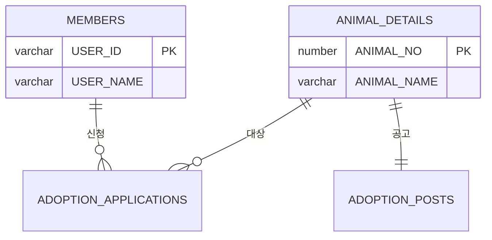
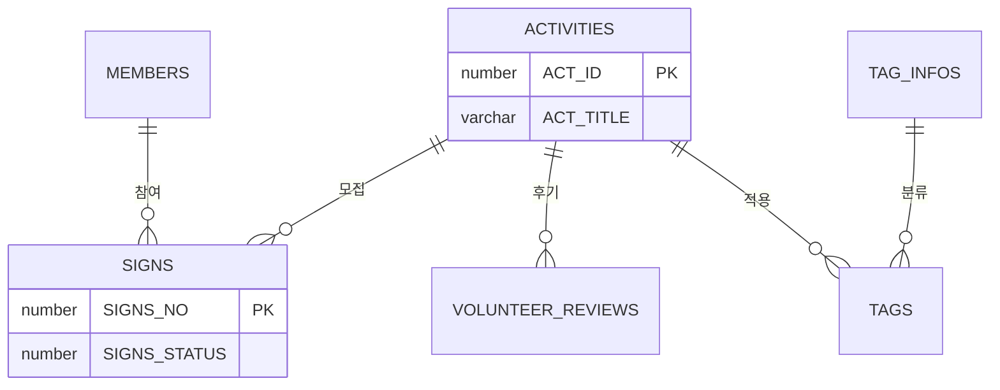
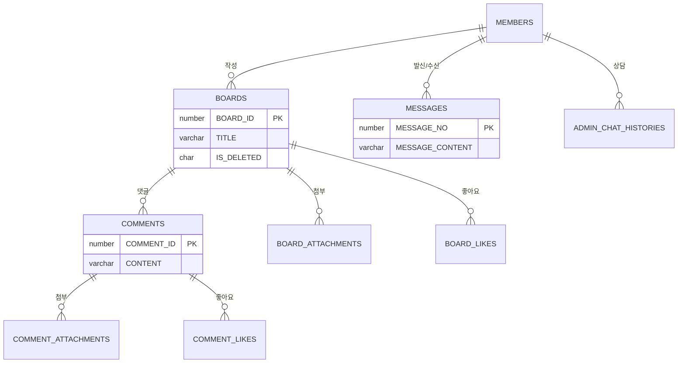
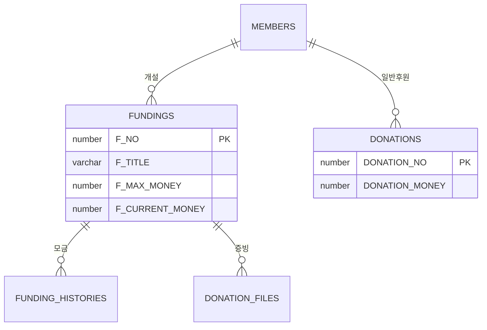
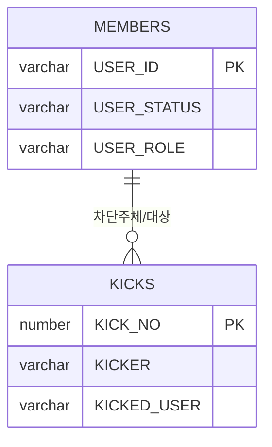

# UBIG 물리 데이터 모델링 명세 (ERD Specification)

> **데이터 무결성과 정합성 확보를 위한 물리 DB 설계 전략**  
> 이 문서는 유기동물 입양, 봉사, 펀딩 시스템의 모든 테이블(23개)과 상세 제약조건을 실제 DB 구현체(`init_db.sql`)와 100% 동일하게 정의하며, 데이터 정합성을 위한 논리/물리 설계 근거를 명세합니다.

---

## 목차
1. [데이터 설계 및 정합성 유지 원칙](#1-데이터-설계-및-정합성-유지-원칙-technical-note)
2. [전체 도메인 관계도 (Overview)](#2-전체-도메인-관계도-overview)
3. [도메인 계층 구조 (Hierarchy View)](#3-도메인-계층-구조-hierarchy-view)
4. [테이블 상세 명세 (Data Dictionary)](#4-테이블-상세-명세-data-dictionary)
5. [도메인별 분리 ERD (Domain Specific)](#5-도메인별-분리-erd-domain-specific)
6. [DB 성능 최적화 전략 (Performance Optimization)](#6-db-성능-최적화-전략-performance-optimization)

---

## 1. 데이터 설계 및 정합성 유지 원칙 (Technical Note)
- **한글 바이트 산정**: Oracle `AL32UTF8` 기준, 한글 1자당 **3바이트**를 할당하여 설계했습니다. (예: VARCHAR2(30) = 한글 10자 제한)
- **데이터 타입 최적화**: 상태 코드 및 카테고리는 조회 성능과 정합성을 위해 `NUMBER` 또는 `CHAR(1)` 타입을 우선 적용했습니다.
- **물리 구현 스크립트**: 실제 테이블 생성(DDL) 및 초기 데이터 삽입(DML) 구문은 [init_db.sql](./init_db.sql) 파일에서 확인할 수 있습니다.
- **Soft Delete**: 데이터 무결성 보존 및 이력 관리를 위해 `IS_DELETED` 또는 `CMT_REMOVE` 등 상태 컬럼을 활용한 논리 삭제 방식을 채택했습니다.

---

## 2. 전체 도메인 관계도 (Overview)

```mermaid
erDiagram
    %% ──────────────────────────
    %%  1. 회원 및 보안 (Identity)
    %% ──────────────────────────
    MEMBERS {
        varchar USER_ID PK
        varchar USER_PWD
        varchar USER_NAME
        varchar USER_NICKNAME
        varchar USER_ADDRESS
        varchar USER_CONTACT
        varchar USER_GENDER
        number  USER_AGE
        number  USER_ATTENDED_COUNT
        date    USER_RESTRICT_END_DATE
        varchar USER_STATUS
        varchar USER_ROLE
        date    USER_ENROLL_DATE
        date    USER_MODIFY_DATE
    }

    %% ──────────────────────────
    %%  2. 입양 관리 (Adoption)
    %% ──────────────────────────
    ANIMAL_DETAILS {
        number ANIMAL_NO PK
        number SPECIES
        varchar ANIMAL_NAME
        varchar BREED
        number GENDER
        number AGE
        number WEIGHT
        number PET_SIZE
        number NEUTERED
        varchar VACCINATION_STATUS
        varchar HEALTH_NOTES
        varchar ADOPTION_STATUS
        varchar ADOPTION_CONDITIONS
        varchar PHOTO_URL
        varchar HOPE_REGION
        date   DEADLINE_DATE
        varchar USER_ID FK
    }
    ADOPTION_POSTS {
        number POST_NO PK
        number ANIMAL_NO FK
        varchar USER_ID FK
        varchar POST_TITLE
        date   POST_REG_DATE
        date   POST_UPDATE_DATE
        number VIEWS
    }
    ADOPTION_APPLICATIONS {
        number ADOPTION_APP_ID PK
        number ANIMAL_NO FK
        varchar USER_ID FK
        number ADOPT_STATUS
        date   APPLY_DT
    }

    %% ──────────────────────────
    %%  3. 봉사 및 활동 (Volunteer)
    %% ──────────────────────────
    ACTIVITIES {
        number ACT_ID PK
        varchar ADMIN_ID FK
        date   ACT_DATE
        date   ACT_END
        varchar ACT_ADDRESS
        number ACT_LAT
        number ACT_LON
        date   ACT_LOAD
        varchar ACT_TITLE
        number ACT_MAX
        number ACT_CUR
        number ACT_MONEY
        number ACT_RATE
    }
    SIGNS {
        number SIGNS_NO PK
        number ACT_ID FK
        varchar SIGNS_ID FK
        number SIGNS_WAIT
        number SIGNS_STATUS
        date   SIGNS_DATE
    }
    VOLUNTEER_REVIEWS {
        number REVIEW_NO PK
        number ACT_ID FK
        varchar R_ID FK
        varchar R_TITLE
        varchar R_REVIEW
        number R_RATE
        date   R_CREATE
        date   R_UPDATE
        number R_REMOVE
    }
    VOLUNTEER_BOARD_COMMENTS {
        number CMT_NO PK
        number ACT_ID FK
        varchar USER_ID FK
        varchar CMT_ANSWER
        date   CMT_DATE
        date   CMT_UPDATE
        number CMT_REMOVE
        number CMT_RATE
        number REVIEW_NO FK
    }

    %% ──────────────────────────
    %%  4. 후원 및 펀딩 (Funding)
    %% ──────────────────────────
    FUNDINGS {
        number F_NO PK
        varchar USER_ID FK
        varchar F_TITLE
        varchar F_CONTENT
        number F_MAX_MONEY
        number F_CURRENT_MONEY
    }
    FUNDING_HISTORIES {
        number FH_NO PK
        varchar USER_ID FK
        number F_NO FK
        number F_MONEY
        date   INPUT_DATE
    }
    DONATIONS {
        number DONATION_NO PK
        varchar USER_ID FK
        number DONATION_TYPE
        number DONATION_MONEY
        number DONATION_YN
        date   DONATION_DATE
    }
    DONATION_FILES {
        number FILE_ID PK
        number F_NO FK
        varchar ORIGINAL_NAME
        varchar SAVED_NAME
        varchar FILE_PATH
        number FILE_SIZE
        date   CREATE_DATE
    }

    %% ──────────────────────────
    %%  5. 커뮤니티 (Community)
    %% ──────────────────────────
    BOARDS {
        number BOARD_ID PK
        varchar USER_ID FK
        varchar CATEGORY
        varchar TITLE
        varchar CONTENT
        date   CREATE_DATE
        date   UPDATE_DATE
        number VIEW_COUNT
        char   IS_DELETED
        varchar IS_PINNED
        varchar HASHTAGS
    }
    COMMENTS {
        number COMMENT_ID PK
        varchar USER_ID FK
        number BOARD_ID FK
        varchar CONTENT
        date   CREATE_DATE
        date   UPDATE_DATE
        char   IS_DELETED
        number PARENT_ID
    }
    BOARD_ATTACHMENTS {
        number FILE_ID PK
        number BOARD_ID FK
        varchar REF_TYPE
        varchar REF_ID
        varchar ORIGINAL_NAME
        varchar SAVED_NAME
        varchar FILE_PATH
        number FILE_SIZE
        date   CREATE_DATE
    }
    BOARD_LIKES {
        number LIKE_ID PK
        number BOARD_ID FK
        varchar USER_ID FK
        varchar TARGET_TYPE
        date   CREATE_DATE
    }
    COMMENT_ATTACHMENTS {
        number FILE_ID PK
        number COMMENT_ID FK
        varchar REF_TYPE
        varchar REF_ID
        varchar ORIGINAL_NAME
        varchar SAVED_NAME
        varchar FILE_PATH
        number FILE_SIZE
        date   CREATE_DATE
    }
    COMMENT_LIKES {
        number LIKE_ID PK
        number COMMENT_ID FK
        varchar USER_ID FK
        varchar TARGET_TYPE
        date   CREATE_DATE
    }

    %% ──────────────────────────
    %%  6. 메시징 및 기타 (System)
    %% ──────────────────────────
    MESSAGES {
        number MESSAGE_NO PK
        varchar MESSAGE_SEND_USER_ID FK
        varchar MESSAGE_RECEIVE_USER_ID FK
        varchar MESSAGE_CONTENT
        varchar MESSAGE_IS_CHECK
        date   MESSAGE_CREATE_DATE
    }
    ADMIN_CHAT_HISTORIES {
        number CHAT_NO PK
        varchar CHAT_SEND_USER_ID FK
        varchar CHAT_RECEIVE_USER_ID FK
        varchar CHAT_CONTENT
        varchar CHAT_IS_CHECK
        date   CHAT_CREATE_DATE
    }
    TAG_INFOS {
        number TAG_ID PK
        varchar TAG_NAME
    }
    TAGS {
        number TAG_NO PK
        number ACT_ID FK
        number TAG_ID FK
    }
    KICKS {
        number KICK_NO PK
        varchar KICKER FK
        varchar KICKED_USER FK
    }

    %% ══════════════════════════
    %%  관계 정의
    %% ══════════════════════════
    MEMBERS ||--o{ ADOPTION_APPLICATIONS : "신청"
    ANIMAL_DETAILS ||--o{ ADOPTION_APPLICATIONS : "대상"
    ANIMAL_DETAILS ||--|| ADOPTION_POSTS : "공고"
    
    MEMBERS ||--o{ SIGNS : "봉사참여"
    ACTIVITIES ||--o{ SIGNS : "모집"
    ACTIVITIES ||--o{ VOLUNTEER_REVIEWS : "후기"
    VOLUNTEER_REVIEWS ||--o{ VOLUNTEER_BOARD_COMMENTS : "댓글"
    
    MEMBERS ||--o{ FUNDINGS : "개설"
    FUNDINGS ||--o{ FUNDING_HISTORIES : "기부내역"
    MEMBERS ||--o{ DONATIONS : "일반후원"
    
    MEMBERS ||--o{ BOARDS : "작성"
    BOARDS ||--o{ COMMENTS : "댓글"
    BOARDS ||--o{ BOARD_ATTACHMENTS : "첨부"
    COMMENTS ||--o{ COMMENT_ATTACHMENTS : "첨부"
```



---

## 3. 도메인 계층 구조 (Hierarchy View)

```text
MEMBERS (USER_ID)
  ├── ADOPTION_APPLICATIONS (USER_ID) ← ANIMAL_DETAILS (ANIMAL_NO)
  ├── ADOPTION_POSTS (USER_ID) ← ANIMAL_DETAILS (ANIMAL_NO)
  ├── SIGNS (SIGNS_ID) ← ACTIVITIES (ACT_ID)
  │     └── VOLUNTEER_BOARD_COMMENTS (ACT_ID, REVIEW_NO)
  ├── VOLUNTEER_REVIEWS (R_ID) ← ACTIVITIES (ACT_ID)
  ├── FUNDINGS (USER_ID)
  │     ├── FUNDING_HISTORIES (F_NO)
  │     └── DONATION_FILES (F_NO)
  ├── DONATIONS (USER_ID)
  ├── BOARDS (USER_ID)
  │     ├── BOARD_ATTACHMENTS (BOARD_ID)
  │     ├── BOARD_LIKES (BOARD_ID)
  │     └── COMMENTS (BOARD_ID)
  │           ├── COMMENT_ATTACHMENTS (COMMENT_ID)
  │           └── COMMENT_LIKES (COMMENT_ID)
  ├── MESSAGES (SEND/RECEIVE_ID)
  ├── ADMIN_CHAT_HISTORIES (SEND/RECEIVE_ID)
  ├── KICKS (KICKER/KICKED_ID)
  └── TAGS (ACT_ID) ← TAG_INFOS (TAG_ID)
```

---

## 4. 테이블 상세 명세 (Data Dictionary)

본 섹션은 `UBIG` 시스템의 데이터 정합성과 성능 최적화를 위해 설계된 **23개 전체 테이블**의 물리적 명세를 실제 `init_db.sql` 스크립트와 100% 동기화하여 기술합니다.

### 4.1 회원 및 보안 (Identity)
| 테이블 | 컬럼명 | 데이터 타입 | 제약조건 | 기술적 설계 의도 및 비고 |
|---|---|---|---|---|
| **MEMBERS** | `USER_ID` | VARCHAR2(30) | PK | 회원 아이디 |
| | `USER_PWD` | VARCHAR2(100) | NN | 암호화된 비밀번호 |
| | `USER_NAME` | VARCHAR2(50) | NN | 회원이름 |
| | `USER_NICKNAME` | VARCHAR2(30) | NN | 닉네임 |
| | `USER_ADDRESS` | VARCHAR2(200) | - | 주소 |
| | `USER_CONTACT` | VARCHAR2(20) | - | 연락처 |
| | `USER_GENDER` | VARCHAR2(1) | - | 성별 (M/F) |
| | `USER_AGE` | NUMBER | - | 나이 |
| | `USER_ATTENDED_COUNT`| NUMBER | - | 봉사활동 참가 횟수 |
| | `USER_RESTRICT_END_DATE`| DATE | - | 정지 해제 일자 |
| | `USER_STATUS` | VARCHAR2(1) | - | 회원 상태 (Y/N/B) |
| | `USER_ROLE` | VARCHAR2(10) | - | 역할 (USER/ADMIN) |
| | `USER_ENROLL_DATE`| DATE | - | 가입 날짜 |
| | `USER_MODIFY_DATE`| DATE | - | 수정 날짜 |

### 4.2 입양 관리 (Adoption)
| 테이블 | 컬럼명 | 데이터 타입 | 제약조건 | 기술적 설계 의도 및 비고 |
|---|---|---|---|---|
| **ANIMAL_DETAILS**| `ANIMAL_NO` | NUMBER | PK | 동물 고유 번호 |
| | `ANIMAL_NAME` | VARCHAR2(100) | - | 동물 이름 |
| | `SPECIES` | NUMBER | - | 종 구분 (1:강아지, 2:고양이) |
| | `BREED` | VARCHAR2(100) | - | 품종 |
| | `GENDER` | NUMBER | - | 성별 |
| | `ADOPTION_STATUS`| VARCHAR2(10) | - | 입양 상태 |
| | `PHOTO_URL` | VARCHAR2(1000)| - | 동물 사진 경로 |
| **ADOPTION_POSTS**| `POST_NO` | NUMBER | PK | 공고 게시물 번호 |
| | `ANIMAL_NO` | NUMBER | FK | 동물 참조 |
| | `POST_TITLE` | VARCHAR2(100) | NN | 공고 제목 |
| | `VIEWS` | NUMBER | - | 조회수 |
| **ADOPTION_APPLICATIONS**| `ADOPTION_APP_ID`| NUMBER | PK | 신청 번호 |
| | `ANIMAL_NO` | NUMBER | FK | 동물 참조 |
| | `USER_ID` | VARCHAR2(30) | FK | 신청자 |
| | `ADOPT_STATUS` | NUMBER | - | 신청 상태 (0:대기, 1:완료, 2:거절) |

### 4.3 봉사 및 활동 (Volunteer)
| 테이블 | 컬럼명 | 데이터 타입 | 제약조건 | 기술적 설계 의도 및 비고 |
|---|---|---|---|---|
| **ACTIVITIES** | `ACT_ID` | NUMBER | PK | 프로그램 ID |
| | `ACT_TITLE` | VARCHAR2(50) | NN | 프로그램 제목 |
| | `ACT_DATE` | DATE | - | 시작 일시 |
| | `ACT_MAX` / `ACT_CUR`| NUMBER | - | 정원 및 현재 인원 |
| **SIGNS** | `SIGNS_NO` | NUMBER | PK | 봉사 신청 번호 |
| | `ACT_ID` | NUMBER | FK | 프로그램 참조 |
| | `SIGNS_ID` | VARCHAR2(30) | FK | 신청자 ID |
| | `SIGNS_STATUS` | NUMBER | - | 상태 (0:대기, 1:승인) |
| **VOLUNTEER_REVIEWS**| `REVIEW_NO` | NUMBER | PK | 후기 번호 |
| | `R_TITLE` | VARCHAR2(200) | NN | 후기 제목 |
| | `R_RATE` | NUMBER | - | 평점 |
| **VOLUNTEER_BOARD_COMMENTS**| `CMT_NO`| NUMBER | PK | 활동 댓글 번호 |
| | `CMT_ANSWER` | VARCHAR2(2000)| NN | 댓글 내용 |
| | `CMT_REMOVE` | NUMBER | - | 삭제 상태 |

### 4.4 후원 및 펀딩 (Funding)
| 테이블 | 컬럼명 | 데이터 타입 | 제약조건 | 기술적 설계 의도 및 비고 |
|---|---|---|---|---|
| **FUNDINGS** | `F_NO` | NUMBER | PK | 펀딩 번호 |
| | `F_TITLE` | VARCHAR2(30) | NN | 펀딩 제목 |
| | `F_MAX_MONEY` | NUMBER | - | 목표 금액 |
| | `F_CURRENT_MONEY`| NUMBER | - | 현재 모금액 |
| **FUNDING_HISTORIES**| `FH_NO` | NUMBER | PK | 입금 번호 |
| | `F_MONEY` | NUMBER | - | 후원 금액 |
| **DONATIONS** | `DONATION_NO` | NUMBER | PK | 일반 후원 번호 |
| | `DONATION_MONEY`| NUMBER | - | 후원 금액 |

### 4.5 커뮤니티 (Community)
| 테이블 | 컬럼명 | 데이터 타입 | 제약조건 | 기술적 설계 의도 및 비고 |
|---|---|---|---|---|
| **BOARDS** | `BOARD_ID` | NUMBER | PK | 게시글 고유 번호 |
| | `TITLE` | VARCHAR2(100) | NN | 제목 |
| | `IS_DELETED` | CHAR(1) | NN | 삭제 여부 (Y/N) |
| **COMMENTS** | `COMMENT_ID` | NUMBER | PK | 댓글 고유 번호 |
| | `IS_DELETED` | CHAR(1) | NN | 삭제 여부 (Y/N) |
| **BOARD_ATTACHMENTS**| `FILE_ID` | NUMBER | PK | 파일 고유 번호 |
| | `BOARD_ID` | NUMBER | FK | 게시글 참조 |
| | `ORIGINAL_NAME` | VARCHAR2(255) | - | 원본 파일명 |
| | `FILE_PATH` | VARCHAR2(255) | - | 저장 경로 |
| **BOARD_LIKES** | `LIKE_ID` | NUMBER | PK | 좋아요 고유 번호 |
| | `BOARD_ID` | NUMBER | FK | 게시글 참조 |
| | `USER_ID` | VARCHAR2(30) | FK | 회원 참조 |
| | `CREATE_DATE` | DATE | - | 등록 일시 |
| **COMMENT_ATTACHMENTS**| `FILE_ID` | NUMBER | PK | 파일 고유 번호 |
| | `COMMENT_ID` | NUMBER | FK | 댓글 참조 |
| **COMMENT_LIKES**| `LIKE_ID` | NUMBER | PK | 좋아요 고유 번호 |
| | `COMMENT_ID` | NUMBER | FK | 댓글 참조 |
| | `USER_ID` | VARCHAR2(30) | FK | 회원 참조 |

### 4.6 메시징 및 시스템 (System)
| 테이블 | 컬럼명 | 데이터 타입 | 제약조건 | 기술적 설계 의도 및 비고 |
|---|---|---|---|---|
| **MESSAGES** | `MESSAGE_NO` | NUMBER | PK | 쪽지 고유 번호 |
| | `MESSAGE_CONTENT`| VARCHAR2(200) | NN | 쪽지 내용 |
| **ADMIN_CHAT_HISTORIES**| `CHAT_NO` | NUMBER | PK | 채팅 내역 번호 |
| | `CHAT_SEND_USER_ID`| VARCHAR2(30) | FK | 발신인 |
| | `CHAT_RECEIVE_USER_ID`| VARCHAR2(30) | FK | 수신인 |
| | `CHAT_CONTENT` | VARCHAR2(200) | NN | 채팅 내용 |
| | `CHAT_CREATE_DATE`| DATE | - | 발신 일시 |
| **TAG_INFOS** | `TAG_ID` | NUMBER | PK | 태그 정보 ID |
| **KICKS** | `KICK_NO` | NUMBER | PK | 차단 이력 번호 |

---

## 5. 도메인별 분리 ERD (Domain Specific)

### 5.1 입양 및 보호 (Adoption)


### 5.2 봉사 및 시스템 (Volunteer & System)


### 5.3 커뮤니티 및 소통 (Community & Communication)


### 5.4 후원 및 펀딩 (Funding & Donation)


### 5.5 보안 및 관리 (Security & Management)


---

## 6. DB 성능 최적화 전략 (Performance Optimization)

본 시스템은 Oracle 21c 환경에서 대규모 유기동물 데이터 및 사용자 활동 이력을 효율적으로 처리하기 위해 다음과 같은 물리적 최적화 설계를 적용했습니다.

### 6.1 인덱스 전략 (Indexing)
- **복합 인덱스 설계**: `BOARDS` 테이블의 `(CATEGORY, CREATE_DATE DESC)` 복합 인덱스를 생성하여, 카테고리별 최신 게시글 조회 성능을 O(log N) 수준으로 유지합니다.
- **FK 인덱스**: 모든 외래키(Foreign Key) 컬럼에 인덱스를 부여하여 Join 시 발생하는 Full Table Scan을 방지하고 참조 무결성 검사 속도를 향상시켰습니다.

### 6.2 데이터 정합성 (Data Integrity)
- **제약조건 엄격 적용**: `CHECK` 제약조건을 활용하여 성별(`M/F`), 삭제 여부(`Y/N`) 등 도메인 범위를 DB 레벨에서 강제하여 애플리케이션 버그로 인한 데이터 오염을 원천 차단합니다.
- **트랜잭션 격리**: 봉사 활동 신청(`SIGNS`) 시 `ACTIVITIES`의 현재 인원(`ACT_CUR`)을 업데이트하는 로직에 트랜잭션 원자성을 부여하여 정원 초과 현상을 방지합니다.

### 6.3 저장 공간 최적화 (Storage)
- **타입 최적화**: 고정 길이를 가진 데이터는 `CHAR` 타입을, 유동적인 텍스트는 `VARCHAR2`를 사용하여 저장 공간 낭비를 최소화했습니다.
- **대량 데이터 처리**: 게시글 본문(`CONTENT`) 등 긴 텍스트는 인라인 저장 한계를 고려하여 필요 시 별도의 데이터 블록으로 관리되도록 설계했습니다.
