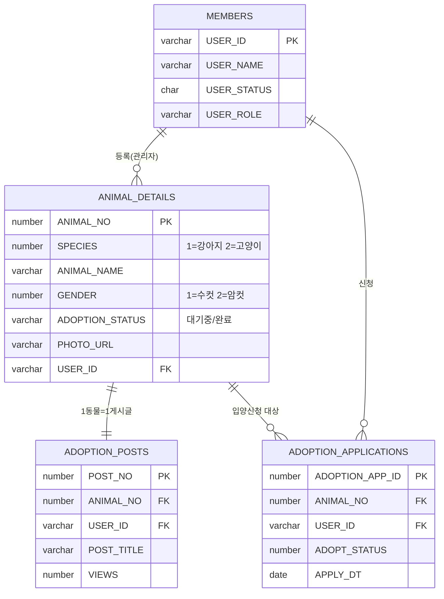
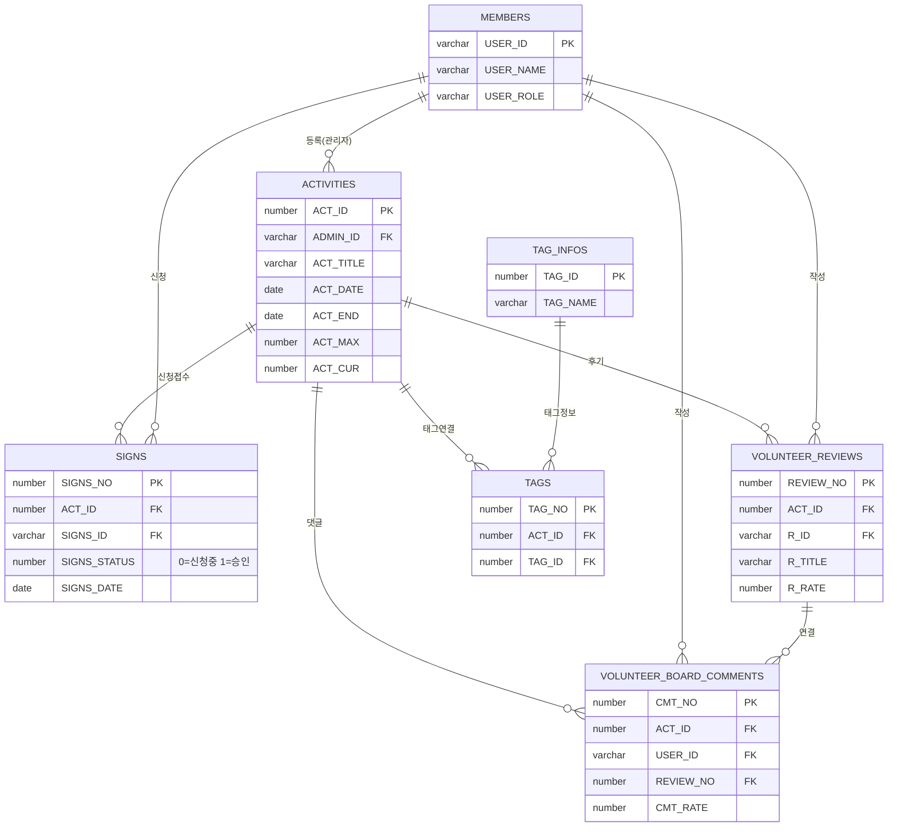
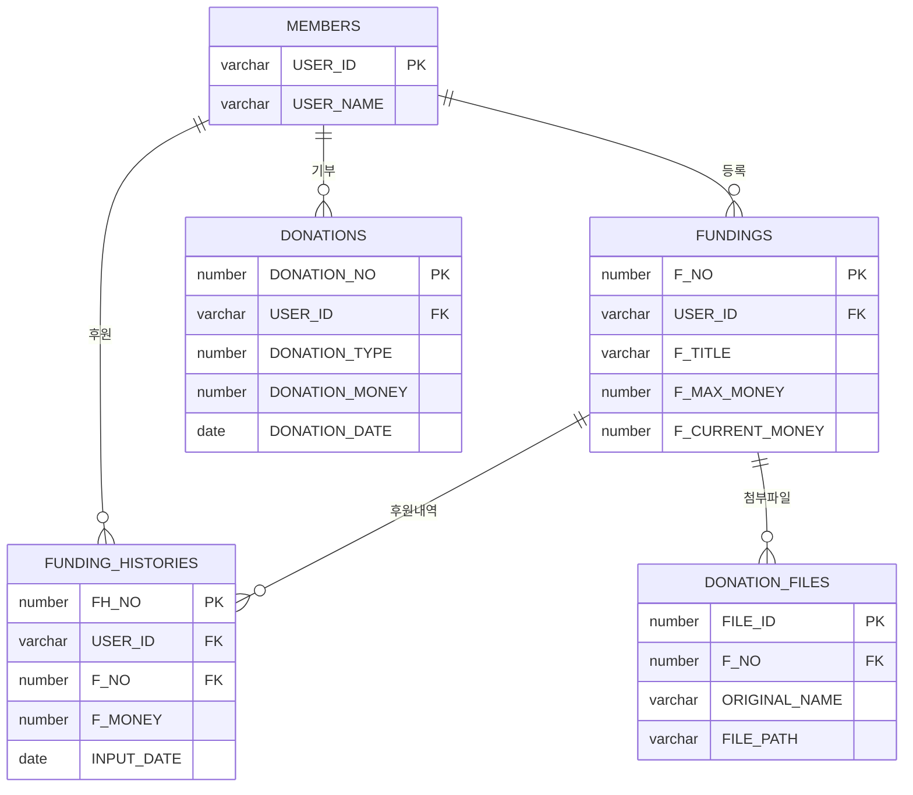
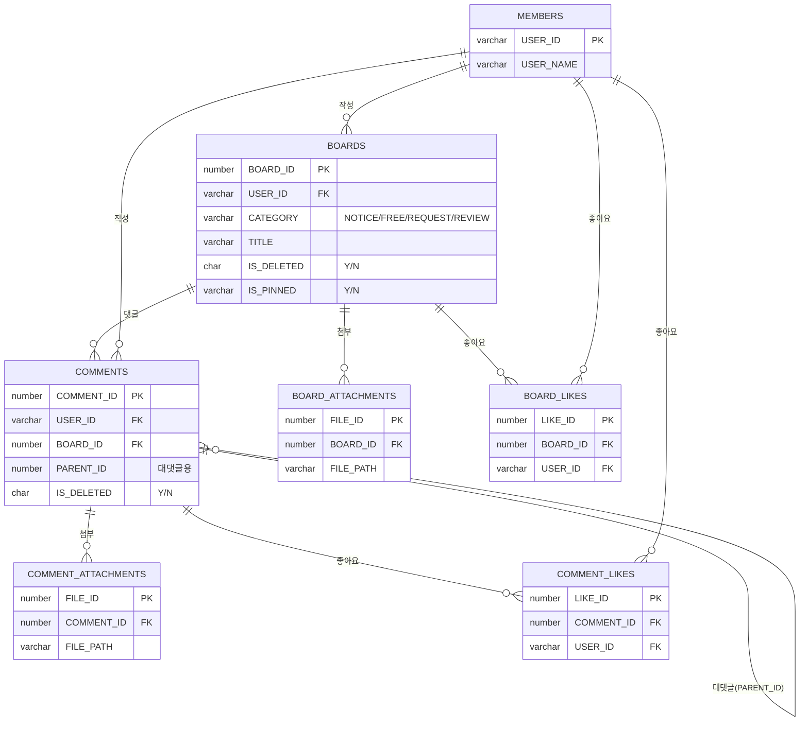

# UBIG 세미 프로젝트 ERD

> Mermaid 문법으로 작성  
> 보는 방법: VS Code(Mermaid 확장) / GitHub / Obsidian / [mermaid.live](https://mermaid.live) 에 붙여넣기

---

```mermaid
erDiagram

    %% ──────────────────────────
    %%  회원
    %% ──────────────────────────
    MEMBERS {
        varchar USER_ID PK
        varchar USER_PWD
        varchar USER_NAME
        varchar USER_NICKNAME
        varchar USER_ADDRESS
        varchar USER_CONTACT
        char    USER_GENDER
        number  USER_AGE
        number  USER_ATTENDED_COUNT
        date    USER_RESTRICT_END_DATE
        char    USER_STATUS
        varchar USER_ROLE
        date    USER_ENROLL_DATE
        date    USER_MODIFY_DATE
    }

    %% ──────────────────────────
    %%  입양
    %% ──────────────────────────
    ANIMAL_DETAILS {
        number  ANIMAL_NO PK
        number  SPECIES
        varchar ANIMAL_NAME
        varchar BREED
        number  GENDER
        number  AGE
        number  WEIGHT
        number  PET_SIZE
        number  NEUTERED
        varchar VACCINATION_STATUS
        varchar HEALTH_NOTES
        varchar ADOPTION_STATUS
        varchar ADOPTION_CONDITIONS
        varchar PHOTO_URL
        varchar HOPE_REGION
        date    DEADLINE_DATE
        varchar USER_ID FK
    }

    ADOPTION_POSTS {
        number  POST_NO PK
        number  ANIMAL_NO FK
        varchar USER_ID FK
        varchar POST_TITLE
        date    POST_REG_DATE
        date    POST_UPDATE_DATE
        number  VIEWS
    }

    ADOPTION_APPLICATIONS {
        number  ADOPTION_APP_ID PK
        number  ANIMAL_NO FK
        varchar USER_ID FK
        number  ADOPT_STATUS
        date    APPLY_DT
    }

    %% ──────────────────────────
    %%  봉사활동
    %% ──────────────────────────
    ACTIVITIES {
        number  ACT_ID PK
        varchar ADMIN_ID FK
        date    ACT_DATE
        date    ACT_END
        varchar ACT_ADDRESS
        number  ACT_LAT
        number  ACT_LON
        date    ACT_LOAD
        varchar ACT_TITLE
        number  ACT_MAX
        number  ACT_CUR
        number  ACT_MONEY
        number  ACT_RATE
    }

    SIGNS {
        number  SIGNS_NO PK
        number  ACT_ID FK
        varchar SIGNS_ID FK
        number  SIGNS_WAIT
        number  SIGNS_STATUS
        date    SIGNS_DATE
    }

    VOLUNTEER_REVIEWS {
        number  REVIEW_NO PK
        number  ACT_ID FK
        varchar R_ID FK
        varchar R_TITLE
        varchar R_REVIEW
        number  R_RATE
        date    R_CREATE
        date    R_UPDATE
        number  R_REMOVE
    }

    VOLUNTEER_BOARD_COMMENTS {
        number  CMT_NO PK
        number  ACT_ID FK
        varchar USER_ID FK
        varchar CMT_ANSWER
        date    CMT_DATE
        date    CMT_UPDATE
        number  CMT_REMOVE
        number  CMT_RATE
        number  REVIEW_NO FK
    }

    TAG_INFOS {
        number  TAG_ID PK
        varchar TAG_NAME
    }

    TAGS {
        number TAG_NO PK
        number ACT_ID FK
        number TAG_ID FK
    }

    %% ──────────────────────────
    %%  펀딩
    %% ──────────────────────────
    FUNDINGS {
        number  F_NO PK
        varchar USER_ID FK
        varchar F_TITLE
        varchar F_CONTENT
        number  F_MAX_MONEY
        number  F_CURRENT_MONEY
    }

    FUNDING_HISTORIES {
        number  FH_NO PK
        varchar USER_ID FK
        number  F_NO FK
        number  F_MONEY
        date    INPUT_DATE
    }

    DONATION_FILES {
        number  FILE_ID PK
        number  F_NO FK
        varchar ORIGINAL_NAME
        varchar SAVED_NAME
        varchar FILE_PATH
        number  FILE_SIZE
        date    CREATE_DATE
    }

    DONATIONS {
        number  DONATION_NO PK
        varchar USER_ID FK
        number  DONATION_TYPE
        number  DONATION_MONEY
        number  DONATION_YN
        date    DONATION_DATE
    }

    %% ──────────────────────────
    %%  커뮤니티 게시판
    %% ──────────────────────────
    BOARDS {
        number  BOARD_ID PK
        varchar USER_ID FK
        varchar CATEGORY
        varchar TITLE
        varchar CONTENT
        date    CREATE_DATE
        date    UPDATE_DATE
        number  VIEW_COUNT
        char    IS_DELETED
        varchar IS_PINNED
        varchar HASHTAGS
    }

    COMMENTS {
        number  COMMENT_ID PK
        varchar USER_ID FK
        number  BOARD_ID FK
        varchar CONTENT
        date    CREATE_DATE
        date    UPDATE_DATE
        char    IS_DELETED
        number  PARENT_ID
    }

    BOARD_ATTACHMENTS {
        number  FILE_ID PK
        number  BOARD_ID FK
        varchar REF_TYPE
        varchar REF_ID
        varchar ORIGINAL_NAME
        varchar SAVED_NAME
        varchar FILE_PATH
        number  FILE_SIZE
        date    CREATE_DATE
    }

    BOARD_LIKES {
        number  LIKE_ID PK
        number  BOARD_ID FK
        varchar USER_ID FK
        varchar TARGET_TYPE
        date    CREATE_DATE
    }

    COMMENT_ATTACHMENTS {
        number  FILE_ID PK
        number  COMMENT_ID FK
        varchar REF_TYPE
        varchar REF_ID
        varchar ORIGINAL_NAME
        varchar SAVED_NAME
        varchar FILE_PATH
        number  FILE_SIZE
        date    CREATE_DATE
    }

    COMMENT_LIKES {
        number  LIKE_ID PK
        number  COMMENT_ID FK
        varchar USER_ID FK
        varchar TARGET_TYPE
        date    CREATE_DATE
    }

    %% ──────────────────────────
    %%  메시지 / 채팅 / 차단
    %% ──────────────────────────
    MESSAGES {
        number  MESSAGE_NO PK
        varchar MESSAGE_SEND_USER_ID FK
        varchar MESSAGE_RECEIVE_USER_ID FK
        varchar MESSAGE_CONTENT
        varchar MESSAGE_IS_CHECK
        date    MESSAGE_CREATE_DATE
    }

    ADMIN_CHAT_HISTORIES {
        number  CHAT_NO PK
        varchar CHAT_SEND_USER_ID FK
        varchar CHAT_RECEIVE_USER_ID FK
        varchar CHAT_CONTENT
        varchar CHAT_IS_CHECK
        date    CHAT_CREATE_DATE
    }

    KICKS {
        number  KICK_NO PK
        varchar KICKER FK
        varchar KICKED_USER FK
    }

    %% ══════════════════════════
    %%  관계 정의
    %% ══════════════════════════

    %% 회원 ↔ 동물/입양
    MEMBERS ||--o{ ANIMAL_DETAILS : "등록(관리자)"
    ANIMAL_DETAILS ||--|| ADOPTION_POSTS : "1동물=1게시글"
    ANIMAL_DETAILS ||--o{ ADOPTION_APPLICATIONS : "입양신청"
    MEMBERS ||--o{ ADOPTION_APPLICATIONS : "신청"

    %% 회원 ↔ 봉사활동
    MEMBERS ||--o{ ACTIVITIES : "등록(관리자)"
    ACTIVITIES ||--o{ SIGNS : "신청"
    MEMBERS ||--o{ SIGNS : "신청"
    ACTIVITIES ||--o{ VOLUNTEER_REVIEWS : "후기"
    MEMBERS ||--o{ VOLUNTEER_REVIEWS : "작성"
    ACTIVITIES ||--o{ VOLUNTEER_BOARD_COMMENTS : "댓글"
    MEMBERS ||--o{ VOLUNTEER_BOARD_COMMENTS : "작성"
    VOLUNTEER_REVIEWS ||--o{ VOLUNTEER_BOARD_COMMENTS : "연결"
    ACTIVITIES ||--o{ TAGS : "태그"
    TAG_INFOS ||--o{ TAGS : "태그정보"

    %% 회원 ↔ 펀딩
    MEMBERS ||--o{ FUNDINGS : "등록"
    FUNDINGS ||--o{ FUNDING_HISTORIES : "후원내역"
    MEMBERS ||--o{ FUNDING_HISTORIES : "후원"
    FUNDINGS ||--o{ DONATION_FILES : "첨부파일"
    MEMBERS ||--o{ DONATIONS : "기부"

    %% 회원 ↔ 커뮤니티
    MEMBERS ||--o{ BOARDS : "작성"
    BOARDS ||--o{ COMMENTS : "댓글"
    MEMBERS ||--o{ COMMENTS : "작성"
    COMMENTS ||--o{ COMMENTS : "대댓글(PARENT_ID)"
    BOARDS ||--o{ BOARD_ATTACHMENTS : "첨부"
    BOARDS ||--o{ BOARD_LIKES : "좋아요"
    MEMBERS ||--o{ BOARD_LIKES : "좋아요"
    COMMENTS ||--o{ COMMENT_ATTACHMENTS : "첨부"
    COMMENTS ||--o{ COMMENT_LIKES : "좋아요"
    MEMBERS ||--o{ COMMENT_LIKES : "좋아요"

    %% 회원 ↔ 메시지/채팅/차단
    MEMBERS ||--o{ MESSAGES : "발신"
    MEMBERS ||--o{ ADMIN_CHAT_HISTORIES : "채팅"
    MEMBERS ||--o{ KICKS : "차단"

    %% ──────────────────────────
    %%  도메인별 색상 정의 (시각화)
    %% ──────────────────────────
    classDef member fill:#E3F2FD,stroke:#2196F3,stroke-width:2px;
    classDef adoption fill:#FFF3E0,stroke:#FF9800,stroke-width:2px;
    classDef volunteer fill:#E8F5E9,stroke:#4CAF50,stroke-width:2px;
    classDef funding fill:#E1F5FE,stroke:#03A9F4,stroke-width:2px;
    classDef community fill:#F3E5F5,stroke:#9C27B0,stroke-width:2px;
    classDef system fill:#FAFAFA,stroke:#9E9E9E,stroke-width:2px;

    class MEMBERS member;
    class ANIMAL_DETAILS,ADOPTION_POSTS,ADOPTION_APPLICATIONS adoption;
    class ACTIVITIES,SIGNS,VOLUNTEER_REVIEWS,VOLUNTEER_BOARD_COMMENTS,TAGS,TAG_INFOS volunteer;
    class FUNDINGS,FUNDING_HISTORIES,DONATION_FILES,DONATIONS funding;
    class BOARDS,COMMENTS,BOARD_ATTACHMENTS,BOARD_LIKES,COMMENT_ATTACHMENTS,COMMENT_LIKES community;
    class MESSAGES,ADMIN_CHAT_HISTORIES,KICKS system;
```

---

## 🔄 테이블 관계 (Hierarchy View)

> `MEMBERS` 테이블을 중심으로 한 도메인별 계층 구조입니다.

```text
MEMBERS (USER_ID)
  ├── ANIMAL_DETAILS (USER_ID)
  │     └── ADOPTION_POSTS (ANIMAL_NO)
  │           └── ADOPTION_APPLICATIONS (ANIMAL_NO)
  ├── ACTIVITIES (ADMIN_ID)
  │     ├── SIGNS (ACT_ID)
  │     ├── TAGS (ACT_ID) → TAG_INFOS
  │     ├── VOLUNTEER_REVIEWS (ACT_ID)
  │     └── VOLUNTEER_BOARD_COMMENTS (ACT_ID)
  ├── FUNDINGS (USER_ID)
  │     ├── FUNDING_HISTORIES (F_NO)
  │     └── DONATION_FILES (F_NO)
  ├── DONATIONS (USER_ID)
  ├── BOARDS (USER_ID)
  │     ├── COMMENTS (BOARD_ID)
  │     │     ├── COMMENT_ATTACHMENTS (COMMENT_ID)
  │     │     └── COMMENT_LIKES (COMMENT_ID)
  │     ├── BOARD_ATTACHMENTS (BOARD_ID)
  │     └── BOARD_LIKES (BOARD_ID)
  ├── MESSAGES (발신/수신)
  ├── ADMIN_CHAT_HISTORIES (발신/수신)
  └── KICKS (차단자/피차단자)
```

---

## 📋 테이블 그룹 요약

| 그룹 | 테이블 | 비고 |
|---|---|---|
| 👤 회원 | `MEMBERS` | 권한 관리(RBAC) 및 보안 핵심 |
| 🐾 입양 | `ANIMAL_DETAILS`, `ADOPTION_POSTS`, `ADOPTION_APPLICATIONS` | 1:1 관계 및 트랜잭션 수직 구조 |
| 🌱 봉사활동 | `ACTIVITIES`, `SIGNS`, `VOLUNTEER_REVIEWS`, `TAGS` | 다대다 관계 해결 및 매핑 테이블 중심 |
| 💰 펀딩/기부 | `FUNDINGS`, `FUNDING_HISTORIES`, `DONATIONS` | 데이터 무결성이 가장 중요한 도메인 |
| 📝 커뮤니티 | `BOARDS`, `COMMENTS`, `BOARD_LIKES` | 계층형 댓글(Self-Join) 및 파일 첨부 구조 |
| 💬 메시지/채팅 | `MESSAGES`, `ADMIN_CHAT_HISTORIES` | 실시간(Socket) 대비용 데이터 스토리지 |

---

## ⚡ DB 성능 최적화 전략 (Index Strategy)

조회 성능 극대화 및 조인 효율을 위해 다음과 같은 인덱스 설계를 권장합니다.

| 분류 | 대상 테이블 | 대상 컬럼 | 기대 효과 |
|---|---|---|---|
| **자주 쓰이는 외래키** | `ADOPTION_POSTS` | `ANIMAL_NO` | 게시글-동물 간 조인 성능 향상 |
| **상태값 필터링** | `ANIMAL_DETAILS` | `ADOPTION_STATUS` | 입양 가능 목록 필터링 속도 개선 |
| **사용자 기반 조회** | `ADOPTION_APPLICATIONS` | `USER_ID` | 마이페이지 내 신청 내역 조회 최적화 |
| **정렬 및 페이징** | `BOARDS` | `CREATE_DATE` | 최신글 순 리스트 조회 성능 향상 |

---

## 🗂️ 테이블 상세 명세서 (Data Dictionary)

### 🐾 1. 입양 도메인 (Adoption Core)

#### [ANIMAL_DETAILS] - 동물 마스터 정보
| 컬럼명 | 타입 | 제약조건 | 설명 |
|:---:|:---:|:---:|:---|
| **ANIMAL_NO** | NUMBER | PK | 동물 고유 관리 번호 (자동 일련번호) |
| **ADOPTION_STATUS** | VARCHAR2 | NOT NULL | 현재 상태 (`대기중`, `신청중`, `완료`, `마감`) |
| **SPECIES** | NUMBER | CHECK | 동물 종류 구분 (1: 강아지, 2: 고양이, 3: 기타) |
| **USER_ID** | VARCHAR2 | FK | 등록자(관리자) ID |

#### [ADOPTION_APPLICATIONS] - 입양 심사 정보
| 컬럼명 | 타입 | 제약조건 | 설명 |
|:---:|:---:|:---:|:---|
| **ADOPTION_APP_ID** | NUMBER | PK | 신청서 고유 ID |
| **ANIMAL_NO** | NUMBER | FK, NN | 신청 대상 동물 번호 |
| **USER_ID** | VARCHAR2 | FK, NN | 신청자(회원) ID |
| **ADOPT_STATUS** | NUMBER | DEFAULT 0 | 심사 결과 (0: 대기, 1: 승인, 2: 반려, 3: 확정) |

### 👤 2. 회원 도메인 (Identity)

#### [MEMBERS] - 회원 통합 계정
| 컬럼명 | 타입 | 제약조건 | 설명 |
|:---:|:---:|:---:|:---|
| **USER_ID** | VARCHAR2 | PK | 회원 고유 식별자 |
| **USER_ROLE** | VARCHAR2 | NOT NULL | 권한 등급 (`ADMIN`: 운영진, `MEMBER`: 일반유저) |
| **USER_STATUS** | CHAR | DEFAULT 'Y'| 계정 활성화 상태 (`Y`: 정상, `N`: 탈퇴, `B`: 차단) |

### 🌱 3. 봉사활동 도메인 (Volunteer)

#### [ACTIVITIES] - 봉사 프로그램 정보
| 컬럼명 | 타입 | 제약조건 | 설명 |
|:---:|:---:|:---:|:---|
| **ACT_ID** | NUMBER | PK | 활동 고유 ID |
| **ACT_TITLE** | VARCHAR2 | NOT NULL | 봉사활동 제목 |
| **ACT_MAX** | NUMBER | - | 최대 모집 인원 |
| **ACT_CUR** | NUMBER | DEFAULT 0 | 현재 신청 인원 |

#### [SIGNS] - 봉사 신청 내역
| 컬럼명 | 타입 | 제약조건 | 설명 |
|:---:|:---:|:---:|:---|
| **SIGNS_NO** | NUMBER | PK | 신청 고유 번호 |
| **SIGNS_STATUS** | NUMBER | - | 신청 상태 (0: 신청중, 1: 승인, 2: 반려) |

### 💰 4. 펀딩 및 기부 도메인 (Funding)

#### [FUNDINGS] - 크라우드 펀딩 프로젝트
| 컬럼명 | 타입 | 제약조건 | 설명 |
|:---:|:---:|:---:|:---|
| **F_NO** | NUMBER | PK | 펀딩 프로젝트 고유 번호 |
| **F_MAX_MONEY** | NUMBER | NOT NULL | 목표 후원 금액 |
| **F_CURRENT_MONEY**| NUMBER | DEFAULT 0 | 현재 모금된 금액 |

### 📝 5. 커뮤니티 도메인 (Community)

#### [BOARDS] - 통합 게시판
| 컬럼명 | 타입 | 제약조건 | 설명 |
|:---:|:---:|:---:|:---|
| **BOARD_ID** | NUMBER | PK | 게시글 고유 번호 |
| **CATEGORY** | VARCHAR2 | NOT NULL | 분류 (`NOTICE`, `FREE`, `REVIEW` 등) |
| **IS_DELETED** | CHAR | DEFAULT 'N'| 삭제 여부 (Soft Delete 적용) |

#### [COMMENTS] - 댓글 및 대댓글
| 컬럼명 | 타입 | 제약조건 | 설명 |
|:---:|:---:|:---:|:---|
| **COMMENT_ID** | NUMBER | PK | 댓글 고유 번호 |
| **PARENT_ID** | NUMBER | FK (Self) | 부모 댓글 ID (대댓글 구현용) |

### 💬 6. 메시지 및 시스템 (Messaging)

#### [MESSAGES] - 유저 간 쪽지
| 컬럼명 | 타입 | 제약조건 | 설명 |
|:---:|:---:|:---:|:---|
| **MESSAGE_NO** | NUMBER | PK | 메시지 고유 번호 |
| **MESSAGE_IS_CHECK**| VARCHAR2 | DEFAULT 'N'| 수신 확인 여부 (`Y`, `N`) |

---

## 🗂️ 도메인별 분리 ERD (간소화 — PK/FK 중심)

> 가독성을 위해 핵심 컬럼(PK, FK)만 표시한 도메인별 다이어그램입니다.

### 🐾 1. 입양 도메인



### 🌱 2. 봉사활동 도메인



### 💰 3. 펀딩/기부 도메인



### 📝 4. 커뮤니티 도메인


