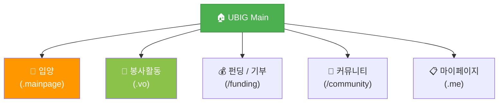
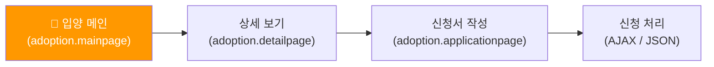
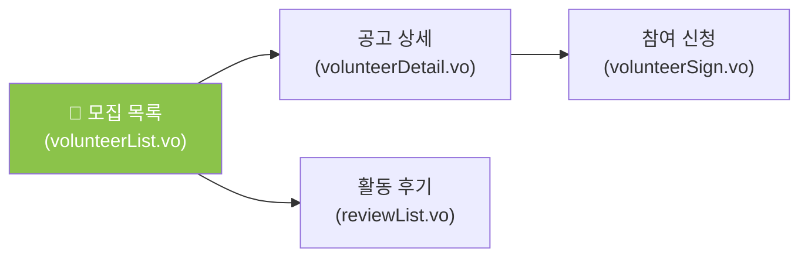
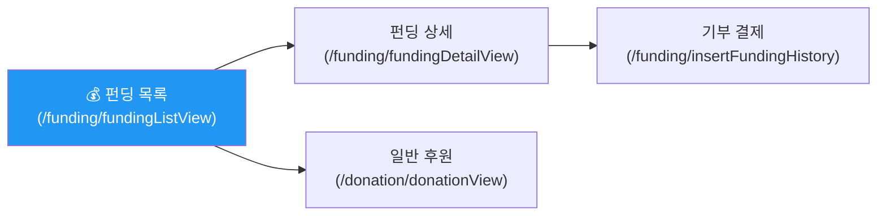
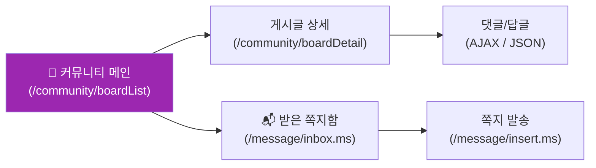
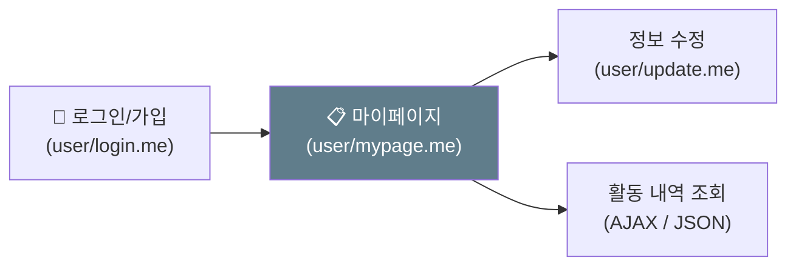

# 🗺️ UBIG 세미 프로젝트 IA (Information Architecture)

> **사용자 경험(UX) 중심의 페이지 계층 구조 및 API 명세**  
> 이 문서는 실제 구현된 서버 사이드 매핑(`@RequestMapping`) 정보를 기반으로 사이트의 정보 구조와 데이터 흐름을 정의합니다.

---

## 📑 목차
1. [📊 서비스 레이아웃 (Overview)](#-1-서비스-레이아웃-overview)
2. [🐾 도메인별 상세 아키텍처](#-2-도메인별-상세-아키텍처)
3. [📑 페이지 및 API 상세 명세](#-3-페이지-및-api-상세-명세)

---

## 📊 1. 서비스 레이아웃 (Overview)

사이트의 핵심 메뉴는 GNB(Global Navigation Bar)를 통해 제어되며, 각 도메인은 독립적인 매핑 서픽스(`.mainpage`, `.vo`, `.me` 등)를 가집니다.

---

## 2. 도메인별 상세 아키텍처

### 🐾 2.1 입양 도메인 (Adoption)
유기동물 매칭과 심사 프로세스를 관리하는 핵심 영역입니다.

### 🌱 2.2 봉사활동 도메인 (Volunteer)
봉사 모집 공고 및 활동 후기 시스템을 구축했습니다.

### 💰 2.3 펀딩 및 기부 도메인 (Funding & Donation)
투명한 기부 문화 조성을 위한 펀딩 및 후원 프로세스입니다.

### 📝 2.4 커뮤니티 및 메시징 (Community & Messaging)
사용자 간 정보 공유 및 소통을 위한 소셜 공간입니다.

### 📋 2.5 회원 및 마이페이지 (Member & MyPage)
개인별 활동 이력 및 회원 정보를 통합 관리합니다.

---

## 📑 3. 페이지 및 API 상세 명세

| 도메인 | 기능(Feature) | Mapping URL (Real) | 데이터 방식 | 권한 |
|---|---|---|---|---|
| **입양** | 공고 리스트 (필터) | `/adoption.mainpage` | SSR (Model) | 공통 |
| **입양** | 입양 신청서 작성 | `/adoption.applicationpage` | SSR (Model) | 일반 |
| **입양** | 내 입양 신청 현황 | `/adoption.mypage` | **AJAX (JSON)** | 일반 |
| **봉사** | 프로젝트 목록 | `/volunteerList.vo` | SSR (Model) | 공통 |
| **봉사** | 후기 댓글 로드 | `/reviewReplyList.vo` | **AJAX (JSON)** | 공통 |
| **봉사** | 내 봉사 신청 관리 | `/mySignList.vo` | **AJAX (JSON)** | 일반 |
| **펀딩** | 펀딩 목록 조회 | `/funding/fundingListView` | SSR (Model) | 공통 |
| **펀딩** | 펀딩 상세 보기 | `/funding/fundingDetailView` | SSR (Model) | 공통 |
| **펀딩** | 기부금 결제 처리 | `/funding/insertFundingHistory` | **AJAX (JSON)** | 일반 |
| **커뮤니티**| 게시글 상세 보기 | `/community/boardDetail` | SSR (Model) | 공통 |
| **커뮤니티**| 댓글 등록/삭제 | `/community/replyInsert` | **AJAX (JSON)** | 일반 |
| **회원** | 마이페이지 메인 | `/user/mypage.me` | SSR (Model) | 일반 |
| **회원** | 회원 정보 수정 | `/user/update.me` | SSR (Model) | 일반 |
| **회원** | 아이디 중복 체크 | `/user/checkId.me` | **AJAX (JSON)** | 공통 |
| **메시지** | 받은 쪽지함 | `/message/inbox.ms` | SSR (Model) | 일반 |
| **메시지** | 쪽지 삭제 처리 | `/message/delete.ms` | **AJAX (JSON)** | 일반 |

---

### 💡 문서 활용 가이드
- **SSR (Server-Side Rendering)**: Controller에서 `Model` 객체에 데이터를 담아 JSP로 직접 전달하는 방식입니다.
- **AJAX (JSON)**: 페이지 새로고침 없이 비동기적으로 데이터를 요청하고 수신하는 방식입니다. (MyPage의 탭 전환 등에서 사용)
- **Mapping URL**: 실제 WAS에서 처리하는 물리적 엔드포인트입니다.
