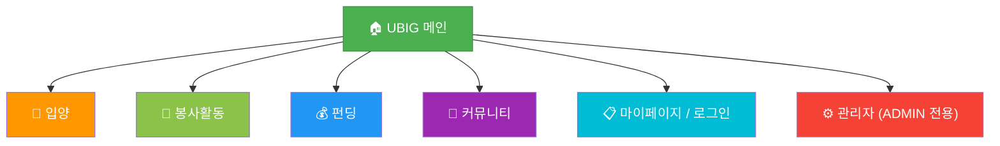
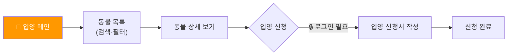
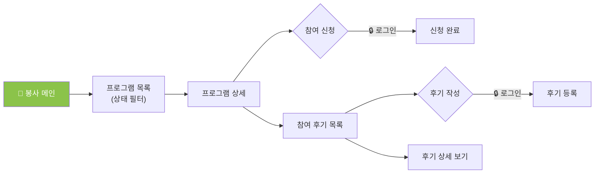
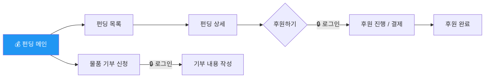
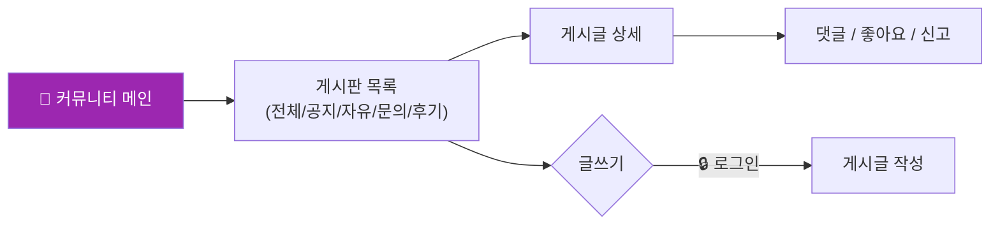
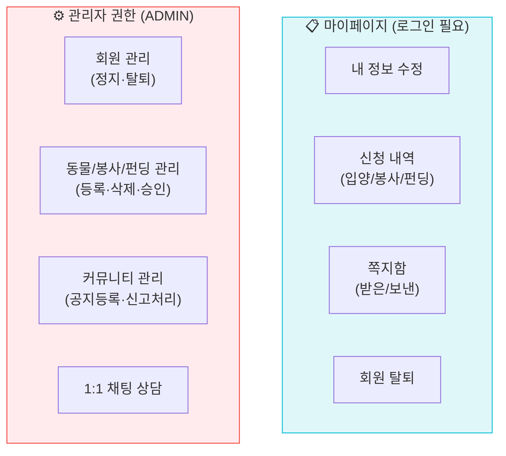

# UBIG 세미 프로젝트 IA (Information Architecture)

> 사이트 전체 페이지 계층 구조 및 기능 정의  
> Mermaid `graph TD` 문법 / GitHub 자동 렌더링 지원

---

## 📑 목차
1. [전체 사이트 구조 (Overview)](#1-전체-사이트-구조-overview)
2. [도메인별 상세 구조](#2-도메인별-상세-구조)
   - [🐾 입양](#-입양)
   - [🌱 봉사활동](#-봉사활동)
   - [💰 펀딩 / 기부](#-펀딩--기부)
   - [📝 커뮤니티](#-커뮤니티)
   - [⚙️ 관리자 및 마이페이지](#-관리자-및-마이페이지)

---

## 1. 전체 사이트 구조 (Overview)

상단 내비게이션 바(GNB)를 중심으로 한 메인 계층 구조입니다.

---

## 2. 도메인별 상세 구조

### 🐾 입양
유기동물 보호 및 입양 신청을 담당하는 도메인입니다.

### 🌱 봉사활동
봉사 프로그램 참여 및 후기 작성을 담당합니다.

### 💰 펀딩 / 기부
프로젝트 후원 및 물품 기부 신청을 담당합니다.

### 📝 커뮤니티
사용자 간 소통 및 문의 게시판을 담당합니다.

### ⚙️ 관리자 및 마이페이지
회원 관리 및 개인 신청 내역을 확인할 수 있는 영역입니다.

---

## 📋 페이지 목록 요약

| 영역 | 페이지 | 로그인 필요 | 접근 권한 |
|---|---|---|---|
| **입양** | 목록, 상세 | ❌ | 공통 |
| **입양** | 신청서 작성 | ✅ | 일반회원 |
| **봉사** | 목록, 상세, 후기 | ❌ | 공통 |
| **봉사** | 참여 신청, 후기 작성 | ✅ | 일반회원 |
| **기타** | 로그인, 회원가입 | ❌ | 비로그인 |
| **마이페이지** | 정보수정, 신청내역, 쪽지 | ✅ | 일반회원 |
| **관리자** | 회원/콘텐츠/신고 관리, 상담 | ✅ | 관리자 |
