# UBIG 세미 프로젝트 IA (Information Architecture)

> 사이트 전체 페이지 계층 구조  
> Mermaid `graph TD` 문법 / GitHub 자동 렌더링 지원

---

## 🗺️ 전체 사이트맵

```mermaid
graph TD
    ROOT["🏠 UBIG 메인"]

    %% ── 상단 내비게이션 ──
    ROOT --> NAV_ADOPT["🐾 입양"]
    ROOT --> NAV_VOL["🌱 봉사활동"]
    ROOT --> NAV_FUND["💰 펀딩"]
    ROOT --> NAV_COMM["📝 커뮤니티"]
    ROOT --> NAV_AUTH["👤 로그인 / 회원가입"]
    ROOT --> NAV_MY["📋 마이페이지"]
    ROOT --> NAV_ADMIN["⚙️ 관리자"]

    %% ── 입양 ──
    NAV_ADOPT --> A1["동물 목록\n(검색·필터)"]
    A1 --> A2["동물 상세"]
    A2 --> A3["입양 신청서 작성\n🔒 로그인 필요"]
    A3 --> A4["신청 완료"]

    %% ── 봉사활동 ──
    NAV_VOL --> V1["봉사 프로그램 목록\n(상태별 필터)"]
    V1 --> V2["프로그램 상세"]
    V2 --> V3["봉사 신청\n🔒 로그인 필요"]
    V3 --> V4["신청 완료"]
    V2 --> V5["후기 목록"]
    V5 --> V6["후기 작성\n🔒 로그인 필요"]
    V5 --> V7["후기 상세"]

    %% ── 펀딩 ──
    NAV_FUND --> F1["펀딩 목록"]
    F1 --> F2["펀딩 상세"]
    F2 --> F3["후원하기\n🔒 로그인 필요"]
    F3 --> F4["후원 완료"]

    %% ── 커뮤니티 ──
    NAV_COMM --> C1["게시판 목록\n(전체/공지/자유/문의/리뷰)"]
    C1 --> C2["게시글 상세"]
    C2 --> C3["댓글 작성\n🔒 로그인 필요"]
    C2 --> C4["좋아요\n🔒 로그인 필요"]
    C2 --> C5["신고\n🔒 로그인 필요"]
    C1 --> C6["게시글 작성\n🔒 로그인 필요"]
    C6 --> C7["작성 완료"]

    %% ── 로그인/회원가입 ──
    NAV_AUTH --> AU1["로그인"]
    NAV_AUTH --> AU2["회원가입"]
    AU2 --> AU3["회원가입 완료"]

    %% ── 마이페이지 (로그인 필요) ──
    NAV_MY --> MY1["내 정보 수정"]
    NAV_MY --> MY2["입양 신청 내역"]
    NAV_MY --> MY3["봉사 신청 내역"]
    NAV_MY --> MY4["펀딩 후원 내역"]
    NAV_MY --> MY5["쪽지함\n(받은/보낸)"]
    NAV_MY --> MY6["회원 탈퇴"]

    %% ── 관리자 (ADMIN 권한) ──
    NAV_ADMIN --> AD1["회원 관리\n(정지·탈퇴 처리)"]
    NAV_ADMIN --> AD2["동물 관리"]
    AD2 --> AD2A["동물 등록"]
    AD2 --> AD2B["동물 수정 / 삭제"]
    NAV_ADMIN --> AD3["봉사 프로그램 관리"]
    AD3 --> AD3A["프로그램 등록"]
    AD3 --> AD3B["신청자 조회 / 승인"]
    NAV_ADMIN --> AD4["펀딩 관리"]
    NAV_ADMIN --> AD5["커뮤니티 관리"]
    AD5 --> AD5A["공지사항 등록"]
    AD5 --> AD5B["게시글 삭제"]
    NAV_ADMIN --> AD6["채팅 상담"]

    %% ── 스타일 ──
    style ROOT fill:#4CAF50,color:#fff,stroke:#388E3C
    style NAV_ADOPT fill:#FF9800,color:#fff,stroke:#F57C00
    style NAV_VOL fill:#8BC34A,color:#fff,stroke:#689F38
    style NAV_FUND fill:#2196F3,color:#fff,stroke:#1565C0
    style NAV_COMM fill:#9C27B0,color:#fff,stroke:#6A1B9A
    style NAV_AUTH fill:#607D8B,color:#fff,stroke:#455A64
    style NAV_MY fill:#00BCD4,color:#fff,stroke:#00838F
    style NAV_ADMIN fill:#F44336,color:#fff,stroke:#C62828
```

### 🗺️ Information Architecture (정보 구조도)

<a href="https://kroki.io/mermaid/svg/eNqNVl1PG0cUfedXjIwigZTI9q53veah0nrdbSPVuKrAEiJVVVWhrYpCRfLSN9deVBJbAYLdGrCJaVEDEVTGuMVR0z7kp-RxZ1bNT-idGe_3xCAhgdhz7j3n7v3Yr9e__P4btFCYetND8PNZqbSwnHj3fKuHFvN3P0L4tEm6o8TnU-Pnt26ht80K_CBS-xHXTxCuDvEryx40SHdINtrjp4Fo6M6dD9C8Xv5CL5Q-ZbG3_0XkcIP8vANhBbhy6ROKalwgPHxMqmfOXgdv7Ymx5uJ8gYKf9ZHztIKbp2KYUSoWKWy3i8jfx_iPY1zfdOp9MVhfXPiYgneOET7q2FcjKABKIme_QQ627X4FtIuJxSWWo47wi02ohvO0TWvyovKeNIXi3fnlxNv9vf9GW8geVvDvZ-RwW1hqVq1wab2KsoB6ejkBRcJnrxF-eYqPuvcezNiDCqk9fnPltCzH6s96KvQ0p0geBV4lsUY-QOIAeTkxzkzqPTI4J1YHpOwQ6-Leg3fPm88C5YEcZL_pR5B5hAxEYFRE9iz8W0NkLviS4xahGVioMjXIkMhpWjwxPjzx3YIHp9bBlxaK-i1zv2XwG6JGXJe567LsJeLSr_Na5l7LAq_hwArkP7DsUX8s2gcoHKB6gJtV2eVlfZ5rKVZlPh3x-tIBYlFMKPAYFJFn8vqZkgeIVM7kBk2Z6YAhcVptUHOdfJMXzsy4tAlNEpzauAk63iyWASboKqp3nMZ2oDd6FhkMk_blnzCNSRgy0ukl8RmIaidh6vBVoFsM7taQ3Ej2qBI1bHDDBm2Vxi4D3OiFuTzaKr_WCXt4U47C2su-7F1LGBtQQwZupk_l1CwdfEqYNLZukGRwMQp2FGxTvgwW6Qi7LC9nBEObTLRo4ckYIYcRkySG1zCaiRqfjcstLrE0xSUqtjpEpNfCl_Brsw1_hUR7SCmyJulJJL-ci8HR7TIRnPEmbjwgk8C0QV7-Az6d1gn0PO4fkG4lCeJxdTQrpqhuKZFT23R-GoqK6B0mNMMuFrL_ajitzqzoGtHH7CUV0l5kzmdD2AJxcI5YKkQGbfh_WFgwgn-deAS_EwqSC9H9o7d7EVxZAUzev3LsHcIlJ9Vz0uu8N7MsvjQxGbKL1yOHJSbGQ-bdG0HrSY76UCOq58mr2EQE9PhdEJEQBdIOCO7JmGLFBYJivgzp5W2dxxV7yHxoi0wuHLQTubCcxgb_NhS2E3ly7NQqpPs63D8PH_2wep9_H618u7o6N50xdFNJ3f5qbXVtfW56ZWXl9sNH62vf3Z-bljXtQ9kI8fxvIU42zZyWEpJNJWukUjEy_crgVC1vyBldRFW1nClrMSo7oJwrpXOqKYu4aUVVjHhadrc4N2dI2bxQsqqn8zk97pfuTM5VU9mClhdxM4qiq5kYFxYAZ6ZSeaOQETFTKU3WTEGV6eseVzmTkWVVRDZUSZO0qf8BbRKewA==" target="_blank">
  
</a>

> 🔍 **이미지를 클릭하면 큰 화면으로 상세히 볼 수 있습니다.**
---

## 📋 페이지 목록 요약

| 영역 | 페이지 | 로그인 필요 |
|---|---|---|
| **입양** | 동물 목록, 동물 상세 | ❌ |
| **입양** | 입양 신청서 제출 | ✅ |
| **봉사활동** | 프로그램 목록, 상세, 후기 목록, 후기 상세 | ❌ |
| **봉사활동** | 봉사 신청, 후기 작성 | ✅ |
| **펀딩** | 펀딩 목록, 상세 | ❌ |
| **펀딩** | 후원하기 | ✅ |
| **커뮤니티** | 게시판 목록, 게시글 상세 | ❌ |
| **커뮤니티** | 게시글 작성, 댓글, 좋아요, 신고 | ✅ |
| **인증** | 로그인, 회원가입 | ❌ |
| **마이페이지** | 내 정보, 신청내역, 쪽지함 | ✅ |
| **관리자** | 회원/동물/봉사/펀딩/커뮤니티 관리, 채팅 | ✅ ADMIN |

---

## 🛠️ 시각화 방법

| 방법 | 주소 |
|---|---|
| **GitHub** | `.md` 파일 push 시 자동 렌더링 |
| **mermaid.live** | [mermaid.live](https://mermaid.live) 에 코드 붙여넣기 |
| **VS Code** | `Markdown Preview Mermaid Support` 확장 설치 후 미리보기 |
