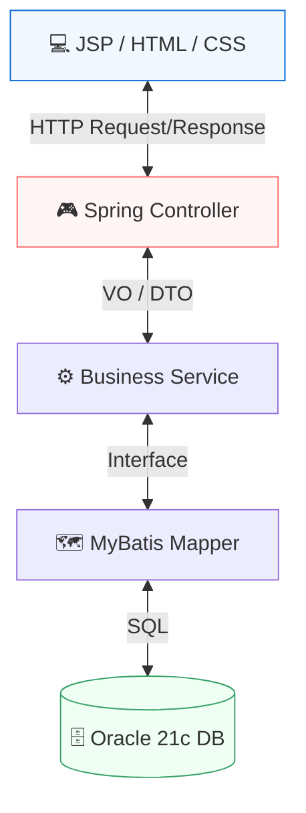

# 🏗️ UBIG 세미 프로젝트 Infrastructure Architecture

> **전통적 MVC 패턴 및 계층화된 아키텍처 설계 명세**  
> 이 문서는 세미 프로젝트의 기반이 되는 Spring Legacy MVC 구조, Oracle DB 기반의 데이터 무결성 설계, 그리고 계층형 통신 아키텍처를 정의합니다.

---

## 📑 목차
1. [아키텍처 설계 철학 (Technical Note)](#-아키텍처-설계-철학-technical-note)
2. [표준 3-Tier MVC 아키텍처](#1-표준-3-tier-mvc-아키텍처)
3. [데이터베이스 설계 및 정합성 (Oracle & MyBatis)](#2-데이터베이스-설계-및-정합성-oracle--mybatis)
4. [보안 및 예외 처리 아키텍처](#3-보안-및-예외-처리-아키텍처)

---

## 💡 아키텍처 설계 철학 (Technical Note)
- **높은 응집도와 낮은 결합도**: 도메인별 패키지 구성을 통해 기능을 독립적으로 관리하며, 인터페이스 기반의 서비스 설계를 통해 유지보수성을 극대화했습니다.
- **MyBatis 중심의 정밀한 쿼리 제어**: 복잡한 유기동물 매칭 로직을 효율적으로 처리하기 위해 MyBatis의 동적 SQL 기능을 적극 활용하여 DB 성능을 최적화했습니다.
- **방어적 프로그래밍**: 서버 측 유효성 검사 및 트랜잭션 관리를 통해 어떤 상황에서도 데이터 무결성이 보장되도록 설계했습니다.

---

## 📊 1. 표준 3-Tier MVC 아키텍처

세미 프로젝트는 안정성과 확장성을 위해 전형적인 3계층 아키텍처를 채택했습니다.

---

## 🗄️ 2. 데이터베이스 설계 및 정합성 (Oracle & MyBatis)

### 2.1 Oracle Sequence & Constraint
- **무결성 제약 조건**: `MEMBERS`, `ADOPTION_POST` 등 모든 핵심 테이블에 PK, FK, CHECK 제약 조건을 명시하여 데이터 레벨에서의 정합성을 강제했습니다.
- **자동 번호 생성**: `Sequence`를 활용하여 고유 번호(Primary Key) 발급을 자동화하고 동시성 문제를 방지했습니다.

### 2.2 MyBatis Dynamic SQL
- 복잡한 검색 필터(품종, 나이, 지역 등)에 대응하기 위해 MyBatis의 동적 SQL을 사용하여 단일 엔드포인트에서 다양한 검색 시나리오를 수용합니다.

---

## 🛡️ 3. 보안 및 예외 처리 아키텍처

### 3.1 Spring Security & BCrypt
- **암호화**: `BCryptPasswordEncoder`를 사용하여 사용자 비밀번호를 안전하게 단방향 암호화하여 저장합니다.
- **접근 제어**: `HttpSession`을 기반으로 한 로그인 세션 관리와 특정 URL에 대한 권한 체크 로직을 공통 서비스 레이어에서 수행합니다.

### 3.2 통합 에러 핸들링
- 발생 가능한 비즈니스 예외(이미 신청된 입양, 마감된 펀딩 등)를 사용자 정의 예외로 처리하고, 사용자에게 일관된 안내 메시지를 제공하는 구조를 갖추고 있습니다.
