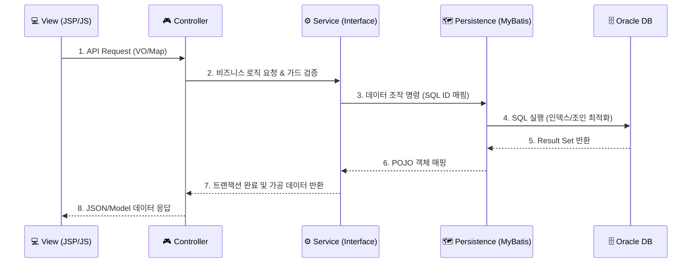

# 🏗️ UBIG Infrastructure & Technical Architecture

> **Docker 기반 컨테이너 아키텍처 및 도메인 중심(Domain-Driven) 설계 명세**  
> 이 문서는 UBIG 세미 프로젝트의 물리적 인프라 구성, 소프트웨어 계층 구조, 그리고 데이터 흐름에 대한 기술적 설계 근거를 정의합니다.

---

## 📑 목차
1. [🏢 물리 인프라 아키텍처 (Docker & Container)](#1-물리-인프라-아키텍처-docker--container)
2. [📦 소프트웨어 아키텍처 (Domain-First Package)](#2-소프트웨어-아키텍처-domain-first-package)
3. [📊 데이터 흐름 및 계층 (3-Tier MVC Layer)](#3-데이터-흐름-및-계층-3-tier-mvc-layer)
4. [🗄️ 데이터베이스 설계 전략 (Persistence Layer)](#4-데이터베이스-설계-전략-persistence-layer)
5. [🛡️ 보안 및 방어적 설계 (Security & Integrity)](#5-보안-및-방어적-설계-security--integrity)

---

## 🏢 1. 물리 인프라 아키텍처 (Docker & Container)

본 프로젝트는 개발 환경과 운영 환경의 일치(Environment Parity)를 위해 **Docker 컨테이너 기반 아키텍처**를 채택했습니다. 

```mermaid
graph LR
    subgraph "Docker Compose Network"
        WEB["🚀 Spring WebApp\n(Tomcat 9)"]
        DB[("🗄️ Oracle XE 21c\n(Persistence)")]
        VOL["💾 Docker Volume\n(Oracle Data/Scripts)"]
    end

    USR((👤 User)) -->|Port 8080| WEB
    WEB -->|JDBC (Port 1522)| DB
    DB <--> VOL

    style WEB fill:#f1f8ff,stroke:#0366d6
    style DB fill:#f0fff4,stroke:#38a169
    style VOL fill:#fff5f5,stroke:#ff6b6b
```

- **이식성(Portability)**: `Dockerfile`과 `docker-compose.yml`을 통해 어느 환경에서도 동일하게 구동되는 인프라를 구축했습니다.
- **데이터 영속성**: Docker Volume을 통해 컨테이너 재시작 시에도 Oracle 데이터 및 초기화 스크립트(`init_db.sql`)가 보존되도록 설계했습니다.

---

## 📦 2. 소프트웨어 아키텍처 (Domain-First Package)

유지보수성과 가독성을 극대화하기 위해 기술 계층이 아닌 **비즈니스 도메인 중심의 패키지 구조**를 설계했습니다.

- **패키지 경로**: `com.ubig.app.[domain]`
- **핵심 도메인**: `adoption`(입양), `funding`(펀딩), `volunteer`(봉사), `community`(커뮤니티) 등
- **구조적 이점**: 
    - 특정 기능 수정 시 관련 소스(Controller, Service, DAO)를 한눈에 파악 가능 (신규 입사자 온보딩 속도 향상)
    - 도메인 간의 결합도를 낮추어 향후 마이크로서비스(MSA) 전환 시 유리한 구조 확보

---

## 📊 3. 데이터 흐름 및 계층 (3-Tier MVC Layer)

Spring Legacy MVC 패턴을 기반으로 한 엄격한 계층 분리를 통해 비즈니스 로직의 독립성을 확보했습니다.



---

## 🗄️ 4. 데이터베이스 설계 전략 (Persistence Layer)

### 4.1 MyBatis 정밀 제어 (Dynamic SQL)
- **효율적 쿼리**: 복합 필터 조건(검색 키워드, 지역, 상태 등) 발생 시 MyBatis 동적 태그를 사용하여 **실행 시점에 최적화된 SQL을 생성**합니다.
- **N+1 방지**: 리스트 조회 시 적극적인 **JOIN 전술**을 사용하여 DB I/O 횟수를 최소화했습니다.

### 4.2 데이터 무결성 강제
- **물리적 제약 조건**: PK, FK, NOT NULL 제약 조건을 실제 DB 스키마에 정의하여 데이터 고아 현상을 원천 방지합니다.
- **시퀀스(Sequence)**: Oracle Sequence를 활용하여 분산 환경에서도 중복 없는 PK 발급을 보장합니다.

---

## 🛡️ 5. 보안 및 방어적 설계 (Security & Integrity)

- **BCrypt 암호화**: `MEMBERS.USER_PWD` 컬럼은 **BCrypt 10 rounds** 암호화를 적용하여 DB 유출 시에도 기술적인 방어가 가능하도록 설계했습니다.
- **5중 서버 가드(Guard Logic)**: 클라이언트 측 검증을 필수로 하되, 컨트롤러 레이어에서 세션 및 DB 실시간 조회를 통해 **우회적인 요청(API 직접 호출)을 100% 차단**합니다.
- **Atomic Transaction**: 입양 확정 시 다수의 관련 레코드(동물 상태, 신청서 일괄 반려 등)를 `@Transactional`로 묶어 **All-or-Nothing** 원칙을 수행합니다.
