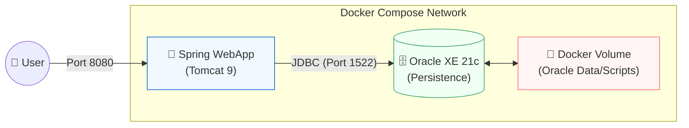
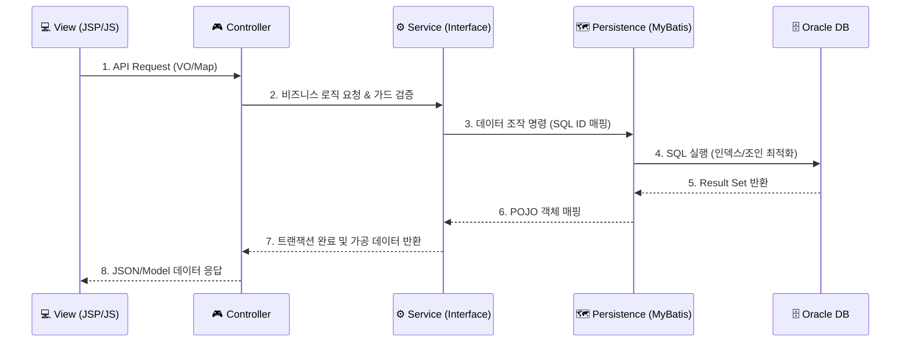

# 🏗️ UBIG Infrastructure & Technical Architecture

> **Docker 기반 컨테이너 아키텍처 및 도메인 중심(Domain-Driven) 설계 명세**  
> 이 문서는 UBIG 세미 프로젝트의 물리적 인프라 구성, 소프트웨어 계층 구조, 그리고 데이터 흐름에 대한 기술적 설계 근거를 정의합니다.

---

## 📑 목차
1. [🏢 물리 인프라 아키텍처 (Docker & Container)](#-1-물리-인프라-아키텍처-docker--container)
2. [📦 소프트웨어 아키텍처 (Domain-First Package)](#-2-소프트웨어-아키텍처-domain-first-package)
3. [📊 데이터 흐름 및 계층 (3-Tier MVC Layer)](#-3-데이터-흐름-및-계층-3-tier-mvc-layer)
4. [🗄️ 데이터베이스 설계 전략 (Persistence Layer)](#-4-데이터베이스-설계-전략-persistence-layer)
5. [🛡️ 보안 및 방어적 설계 (Security & Integrity)](#-5-보안-및-방어적-설계-security--integrity)

---

## 🏢 1. 물리 인프라 아키텍처 (Docker & Container)

본 프로젝트는 개발 환경과 운영 환경의 일치(Environment Parity)를 위해 **Docker 컨테이너 기반 아키텍처**를 채택했습니다. 

- **이식성(Portability)**: `Dockerfile`과 `docker-compose.yml`을 통해 어느 환경에서도 동일하게 구동되는 인프라를 구축했습니다.
- **데이터 영속성**: Docker Volume을 통해 컨테이너 재시작 시에도 Oracle 데이터 및 초기화 스크립트(`init_db.sql`)가 보존되도록 설계했습니다.

---

## 📦 2. 소프트웨어 아키텍처 (Domain-First Package)

유지보수성과 가독성을 극대화하기 위해 기술 계층이 아닌 **비즈니스 도메인 중심의 패키지 구조**를 설계했습니다.

- **패키지 경로**: `com.ubig.app.[domain]`
- **핵심 도메인**: `adoption`(입양), `funding`(펀딩), `volunteer`(봉사), `community`(커뮤니티) 등
- **구조적 이점**: 
    - 특정 기능 수정 시 관련 소스(Controller, Service, DAO)를 한눈에 파악 가능 (신규 입사자 온보딩 속도 향상)
    - 도메인 간의 결합도를 낮추어 향후 마이크로서비스(MSA) 전환 시 유리한 구조 확보

---

## 📊 3. 데이터 흐름 및 계층 (3-Tier MVC Layer)

Spring Legacy MVC 패턴을 기반으로 한 엄격한 계층 분리를 통해 비즈니스 로직의 독립성을 확보했습니다.

### 3.1 계층별 상세 데이터 처리 프로세스
- **요청 (Request)**: 브라우저에서 보낸 `Form` 데이터나 `JSON`은 Controller에서 **VO(Value Object)** 객체로 자동 바인딩(Data Binding)됩니다. 이때 인터셉터나 가드 로직을 통해 사용자의 권한을 1차 검증합니다.
- **비즈니스 로직 (Service)**: 요청을 받은 Service 계층은 트랜잭션(`@Transactional`)을 관리하며, 필요에 따라 여러 DAO를 호출하여 비즈니스 정합성을 맞춥니다.
- **영속성 처리 (Persistence)**: MyBatis는 인터페이스와 XML 매핑 정보를 바탕으로 SQL을 실행합니다. 이때 미리 정의된 **ResultMap**을 통해 DB의 행(Row) 데이터를 자바 객체로 변환합니다.
- **응답 (Response)**: 가공된 데이터는 `ModelAndView`를 통해 JSP로 전달되거나, `@ResponseBody`를 통해 JSON 형태로 클라이언트에 전송됩니다.

### 3.2 POJO (Plain Old Java Object) 기반 설계
본 프로젝트의 데이터 모델(VO)은 **POJO** 원칙을 준수하여 설계되었습니다.

- **정의**: 특정 프레임워크나 인터페이스에 종속되지 않는 **순수한 자바 객체**를 의미합니다.
- **활용**: `AnimalDetailVO`, `MemberVO` 등은 별도의 기술적 의존성 없이 필드와 Getter/Setter로만 구성되어 있습니다.
- **이점**: 
    1. **객체지향적 설계**: 비즈니스 데이터를 담는 그릇으로서의 본질에 집중할 수 있습니다.
    2. **테스트 용이성**: 프레임워크 없이도 단위 테스트(Unit Test)가 가능합니다.
    3. **자동 매핑**: MyBatis 같은 라이브러리가 DB 레코드와 자바 객체를 1:1로 연결해줄 때 가장 효율적으로 작동합니다.

---

## 🗄️ 4. 데이터베이스 설계 전략 (Persistence Layer)

### 4.1 MyBatis 정밀 제어 (Dynamic SQL)
- **효율적 쿼리**: 복합 필터 조건(검색 키워드, 지역, 상태 등) 발생 시 MyBatis 동적 태그를 사용하여 **실행 시점에 최적화된 SQL을 생성**합니다.
- **N+1 방지**: 리스트 조회 시 적극적인 **JOIN 전술**을 사용하여 DB I/O 횟수를 최소화했습니다.

### 4.2 데이터 무결성 강제
- **물리적 제약 조건**: PK, FK, NOT NULL 제약 조건을 실제 DB 스키마에 정의하여 데이터 고아 현상을 원천 방지합니다.
- **시퀀스(Sequence)**: Oracle Sequence를 활용하여 분산 환경에서도 중복 없는 PK 발급을 보장합니다.

---

## 🛡️ 5. 보안 및 방어적 설계 (Security & Integrity)

- **BCrypt 암호화**: `MEMBERS.USER_PWD` 컬럼은 **BCrypt 10 rounds** 암호화를 적용하여 DB 유출 시에도 기술적인 방어가 가능하도록 설계했습니다.
- **5중 서버 가드(Guard Logic)**: 클라이언트 측 검증을 필수로 하되, 컨트롤러 레이어에서 세션 및 DB 실시간 조회를 통해 **우회적인 요청(API 직접 호출)을 100% 차단**합니다.
- **Atomic Transaction**: 입양 확정 시 다수의 관련 레코드(동물 상태, 신청서 일괄 반려 등)를 `@Transactional`로 묶어 **All-or-Nothing** 원칙을 수행합니다.

---

## ⚙️ 6. 공통 시스템 컴포넌트 (Global Infrastructure Components)

애플리케이션 전역에서 동작하며 보안, 성능, 자동화를 담당하는 핵심 기술 컴포넌트입니다.

### 🛡️ 6.1 관문 제어 (Interceptor)
Spring MVC의 `HandlerInterceptor`를 구현하여 컨트롤러 진입 전 권한을 중앙 집중식으로 제어합니다.

*   **LoginInterceptor**: 마이페이지, 신청서 작성 등 회원 전용 서비스 접근 시 세션 유효성을 미리 검증합니다.
*   **AdminInterceptor**: `USER_ROLE` 필드를 확인하여 관리자 페이지(`/admin/**`) 및 공고 관리 기능을 비인가 사용자로부터 원천 차단합니다.
*   **장점**: 각 컨트롤러마다 중복된 로그인 체크 코드를 작성할 필요가 없어 유지보수성이 극대화됩니다.

### ⏰ 6.2 배경 자동화 (Scheduler)
`@Scheduled` 어노테이션과 Cron 표현식을 활용하여 서버에서 백그라운드로 실행되는 자동화 작업을 수행합니다.

*   **AdoptionScheduler**: 매일 자정(`00:00:00`) 마감일이 지난 입양 공고를 전수 조사하여 상태값을 자동으로 업데이트합니다.
*   **구현**: `AdoptionService`와 결합하여 대량의 데이터를 배치 처리(Batch Process) 방식으로 안전하게 갱신합니다.

### 💬 6.3 실시간 통신 (WebSocket)
`TextWebSocketHandler`를 확장하여 별도의 새로고침 없이 관리자와 사용자 간의 1:1 실시간 상담 기능을 제공합니다.
