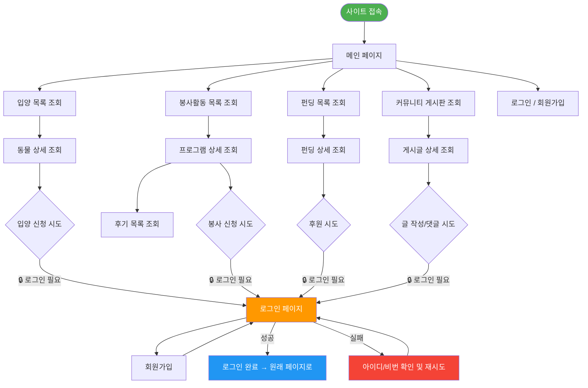
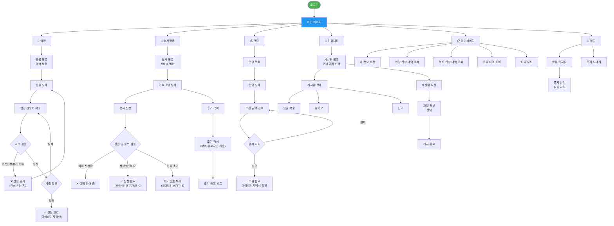
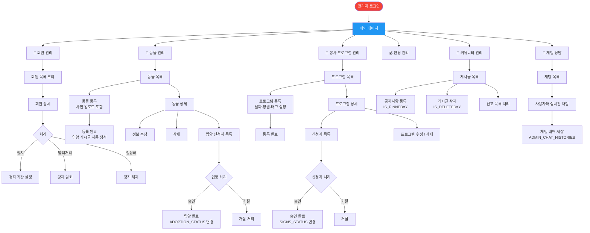
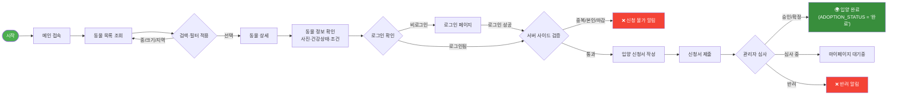
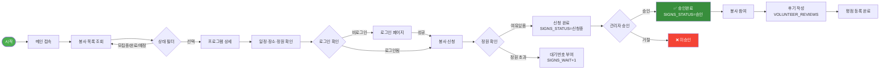
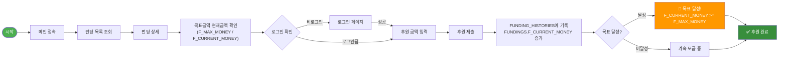
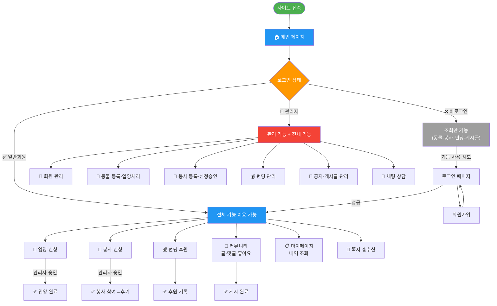

# UBIG 세미 프로젝트 User Flow

> 사용자 행동 경로 다이어그램  
> Mermaid `flowchart` 문법 / GitHub 자동 렌더링 지원

---

## 📑 목차

1. [역할별 플로우](#1-역할별-플로우)
   - [비로그인 사용자](#-비로그인-사용자)
   - [일반 사용자 (USER)](#-일반-사용자-user)
   - [관리자 (ADMIN)](#-관리자-admin)
2. [기능별 플로우](#2-기능별-플로우)
   - [입양 플로우](#-입양-플로우)
   - [봉사활동 플로우](#-봉사활동-플로우)
   - [펀딩 플로우](#-펀딩-플로우)
3. [통합 플로우](#3-통합-플로우)

---

## 1. 역할별 플로우

### 👁️ 비로그인 사용자

---

### 👤 일반 사용자 (USER)

---

### ⚙️ 관리자 (ADMIN)

---

## 2. 기능별 플로우

### 🐾 입양 플로우

---

### 🌱 봉사활동 플로우

---

### 💰 펀딩 플로우

---

## 3. 통합 플로우

---

## 🛠️ 시각화 방법

| 방법 | 주소 | 특징 |
|---|---|---|
| **GitHub** | push 후 `.md` 자동 렌더링 | 별도 설치 불필요 |
| **mermaid.live** | [mermaid.live](https://mermaid.live) | 실시간 편집·공유 링크 |
| **VS Code** | `Markdown Preview Mermaid Support` 확장 | 로컬 미리보기 |
